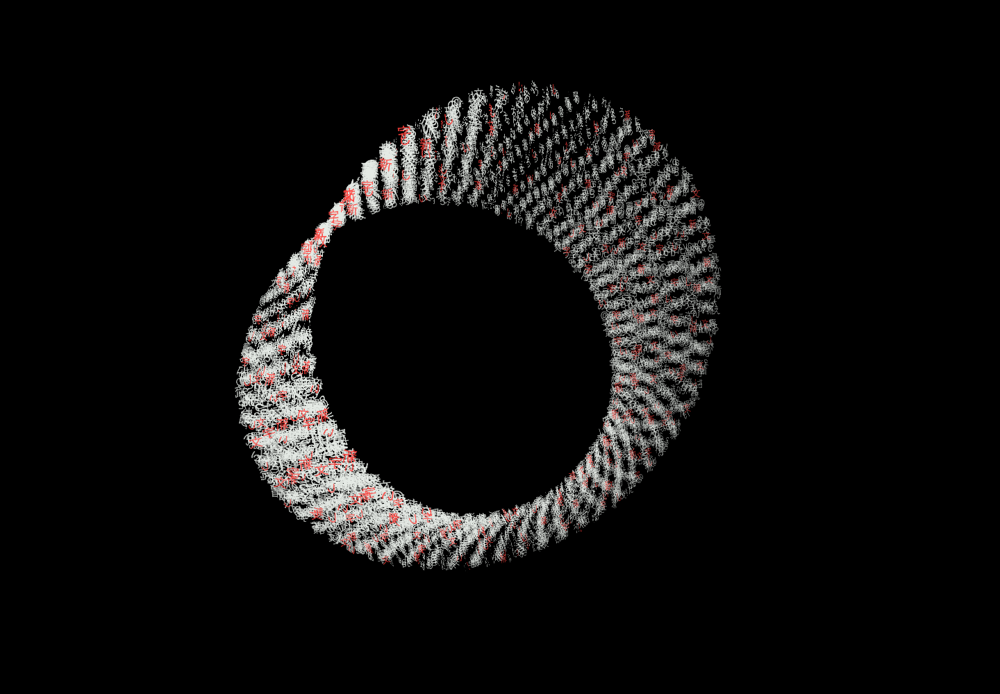
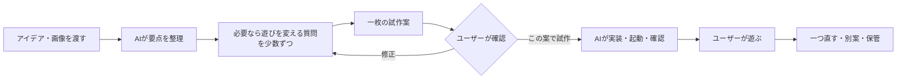

# AIでアイデアを遊べる形にするための制作設計

作成日: 2026-09-30 / 現在の試作設計: 0.3

**現在地: 制作方法の設計は完了。文字の集合P0は、黒い空間と隠れるターミナル・厚さゼロの3D文字へ修正。v0.2.0の試遊待ち。**

[進捗](PROGRESS.md) · [変更履歴](CHANGELOG.md) · [版管理の方針](VERSIONING.md) · [GitHub Issues](https://github.com/KOSEIHAMAYA2077/ai-game-lab/issues) · [Releases](https://github.com/KOSEIHAMAYA2077/ai-game-lab/releases)

**目的は、思いついた遊びを少ない手間で実際に触れる形にし、次の判断ができるようにすること。** 素材の独自制作、細かな手触り、販売用の完成度を先に追わない。無料で使える既存素材と図形・文字を活用する。

このフォルダには制作手順とハーネスの設計を置き、承認された試作を `prototypes/` で実装する。現在の実装と動作確認の状態は[作品の進捗](concepts/glyph-creature/PROGRESS.md)へ記録する。参考画像5点はローカルに保存し、公開版には観察内容だけを含める。添付本のPDFは公開しない。過去の会話やメモリを新たに参照せず、この会話での指示・回答・資料からまとめた。

## 最初の試作

[文字のかたち — 起動方法と操作](prototypes/glyph-creature/README.md)

## 読み方と現在地

| 文書 | 内容 |
| --- | --- |
| [WORKFLOW.md](WORKFLOW.md) | アイデア受領、質問、方向決め、試作確認、試遊の進め方 |
| [HARNESS.md](HARNESS.md) | AIが実装・起動・検証・修正を回すための最小設計 |
| [RESEARCH.md](RESEARCH.md) | 添付本、市場・カンファレンス、並列AI、素材サイト、公式情報の根拠 |
| [文字の集合の試作設計](concepts/glyph-creature/BRIEF.md) | 回答後に制作を始める指示と回答を反映した、承認済みの動くコンセプトアートP0 |
| [試作指示書のひな形](templates/BRIEF.md) | 次のアイデアにも使う短い正本 |
| [AGENTS.md](AGENTS.md) | このフォルダで作業するAIへの共通ルール |

今回確定した進め方は、**遊びの核と最小範囲を相談し、細部はAIに任せる。まとまった試作案をユーザーが確認してから制作する**、である。

文字の集合P0は、自由入力した文字が「凝縮する塊・渦・原子軌道・メビウスの輪」を形作って流れるコンセプトアートとして制作する。黒い空間からEnterで入力枠を開き、枠内のボタンで形を切り替え、新しい文字は赤から白へなじむ。文字を増すと密度と全体の大きさが増し、カメラが引く。成長による自動化は保留し、愛着のためのキャラクター反応や語義モデルとの連携も今回の完成条件には含めない。

## 今後の一巡

承認前も調査・文書整理・参考画像の読解は進める。ゲーム本体の実装は承認後に開始する。この確認点はユーザー自身の希望による。承認済み範囲の小さな修正や通常の技術選択で、同じ確認を繰り返さない。

## 基本方針

- 小さくする単位は「確認したいアイデア」。必ず1画面、5分、勝敗ありに固定するわけではない。
- 短い時間で特徴が現れるようにする。観察型の試作なら、変化を体験できることが一区切りになる。
- 「画像が少ないから作る」ではなく、「この発想を既存素材で手早く試せるか」で題材を選ぶ。
- 核に関わる見た目は残す。今回の文字による身体形成は検証対象であり、普通のキャラ画像への置換では確かめられない。
- 技術は静的Webを第一候補にする。小さな2DはCanvas、一般的な2DアクションはPhaser、簡単な3DはThree.js。既存の使える土台が速ければそれも選べる。
- OSは最初に固定しない。実際に確認したOS・ブラウザだけを「確認済み」と記録する。
- 既存素材を優先し、探索は候補を比較するところで切る。もっとよい素材を延々と探さない。
- まず一人の実装担当で進め、独立した調査・検証を必要に応じて並列化する。複数の試作を作る場合は、ユーザーがその範囲を選んでから分ける。
- ハーネス自体も小さく始める。文書を大量に作ること、テストの件数、エージェント数を成果にしない。

## 次回の使い方

このフォルダを作業場所にし、新しいアイデアを普通の文章と画像で渡す。AIはAGENTS.mdとWORKFLOW.mdを読み、最初に解釈を返す。遊びの方向を変える未決定事項があれば少数ずつ質問し、核と範囲が明確なら試作案の確認へ進む。別の作業場所で使う場合は、このREADMEとWORKFLOW.mdを指定する。フォルダを作っただけで、別の場所のタスクへルールが自動適用されるわけではない。

各作品で継続的に保つ文書は原則BRIEF.mdと、実装が始まってからの短いPROGRESS.mdだけ。ここにある研究資料を毎回全てAIへ渡す必要はない。
