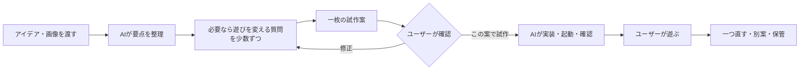

# Glyph Matter — 文字のかたち

**軽量モデルで曖昧な言葉を形へ変え、文字が表面を流れるサイドインテリアを研究・試作中。Codexのサブエージェントで調査・実装・独立検算を分担しています。**

[▶ ブラウザで試す・60形](https://koseihamaya2077.github.io/glyph-matter/) / [小窓Web版](https://koseihamaya2077.github.io/glyph-matter/widget-v3/) / [研究の技術・課題・先行研究](research/widget-research-map-20261003.md)。全アプリ入力との連動はまだ実装していません。

専用入力から小窓へ渡す比較では、待機中の全文転送をやめ、増えた材料だけを受け取る候補を保存しました。独立した12セッションで文字の位置・色・形が元の処理と一致し、時刻の巻戻りを拒否する修正も記録しています。[実装・原票・確認範囲](experiments/widget-metal-ambient-cache-v1/REPORT-R2.md) / [独立監査](experiments/widget-metal-ambient-cache-review-v1/REPORT-R2.md)。小窓全体の負荷、実IME、OS入力は未確認です。

作業の横に置く用途では「形を命令する」と「文章から形を連想する」を別に評価します。[内容の連想と次の比較方針](research/ambient-association-policy-v1/README.md)。連想の楽しさや邪魔にならなさは、人による検証が残っています。

### 日本語の意味特徴を小さく配備する比較

日本語の固定特徴を、約8MiBの表とMac標準CPU処理へ移しました。単独CLIの短い人工試験ではpeak43.53MiB、処理内p95約0.044ms。独立した追加20件と別枠の特殊token4件で、元の処理との一致を確認しました。曖昧な文章から正しい形を選ぶ精度は別課題で、既定の60形版へは接続していません。[候補・原票・失敗](experiments/native-static-japanese-v1/PUBLIC-README-R6.md) / [独立配備確認と未整備の入力境界](experiments/native-static-japanese-review-v1/REPORT.md)。全widget・16GB Windows・消費電力の値ではありません。

その入口を別版にし、返信から本文を除き、長すぎる行の後も次の入力へ戻れるようにしました。独立20入力・21返信が固定した契約に一致。[入口の方法・失敗・再現](experiments/native-static-wire-v1/README.md) / [独立原票](experiments/native-static-wire-review-v1/REPORT-R1.md)。実アプリの入力接続や意味精度の改善とは分けています。

### Macの小窓・13形のMetal比較版

球・箱・メビウスに剣・花瓶・クラゲ・花・蝶・木・星・螺旋・砂時計・土星を追加。既存の文字表面式をMac標準描画へ移した別版です。M5/32GiBの4形・各90秒ではCPU約1.6〜2.0%（1コア基準）、charged peak約70〜72MiB、停止/非表示は提出数0。一般16GBノートPC・GPU負荷・8時間の実窓は未検証です。

[Mac用比較アプリをダウンロード](https://github.com/KOSEIHAMAYA2077/glyph-matter/releases/tag/glyph-matter-metal-v0.3.0) / [操作と保存](desktop/glyph-metal-lab-v3/README.md) / [表面の再現・失敗と限界](experiments/widget-metal-authored-v3/README.md) / [実小窓の測定](experiments/widget-metal-native-evaluation-v3/REPORT.md) / [日本語paste・復元・復帰](experiments/widget-metal-authored-v3-root-ui/README.md)。Apple Silicon・macOS13以上向けの未公証アプリ。既定の60形Webと旧版・保存は維持します。

人工統合R3では、材料を全体追加してからACKし、本文・ID列を保存offから除く境界を確認しました。別入力元の割込みと活動イベントの欠落で見つけた旧版不具合も保持。[結果と公開確認](experiments/ambient-integration-publication-v1/README.md) / [独立review](experiments/ambient-integration-review-v1/README.md)。専用編集欄のR2は、実ブラウザで入力・削除・次の追加の色・再読込による消去を確認しました。[入力アダプター](experiments/ambient-editor-adapter-v1/README.md) / [独立監査](experiments/ambient-editor-adapter-review-v1/README.md) / [実操作の範囲](experiments/ambient-editor-root-ui-v1/README.md)。日本語IME一般と全アプリ入力連動は未確認・未実装です。

サイドインテリアの評価は、好みや作業への影響と、入力を正しく受ける機構を分けます。[評価案の再検討](research/ambient-study-questions-v1/README.md)。人による評価はまだ実施していません。

専用編集欄の材料を、既存の文字表面へ渡す別比較も追加しました。ASCII入力で面が育つこと、停止画面の一致、入力欄を隠しても面が残ることを実ブラウザで確認。[接続の実装と人工検証](experiments/ambient-editor-surface-v1/README.md) / [独立監査](experiments/ambient-editor-surface-review-v1/README.md) / [実画面と確認限界](experiments/ambient-editor-surface-root-ui-v1/README.md)。容量256の研究用比較で、日常の全文量やOS連動の完成版ではありません。

入力の有限状態処理は、Mac標準のJavaScriptCoreでも同じ人工20ケースを処理し、Node側の意味出力と一致しました。[実装・再現手順](experiments/ambient-javascriptcore-v1/README.md) / [結果と環境・限界](experiments/ambient-javascriptcore-v1/REPORT.md)。小窓へ直接接続する前段階のCLI検証で、実IME・常駐資源の結果ではありません。

魚・鳥・蛇を骨格付きの文字表面として加えた16形の別候補も保存。元Webの面・骨格・重みを移し、旧13形の同条件offscreen PNGは完全一致しました。[実装と原表現の由来](desktop/glyph-metal-lab-v4/README.md) / [数値・描画結果と保持した失敗](experiments/widget-metal-authored-v4/REPORT.md)。Macがロック状態のため新16形の実窓操作・通常窓資源は未確認で、配布・採用済みの13形版とは区別します。[root起動attempt](experiments/widget-metal-authored-v4-root-attempt/README.md)。

文章から既知60形を選ぶ約200KiBのCPU候補も固定比較しました。独立した人工120文では、意図した形の受理14/60、形を出さない文への誤反応2/40。説明文は3/36、物語は1/12に留まり、自然な文章を理解する既定機能への採用を見送りました。[方式・重量・採否](experiments/ambient-shape-retrieval-v1/REPORT.md) / [独立評価と全原票](experiments/ambient-shape-retrieval-evaluation-v1/REPORT.md)。辞書・作者の連想グラフ・疎な類似度検索であり、新しい3Dモデルを生成する学習器ではありません。

### Metalの小窓・3形の独立比較版

[専用native入力の独立監査](experiments/widget-metal-ambient-review-v1/REPORT.md)では人工callback12＋境界6を先に固定し、接続の初回18/18と修正後の同期待回帰を確認しました。IME・実窓・全アプリの取得とは区別します。

Macの専用編集欄から同じ文字材料をMetalへ渡す比較も保存。入力取消と、大きい文字のまとまりによる応答上限の不具合を旧版ごと残し、別候補で修正しました。[接続の実装・回帰・限界](experiments/widget-metal-ambient-v1/REPORT.md)。実IME・実窓・常駐資源は未確認です。[サイドインテリアへの現在の実装判断](research/side-interior-current-decision-20261003.md)では、材料の蓄積、形の提案、入力経路、描画を分けています。

球・箱・メビウスの文字表面をMac標準の描画へ移した候補。回転中の端切れを新v2で修正しました。実小窓の白い球・1,536描画・90秒ではCPU2.661%／charged peak68.298MiBですが、60形版との機能差があり既定版は維持します。反復WKの描画周期gate失敗も原票ごと保存。[作成・操作](desktop/glyph-metal-lab-v2/README.md) / [画面と射影](experiments/widget-metal-framing-v2/README.md) / [実窓比較・制限](experiments/widget-metal-native-evaluation-v2/REPORT.md)。

### [▶ 小窓・形の保持と小型分類器の比較版](https://koseihamaya2077.github.io/glyph-matter/widget-v3/)

根性の60形を標準にし、メビウスが単純な輪へ縮退する経路を修正。文字用画像は必要な行数だけ確保します。HELPで約122KBの小型分類器を選べますが、6形・最大2部位の実験用で、自由文の取りこぼしが残ります。[表現・操作・回帰](experiments/widget-atlas-student-v3/README.md) / [新しい120文の意味評価と限界](experiments/widget-student-v2-fresh/REPORT.md)。旧版のURLと文字履歴は保持します。

### [▶ 小窓・描画予算の比較版](https://koseihamaya2077.github.io/glyph-matter/widget-v2/)

旧小窓を残し、表示用の配列・転送を削減した版。形と文字表面を前版と比較して保持し、保存32,000文字と描画1,536文字を分ける。実機のCPU改善は未確認、メモリは少し低い観測値に留まる。[比較・原票・制限](experiments/widget-render-budget-v2/README.md) / [基準の小窓](https://koseihamaya2077.github.io/glyph-matter/widget-v1/)。

### [▶ 小窓・低負荷構成の比較版](https://koseihamaya2077.github.io/glyph-matter/widget-v1/)

Mac標準の小窓で、別の作業の横に置く試作。通常15fps、入力の吸収30fps、停止・非表示では描画を停止し、任意のモデルは解釈後に終了する。描画サンプルと文字履歴を分ける。現時点では全体RAM・CPUの候補予算に未達で、8時間の比較改良を進行中。[操作・実測・制限](experiments/widget-companion-v1/README.md) / [研究の技術・課題・先行研究・評価案](research/widget-research-map-20261003.md) / [Macアプリの作り方](desktop/glyph-widget/README.md)。

### [▶ ブラウザで試す](https://koseihamaya2077.github.io/glyph-matter/)

ダウンロード・インストール不要。Enterで入力欄を開き、好きな文章を加えると、その文字が3Dの形を作って流れます。`表面 鳥`、`表面 魚`、`表面 蛇`、`表面 メビウスの輪`などを試せます。[執筆モード](https://koseihamaya2077.github.io/glyph-matter/?write) / [公開版と保存について](docs/WEB_DEMO.md)。

**軽量モデルで、曖昧な言葉からその場で3Dの形を作る表現を研究・試作中。** 蓄積した文字を形の表面へ流し、別の作業の横でウィジェット程度の負荷で常駐できることを目標にしています。[常駐の資源予算と次の構成](research/widget-first-20261002.md)。現在の公開比較版は、まだその全体RAM・CPU予算を実証したものではありません。

**次の使用像は、創作・プログラミング・仕事の横に置くサイドインテリア。** 日常の入力を材料に育ち、内容から穏やかに形を変える構成を設計中です。全アプリの入力連動は未実装で、公開版では専用の入力欄を使います。[追加の使用像と分析](research/side-interior-direction-20261003.md) / [入力契約の人工実験](experiments/ambient-input-contract-v1/README.md) / [HCI本文と配置の比較案](research/side-interior-hci-v1/README.md) / [研究テーマ・比較・評価計画](research/widget-study-protocol-v1/README.md)。

材料の追加と形の判断を分け、同じ人工入力で更新頻度を比較しました。低頻度化を快適性の実証とはせず、保存offの本文・ID列を出さない候補も別に検査。[機構比較と失敗・限界](experiments/ambient-material-scheduler-v1/REPORT.md) / [接続の設計snapshot](experiments/ambient-integration-map-v1/README.md) / [Windows小窓への移植案・一次資料30項目](research/widget-cross-platform-runtime-v1/README.md)。Windows実行・全アプリ取得は未実施です。

**Codexのサブエージェントをフル稼働。** 先行研究の調査、実装、動きや設計のレビュー、検証を複数のエージェントで分担し、試作と比較を繰り返しています。

[16GBノートPC向けの先行研究・実装方針](research/16gb-text-to-3d-20261002.md) · [0.8B / 2BのCPU実測と失敗](experiments/consumer-16gb-20261002/README.md)。小モデルは動いたものの意味精度が不足したため、次は形・属性・関係を分けて学ぶ方式を比較します。

生成の許容時間は**入力確定から文字の形成まで30秒以内**。モデルが大まかな構造を決め、規定範囲の太さ・曲面を自前で肉付けする。初回モデル取得は別記録にし、解釈だけの速度を全工程の時間としない。[骨格からの生成案](research/skeleton-first-10s-v1.md)。

### [▶ 小型モデルと文字表面の比較版](https://koseihamaya2077.github.io/glyph-matter/skeleton-v1/)

6系統の形・首・縦横・曲がり・ねじれを文章から選び、文字が面を流れる。HELPの「小型モデルを準備」で無料モデルを取得し、ブラウザ内CPUで処理する。初回取得は約128MB、入力の外部送信なし。既知の曲面を制約内で作る版で、任意のtext-to-meshではない。[操作・実測・失敗・モデルとルールの区別](experiments/skeleton-surface-v1/README.md)。表示まで10秒を目安とし、演出を含め30秒まで許容する条件へ更新した。

### [▶ 文章から部位を組み立てる比較版](https://koseihamaya2077.github.io/glyph-matter/program-v1/)

「棒の先に球」「箱を輪が貫く」のように、文章から最大2部位＋1関係を作り、文字を面へ流す版。無料の端末内MiniLMと、人工文から学習した関係分類器を使う。根性モードとも比較できる。初回約128MBの公式モデル取得後、入力の外部送信なし。[操作と構成](experiments/scaffold-program-v1/README.md) / [独立評価・失敗・全工程の時間](experiments/scaffold-program-v1/evaluation/REPORT.md)。

このMacでは、モデル準備後の入力から吸収完了まで約4秒。初回モデル準備は別に約9秒。モデル未準備から同じ入力内で取得も行った初回は13.839秒。16GBノートPC実機は未確認。初回独立30例は21/30、修正後の実ブラウザ回帰は28/30で、自由文の取りこぼしが残る。任意の物体を作るtext-to-meshではなく、6種類の基本形を組み合わせる試作。[次の研究・局所的な形の予測](experiments/scaffold-program-v1/RESEARCH_NEXT.md)。

### [▶ 形の断面と色を直した比較版](https://koseihamaya2077.github.io/glyph-matter/twist-v1/)

箱や刃の断面そのものがねじれ、色の指定だけで形が変わらない版。`白い細い棒の先に大きな球`、`白いねじれた箱`などを試せる。学習済みheadを保ち、色語と構造の解釈を分離した。貫通は材料の内外へ跨ぐことを数値で確認できる範囲に制限する。[操作・前の版との違い](experiments/physical-twist-v1/README.md)。

公開中の試遊版は、用意した60形と語彙・連想グラフ・限定した曖昧検索で動く「根性版」に、鳥・魚・蛇の骨格を追加した版です。試遊中のモデル推論は使いません。軽量モデルによる任意の3D形状生成は、まだ研究段階です。

[公開版のコード・確認](https://github.com/KOSEIHAMAYA2077/glyph-matter/tree/glyph-creature-p0-v0.11.0-rigs.1) · [小型AIの実測](concepts/glyph-creature/LOCAL_AI_RESEARCH.md) · [自作分類モデル](experiments/word-shape/README.md) · [進捗](PROGRESS.md) · [Releases](https://github.com/KOSEIHAMAYA2077/glyph-matter/releases)

---

以下は制作設計と以前の試作の記録です。公開Web版は上記のタグから配布し、このブランチ内の以前のコードは保持しています。

# AIでアイデアを遊べる形にするための制作設計

**2026-10-01 / 骨格版 0.11.0:** 鳥・魚・蛇に親子の骨格を持たせ、動く身体の表面を文字が流れる。[操作・仕組み・比較](experiments/creature-rigs-v1/README.md)。この版は通常4198、執筆4198/?write。以下は以前の版の記録。

**2026-10-01 / 根性版 0.10.1:** ゆっくり左右へ回りながら上下にも傾く見え方と、クラゲの傘の拍動・触手の遅れを追加。[今回の操作と確認](experiments/konjo-motion-v1/README.md)。通常4197、執筆4197/?write。

作成日: 2026-09-30 / 別版: 根性版 0.10.0

**現在地: 根性版を60形へ拡張。形の名前・WordNetの同義語・作者の連想グラフ・限定した誤字検索で、文章から形を選ぶ。モデル推論なし。**

[入力例・形・比較・検証](experiments/konjo-v1/README.md) / 通常画面は localhost:4195。前の版（4173/4194）を保持し、この版は別ブランチ・別の保存領域で動く。

[進捗](PROGRESS.md) · [変更履歴](CHANGELOG.md) · [版管理の方針](VERSIONING.md) · [GitHub Issues](https://github.com/KOSEIHAMAYA2077/glyph-matter/issues) · [Releases](https://github.com/KOSEIHAMAYA2077/glyph-matter/releases)

**目的は、思いついた遊びを少ない手間で実際に触れる形にし、次の判断ができるようにすること。** 素材の独自制作、細かな手触り、販売用の完成度を先に追わない。無料で使える既存素材と図形・文字を活用する。

このフォルダには制作手順とハーネスの設計を置き、承認された試作を `prototypes/` で実装する。現在の実装と動作確認の状態は[作品の進捗](concepts/glyph-creature/PROGRESS.md)へ記録する。参考画像5点はローカルに保存し、公開版には観察内容だけを含める。添付本のPDFは公開しない。過去の会話やメモリを新たに参照せず、この会話での指示・回答・資料からまとめた。

## 最初の試作

[文字のかたち — 起動方法と操作](prototypes/glyph-creature/README.md)

## 読み方と現在地

| 文書 | 内容 |
| --- | --- |
| [WORKFLOW.md](WORKFLOW.md) | アイデア受領、質問、方向決め、試作確認、試遊の進め方 |
| [HARNESS.md](HARNESS.md) | AIが実装・起動・検証・修正を回すための最小設計 |
| [RESEARCH.md](RESEARCH.md) | 添付本、市場・カンファレンス、並列AI、素材サイト、公式情報の根拠 |
| [文字の集合の試作設計](concepts/glyph-creature/BRIEF.md) | 回答後に制作を始める指示と回答を反映した、承認済みの動くコンセプトアートP0 |
| [試作指示書のひな形](templates/BRIEF.md) | 次のアイデアにも使う短い正本 |
| [AGENTS.md](AGENTS.md) | このフォルダで作業するAIへの共通ルール |

今回確定した進め方は、**遊びの核と最小範囲を相談し、細部はAIに任せる。まとまった試作案をユーザーが確認してから制作する**、である。

文字の集合P0は、自由入力した文字が立体の形を作って流れるコンセプトアート。近くの @ と浮かび上がる `press enter` から始まり、Enterで入力欄が開き、好きな文字を送ると動き出す。`流れる 赤 四角形` や `表面 黄色 立方体` のように組み合わせ、入力した文字そのものが渦を巻いて吸収される。指定色は今回追加した文字だけに残る。無料の小型AIは端末内で実験したが、意味の誤解釈が多いため今回の試遊版へは採用しなかった。[実測と今後の選択肢](concepts/glyph-creature/LOCAL_AI_RESEARCH.md)。

## 自作モデルの学習

ユーザーの「形と文字を結びつけるモデルを作ろう」という指示を受け、10形状＋見送りを学ぶ小さな分類器を作った。[学習の入口・成績・再学習手順](experiments/word-shape/README.md)。学習3,684例、調整418例、別担当が作った最終評価60例（重複除外59例）を分け、重みと失敗も公開している。既存の生成モデル2種の不採用記録とは別の実験。

## 今後の一巡

承認前も調査・文書整理・参考画像の読解は進める。ゲーム本体の実装は承認後に開始する。この確認点はユーザー自身の希望による。承認済み範囲の小さな修正や通常の技術選択で、同じ確認を繰り返さない。

## 基本方針

- 小さくする単位は「確認したいアイデア」。必ず1画面、5分、勝敗ありに固定するわけではない。
- 短い時間で特徴が現れるようにする。観察型の試作なら、変化を体験できることが一区切りになる。
- 「画像が少ないから作る」ではなく、「この発想を既存素材で手早く試せるか」で題材を選ぶ。
- 核に関わる見た目は残す。今回の文字による身体形成は検証対象であり、普通のキャラ画像への置換では確かめられない。
- 技術は静的Webを第一候補にする。小さな2DはCanvas、一般的な2DアクションはPhaser、簡単な3DはThree.js。既存の使える土台が速ければそれも選べる。
- OSは最初に固定しない。実際に確認したOS・ブラウザだけを「確認済み」と記録する。
- 既存素材を優先し、探索は候補を比較するところで切る。もっとよい素材を延々と探さない。
- まず一人の実装担当で進め、独立した調査・検証を必要に応じて並列化する。複数の試作を作る場合は、ユーザーがその範囲を選んでから分ける。
- ハーネス自体も小さく始める。文書を大量に作ること、テストの件数、エージェント数を成果にしない。

## 次回の使い方

このフォルダを作業場所にし、新しいアイデアを普通の文章と画像で渡す。AIはAGENTS.mdとWORKFLOW.mdを読み、最初に解釈を返す。遊びの方向を変える未決定事項があれば少数ずつ質問し、核と範囲が明確なら試作案の確認へ進む。別の作業場所で使う場合は、このREADMEとWORKFLOW.mdを指定する。フォルダを作っただけで、別の場所のタスクへルールが自動適用されるわけではない。

各作品で継続的に保つ文書は原則BRIEF.mdと、実装が始まってからの短いPROGRESS.mdだけ。ここにある研究資料を毎回全てAIへ渡す必要はない。

## 執筆と筆画の試作

通常画面の「書く」から、入力を横で眺める執筆モードと日ごとの形へ。「一画」から、KanjiVGの筆画をほどく別実験へ進める。他アプリの入力取得は未実装。[操作・制限](prototypes/glyph-creature/README.md) · [筆画とMARY](research/strokes-and-word-play.md) · [常駐の選択肢](research/writing-companion.md)。
