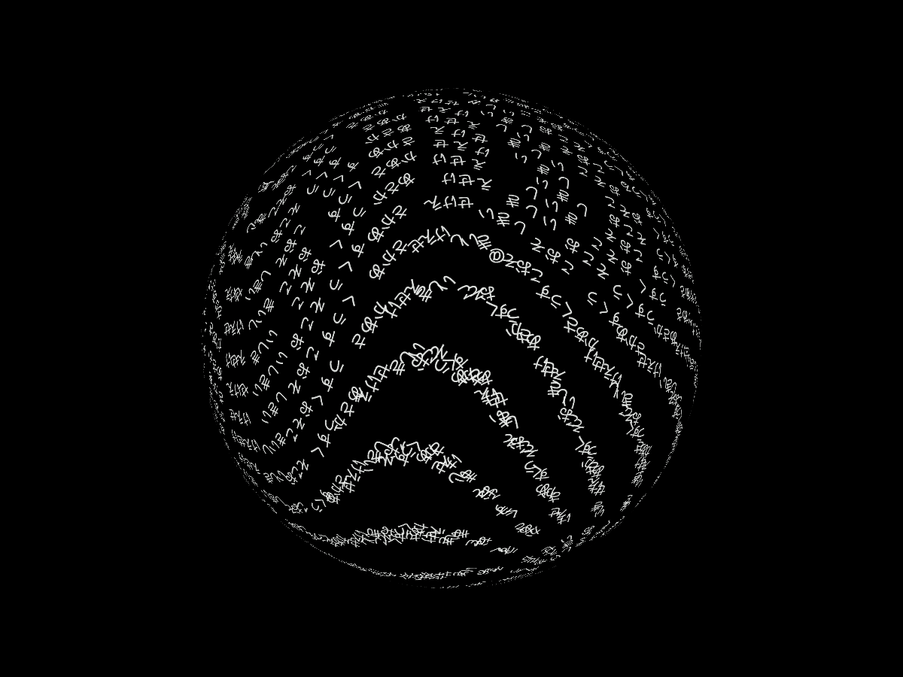
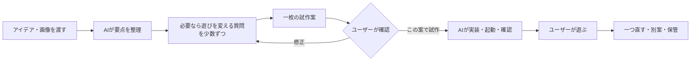

# Glyph Matter — 文字のかたち

### [▶ 小窓・描画予算の比較版](https://koseihamaya2077.github.io/glyph-matter/widget-v2/)

旧小窓を残し、表示用の配列・転送を削減した版。形と文字表面を前版と比較して保持し、保存32,000文字と描画1,536文字を分ける。実機のCPU改善は未確認、メモリは少し低い観測値に留まる。[比較・原票・制限](experiments/widget-render-budget-v2/README.md) / [基準の小窓](https://koseihamaya2077.github.io/glyph-matter/widget-v1/)。

### [▶ 小窓・低負荷構成の比較版](https://koseihamaya2077.github.io/glyph-matter/widget-v1/)

Mac標準の小窓で、別の作業の横に置く試作。通常15fps、入力の吸収30fps、停止・非表示では描画を停止し、任意のモデルは解釈後に終了する。描画サンプルと文字履歴を分ける。現時点では全体RAM・CPUの候補予算に未達で、8時間の比較改良を進行中。[操作・実測・制限](experiments/widget-companion-v1/README.md) / [研究の技術・課題・先行研究・評価案](research/widget-research-map-20261003.md) / [Macアプリの作り方](desktop/glyph-widget/README.md)。

### [▶ ブラウザで試す](https://koseihamaya2077.github.io/glyph-matter/)

ダウンロード・インストール不要。Enterで入力欄を開き、好きな文章を加えると、その文字が3Dの形を作って流れます。`表面 鳥`、`表面 魚`、`表面 蛇`、`表面 メビウスの輪`などを試せます。[執筆モード](https://koseihamaya2077.github.io/glyph-matter/?write) / [公開版と保存について](docs/WEB_DEMO.md)。

**軽量モデルで、曖昧な言葉からその場で3Dの形を作る表現を研究・試作中。** 蓄積した文字を形の表面へ流し、別の作業の横でウィジェット程度の負荷で常駐できることを目標にしています。[常駐の資源予算と次の構成](research/widget-first-20261002.md)。現在の公開比較版は、まだその全体RAM・CPU予算を実証したものではありません。

**Codexのサブエージェントをフル稼働。** 先行研究の調査、実装、動きや設計のレビュー、検証を複数のエージェントで分担し、試作と比較を繰り返しています。

[16GBノートPC向けの先行研究・実装方針](research/16gb-text-to-3d-20261002.md) · [0.8B / 2BのCPU実測と失敗](experiments/consumer-16gb-20261002/README.md)。小モデルは動いたものの意味精度が不足したため、次は形・属性・関係を分けて学ぶ方式を比較します。

生成の許容時間は**入力確定から文字の形成まで30秒以内**。モデルが大まかな構造を決め、規定範囲の太さ・曲面を自前で肉付けする。初回モデル取得は別記録にし、解釈だけの速度を全工程の時間としない。[骨格からの生成案](research/skeleton-first-10s-v1.md)。

### [▶ 小型モデルと文字表面の比較版](https://koseihamaya2077.github.io/glyph-matter/skeleton-v1/)

6系統の形・首・縦横・曲がり・ねじれを文章から選び、文字が面を流れる。HELPの「小型モデルを準備」で無料モデルを取得し、ブラウザ内CPUで処理する。初回取得は約128MB、入力の外部送信なし。既知の曲面を制約内で作る版で、任意のtext-to-meshではない。[操作・実測・失敗・モデルとルールの区別](experiments/skeleton-surface-v1/README.md)。表示まで10秒を目安とし、演出を含め30秒まで許容する条件へ更新した。

### [▶ 文章から部位を組み立てる比較版](https://koseihamaya2077.github.io/glyph-matter/program-v1/)

「棒の先に球」「箱を輪が貫く」のように、文章から最大2部位＋1関係を作り、文字を面へ流す版。無料の端末内MiniLMと、人工文から学習した関係分類器を使う。根性モードとも比較できる。初回約128MBの公式モデル取得後、入力の外部送信なし。[操作と構成](experiments/scaffold-program-v1/README.md) / [独立評価・失敗・全工程の時間](experiments/scaffold-program-v1/evaluation/REPORT.md)。

このMacでは、モデル準備後の入力から吸収完了まで約4秒。初回モデル準備は別に約9秒。モデル未準備から同じ入力内で取得も行った初回は13.839秒。16GBノートPC実機は未確認。初回独立30例は21/30、修正後の実ブラウザ回帰は28/30で、自由文の取りこぼしが残る。任意の物体を作るtext-to-meshではなく、6種類の基本形を組み合わせる試作。[次の研究・局所的な形の予測](experiments/scaffold-program-v1/RESEARCH_NEXT.md)。

### [▶ 形の断面と色を直した比較版](https://koseihamaya2077.github.io/glyph-matter/twist-v1/)

箱や刃の断面そのものがねじれ、色の指定だけで形が変わらない版。`白い細い棒の先に大きな球`、`白いねじれた箱`などを試せる。学習済みheadを保ち、色語と構造の解釈を分離した。貫通は材料の内外へ跨ぐことを数値で確認できる範囲に制限する。[操作・前の版との違い](experiments/physical-twist-v1/README.md)。

公開中の試遊版は、用意した60形と語彙・連想グラフ・限定した曖昧検索で動く「根性版」に、鳥・魚・蛇の骨格を追加した版です。試遊中のモデル推論は使いません。軽量モデルによる任意の3D形状生成は、まだ研究段階です。

[公開版のコード・確認](https://github.com/KOSEIHAMAYA2077/glyph-matter/tree/glyph-creature-p0-v0.11.0-rigs.1) · [小型AIの実測](concepts/glyph-creature/LOCAL_AI_RESEARCH.md) · [自作分類モデル](experiments/word-shape/README.md) · [進捗](PROGRESS.md) · [Releases](https://github.com/KOSEIHAMAYA2077/glyph-matter/releases)

---

以下は制作設計と以前の試作の記録です。公開Web版は上記のタグから配布し、このブランチ内の以前のコードは保持しています。

# AIでアイデアを遊べる形にするための制作設計

**2026-10-01 / 骨格版 0.11.0:** 鳥・魚・蛇に親子の骨格を持たせ、動く身体の表面を文字が流れる。[操作・仕組み・比較](experiments/creature-rigs-v1/README.md)。この版は通常4198、執筆4198/?write。以下は以前の版の記録。

**2026-10-01 / 根性版 0.10.1:** ゆっくり左右へ回りながら上下にも傾く見え方と、クラゲの傘の拍動・触手の遅れを追加。[今回の操作と確認](experiments/konjo-motion-v1/README.md)。通常4197、執筆4197/?write。

作成日: 2026-09-30 / 別版: 根性版 0.10.0

**現在地: 根性版を60形へ拡張。形の名前・WordNetの同義語・作者の連想グラフ・限定した誤字検索で、文章から形を選ぶ。モデル推論なし。**

[入力例・形・比較・検証](experiments/konjo-v1/README.md) / 通常画面は localhost:4195。前の版（4173/4194）を保持し、この版は別ブランチ・別の保存領域で動く。

[進捗](PROGRESS.md) · [変更履歴](CHANGELOG.md) · [版管理の方針](VERSIONING.md) · [GitHub Issues](https://github.com/KOSEIHAMAYA2077/glyph-matter/issues) · [Releases](https://github.com/KOSEIHAMAYA2077/glyph-matter/releases)

**目的は、思いついた遊びを少ない手間で実際に触れる形にし、次の判断ができるようにすること。** 素材の独自制作、細かな手触り、販売用の完成度を先に追わない。無料で使える既存素材と図形・文字を活用する。

このフォルダには制作手順とハーネスの設計を置き、承認された試作を `prototypes/` で実装する。現在の実装と動作確認の状態は[作品の進捗](concepts/glyph-creature/PROGRESS.md)へ記録する。参考画像5点はローカルに保存し、公開版には観察内容だけを含める。添付本のPDFは公開しない。過去の会話やメモリを新たに参照せず、この会話での指示・回答・資料からまとめた。

## 最初の試作

[文字のかたち — 起動方法と操作](prototypes/glyph-creature/README.md)

## 読み方と現在地

| 文書 | 内容 |
| --- | --- |
| [WORKFLOW.md](WORKFLOW.md) | アイデア受領、質問、方向決め、試作確認、試遊の進め方 |
| [HARNESS.md](HARNESS.md) | AIが実装・起動・検証・修正を回すための最小設計 |
| [RESEARCH.md](RESEARCH.md) | 添付本、市場・カンファレンス、並列AI、素材サイト、公式情報の根拠 |
| [文字の集合の試作設計](concepts/glyph-creature/BRIEF.md) | 回答後に制作を始める指示と回答を反映した、承認済みの動くコンセプトアートP0 |
| [試作指示書のひな形](templates/BRIEF.md) | 次のアイデアにも使う短い正本 |
| [AGENTS.md](AGENTS.md) | このフォルダで作業するAIへの共通ルール |

今回確定した進め方は、**遊びの核と最小範囲を相談し、細部はAIに任せる。まとまった試作案をユーザーが確認してから制作する**、である。

文字の集合P0は、自由入力した文字が立体の形を作って流れるコンセプトアート。近くの @ と浮かび上がる `press enter` から始まり、Enterで入力欄が開き、好きな文字を送ると動き出す。`流れる 赤 四角形` や `表面 黄色 立方体` のように組み合わせ、入力した文字そのものが渦を巻いて吸収される。指定色は今回追加した文字だけに残る。無料の小型AIは端末内で実験したが、意味の誤解釈が多いため今回の試遊版へは採用しなかった。[実測と今後の選択肢](concepts/glyph-creature/LOCAL_AI_RESEARCH.md)。

## 自作モデルの学習

ユーザーの「形と文字を結びつけるモデルを作ろう」という指示を受け、10形状＋見送りを学ぶ小さな分類器を作った。[学習の入口・成績・再学習手順](experiments/word-shape/README.md)。学習3,684例、調整418例、別担当が作った最終評価60例（重複除外59例）を分け、重みと失敗も公開している。既存の生成モデル2種の不採用記録とは別の実験。

## 今後の一巡

承認前も調査・文書整理・参考画像の読解は進める。ゲーム本体の実装は承認後に開始する。この確認点はユーザー自身の希望による。承認済み範囲の小さな修正や通常の技術選択で、同じ確認を繰り返さない。

## 基本方針

- 小さくする単位は「確認したいアイデア」。必ず1画面、5分、勝敗ありに固定するわけではない。
- 短い時間で特徴が現れるようにする。観察型の試作なら、変化を体験できることが一区切りになる。
- 「画像が少ないから作る」ではなく、「この発想を既存素材で手早く試せるか」で題材を選ぶ。
- 核に関わる見た目は残す。今回の文字による身体形成は検証対象であり、普通のキャラ画像への置換では確かめられない。
- 技術は静的Webを第一候補にする。小さな2DはCanvas、一般的な2DアクションはPhaser、簡単な3DはThree.js。既存の使える土台が速ければそれも選べる。
- OSは最初に固定しない。実際に確認したOS・ブラウザだけを「確認済み」と記録する。
- 既存素材を優先し、探索は候補を比較するところで切る。もっとよい素材を延々と探さない。
- まず一人の実装担当で進め、独立した調査・検証を必要に応じて並列化する。複数の試作を作る場合は、ユーザーがその範囲を選んでから分ける。
- ハーネス自体も小さく始める。文書を大量に作ること、テストの件数、エージェント数を成果にしない。

## 次回の使い方

このフォルダを作業場所にし、新しいアイデアを普通の文章と画像で渡す。AIはAGENTS.mdとWORKFLOW.mdを読み、最初に解釈を返す。遊びの方向を変える未決定事項があれば少数ずつ質問し、核と範囲が明確なら試作案の確認へ進む。別の作業場所で使う場合は、このREADMEとWORKFLOW.mdを指定する。フォルダを作っただけで、別の場所のタスクへルールが自動適用されるわけではない。

各作品で継続的に保つ文書は原則BRIEF.mdと、実装が始まってからの短いPROGRESS.mdだけ。ここにある研究資料を毎回全てAIへ渡す必要はない。

## 執筆と筆画の試作

通常画面の「書く」から、入力を横で眺める執筆モードと日ごとの形へ。「一画」から、KanjiVGの筆画をほどく別実験へ進める。他アプリの入力取得は未実装。[操作・制限](prototypes/glyph-creature/README.md) · [筆画とMARY](research/strokes-and-word-play.md) · [常駐の選択肢](research/writing-companion.md)。
