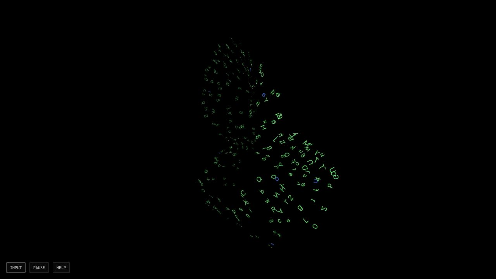

# 専用編集欄から文字の面へ — rootの実ブラウザ確認

2026-10-03 06:53 JST。返却されたsurface R2のproduction HTML/JS/CSSの3ファイルだけを、専用localhostへ配信した。元の作者/独立評価、R1失敗、shaderは変更していない。[実行前METHODと配信物SHA](METHOD-R1.json)。既定の60形版は置き換えない。

## 実際に確認したこと

- 初期の黒い空間と仮表示@、専用欄へのASCII `box`入力で3文字の面を表示。
- 欄を削除して`ring`を追加し、次の追加色を青から緑に変えてASCII本文を追加。文字の表面が動き、色付き文字が表示された。
- PAUSE/RESUMEの表示と停止。2枚の停止画面の上部1280×500は全画素一致。[画像比較](PAUSED-PIXELS-R1.json)。これはframe counterの測定ではない。
- 上限を超えるASCII追加で「保留」を表示。削除・undoで欄を空にし、元の本文へ戻す操作を確認した。
- INPUTを閉じても文字の面を表示し続けた。再読込で欄が空・色が青・仮表示@へ戻った。
- 保存したwarn/error console記録は0件。[console](CONSOLE-R1.json)。試験tab10を閉じ、開始時刻とcommandを確認したown server7208を終了。他のtabやprocessは触らない。[終了記録](server-shutdown.json)。

## 証拠の範囲

read-only browser realmから`window.ambientSurfaceLab`はundefinedだった。直接読めないbodyCount、ID、atlasKinds、renders、exportOffを実UIの観測値にしない。色ごとの正確な旧/new個数・容量256の全体ACK・停止counter0は、作者/独立の人工結果に限る。画素一致はGPU workload0や資源消費0を意味しない。初回APIでQA hookを読めなかった事実をsource failureとはしない。

実操作はASCIIで、paste・複合emoji・日本語IME・OS全体入力・実document hidden・BFCache・WebGL context loss・native資源・人の快適性を検証していない。CSPとruntime graphはsource検査であり、network panelで全requestを記録した試験ではない。旧shaderとのsource一致は、任意条件の画素一致ではない。

256素材の有限プロトコル比較であり、日常の全文量を保持する完成アプリではない。形対応も球・箱・輪の限定された字句で、輪→メビウスは比較用の表示対応。`ring`と`sphere`が共存した今回の本文は、後の名詞を必ず優先する操作の証明にならない。

ブラウザの実確認後、Macがロック状態でnative appの操作APIは停止した。ロック解除・設定変更は実行していない。Webの記録とnative未確認は分ける。

作者のR1失敗原票のstack traceにローカルパスが含まれたため、元のbyteはローカルで保持しGitへ入れない。[公開用の別R2](../ambient-editor-surface-v1/results-r1-build-r2.public-r2.json)はJSONを解釈して各文字列のパス区間だけを伏せ、16tick失敗と期待値を変えていない。[原票SHAと公開copy](PUBLICATION-R2.json)。先の公開copy R1はserialized JSONへの置換でstackの改行を縮めうるため、比較にはR2を使う。作者manifestの31ファイルは元の私有原票も含む一覧であり、31すべてを公開したとの主張ではない。
