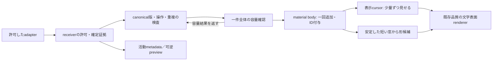

# Ambient接続マップ — 将来設計の一枚

2026-10-03、参照snapshotは03:50:42 JST。**文書と人工JSON例だけの提案。現在のplatform schema・pure reducer・scheduler・widgetは未接続である。** OS取得、コード接続、テスト、保存変更、モデル呼出を行っていない。schedulerはactiveなため、[METHOD.md](../ambient-material-scheduler-v1/METHOD.md)と[METHOD.json](../ambient-material-scheduler-v1/METHOD.json)だけを参照し、source・fixture・resultを読んでいない。参照時点とSHAは [REFERENCES.json](REFERENCES.json)、未実行の人工ケースは [INTEGRATION_CASES.json](INTEGRATION_CASES.json) に残す。

## 提案する流れと責任

矢印は実装済みAPIではない。提案では**material段だけがbody・字形ID・入力色を所有**し、rendererはそのIDを受けて表示する。canonical段は文書版と操作の重複を検査し、body容量の予約が成立した時だけ受理を確定する。reducer v1のbody/tick/ID付与とscheduler METHODの即時body/新IDを両方使わない。前者は独立比較実装として残し、接続用canonical gateは将来の別契約として定義する必要がある。

文字の論理追加を意味処理から独立させ、形候補がhold・例外でも文字を二度足したり消したりしない。表示cursorと形処理はhidden/pausedで止めても、許可済み素材の受理は有限容量内で継続するMETHOD案である。**pause表示と入力取得停止は別操作**にする。保存offではbody・文字ID・色列・recent窓をvolatileにし、再起動時に復元しない。

## 項目と判断の対応

| adapter/platform側 | canonical側の将来対応 | material/scheduler/rendererへの対応 | 現在の差・禁止する推測 |
| --- | --- | --- | --- |
| `source.adapter`、session、primary、allowed、secureState | receiverが許可した接続とregistryに照合。source能力は内部で設定 | unknown/secureは本文を取得・転送せず、可能な活動metadataのみ | payloadの自称safe/known、`synthetic:true`は認証ではない。capability宣言もOS証明ではない |
| eventId、operationId、sequence、focusEpoch、policyEpoch | source別seq、共有操作のcommitSerial、focus/policy失効の明示変換 | 別の正規化stream seqと元source/seq/操作のvolatile来歴を保持 | 現reducerはsource seq、METHODはglobal normalized seqを想定。元seqをコピーすると誤gapを作る。policy-change/gapの直接対応も未定義 |
| monotonicMS、truncated、長さ上限 | receiverの単調時刻へ基準を合わせ、証拠時刻を不変にする。全件受理か明示hold | TTLは素材の証拠時刻から計算。idle/cache sampleで延長しない | 現reducerには時刻fieldがない。schemaのcode point/8KiB案、reducerの256 UTF-16 units、ID長64対32は互換でない。truncatedを完全な確定素材と呼ばない |
| activity.units | key/shortcut/editを別の観測件数へ | 呼吸等の将来metadata経路。body/queryへ文字を足さない | 打鍵数≠文字数≠distinct人間操作。キーから日本語・clipboard本文を復元しない |
| VS Code等のexact document diff、`document-only` | `documentDiff:true, committedText:false`相当。版/rangeは検査しpreviewまで | 語彙窓、body、形の命令へ流さない | typing/paste/completion、静穏時間、`quality:known`の自称でIME確定へ格上げしない |
| composition update/cancel | 明示能力と操作IDを照合し可逆候補を置換/消去 | final素材0。cancelで候補文を残さない | 中間ローマ字・候補・確定文の三重吸収をしない |
| 明示commitとshared serial/version | 一操作の確定証拠＋版整合＋重複なし＋容量予約 | 採用した挿入だけ一回追加。echo/retryは追加0 | `decision.knownCommit:true`だけでは素材ではない。undo、capacity hold、whole-revision未確認もknownになり得る |
| `text-commit/explicit-send`、documentVersion null可 | 新しい素材送信の独立kindを提案。本人の選択送信と操作同一性を確認 | boundedな送信本文を一度素材化 | 現reducerにはrange/baseline不要の送信kindがない。文書版や空baselineを発明してexact diffと称さない |
| 同一baseの最大64 changes | 将来は一操作として原UTF-16に原子的適用。真の挿入segmentだけ列挙 | 新規挿入segmentを定めた順序で同batchとして受理 | 現reducerは単一change。広い一置換へまとめると未変更中央まで新素材になり得る。別version/serialの水増しも禁止 |
| undo/redo/delete | 文書/previewは更新。appendでは素材を追加せず古いbodyを残す | 提案: undo/redoで意味candidate/windowを無効化し、歴史bodyは保持 | このwindow取消は将来の作品方針。reducer/METHODで統一済みと称さない。削除文字を残す選好も未決 |
| stable whole revision / baseline | 初期append接続ではdoc-syncを採用しない。明示opt-in時に別契約 | append schedulerへ全文snapshotを新挿入として送らない | syncは既存本文を含み、prefix/suffix照合は中央IDを失う場合がある |
| queue一杯、単一job/永続body上限 | 一時不足は同じeventを一slot retryするno-ACK。永久不足は理由付きACK-hold | 拒否本文をquery/bodyへ入れない。部分切捨てなし | METHODの下流holdは上流no-ACKを実装しない。先に上流ACKするとlosslessではなくなる |
| focus/policy/source gap | 未確定候補・語彙窓・古いshape requestを取消。版/serial gapは証拠ある再baselineのみ | 既存append歴史は保持し、新contextだけから形候補を作る | 下流は欠落文字を再構成しない。非協調producerや失ったOS eventの無損失を保証しない |
| 原sequence、Unicode、batch ink | offsetにNFCを戻さない。元のcode unitsを保持 | per-insertion grapheme、monotonic ID/color。cross-commit結合文字と表示対応は別検査 | 現MatterはNFC表示分節・空白等除外・repeatとraw batch保存を持つ。単純`Matter.add`ではID/粒度の同値性は未確認 |
| `persistText:false` / rawSavingOff | 全段共通の保存policyを先に固定 | offは文字/glyph/復元可能ID列/色列/query/hashをdisk・診断へ出さない。seed/shape/集計counts等のallowlistのみ | reducer serializerはoff時body/IDを出さない。METHOD.jsonはID/colorのexportを許す記述があり、未来接続では除外が必要 |
| 明示形要求 / ambient内容 | modeを別に持つ。明示操作を選んだ時だけ命令の範囲判定 | ambientは採用素材の窓から低頻度の関連候補。形不明なら保持 | 全入力素材≠全入力命令。METHODの3形語彙は否定/引用を理解しない。6形主RQ/60形/快適性と別評価 |

正規化stream seqは**下流へ実際にforwardするmaterial/controlの順序**として新しく振る提案である。preview/活動経路は別で、抑止したdocument-only eventの元seqを飛び番として下流へ持ち込まない。seqが途切れたことをhidden中の素材再取得や全文取得で埋めない。名前・型・上限を固定した新grammarはまだ存在せず、JSON例のfieldを現APIの互換interfaceと扱わない。

## 接続前のgate

| gate | 接続を進めるための条件 | 未確認のまま進めないもの |
| --- | --- | --- |
| G1 取得範囲・証拠 | 許可source、secure/除外の取得前停止、commitを支持する来歴を文書化。まず合成/本人の限定送信 | OS全体の本文取得、VS Code diffの自動確定認定 |
| G2 一操作と一body | atomic multi-edit、explicit-send、epoch/policy/gap、serial/stream seqの版付きgrammar。body/IDのauthority一つ | 現schemaをreducerへ直接cast、二つのbody/queue/IDの直列接続 |
| G3 一件全体の受理 | canonicalとbody容量を一体で確認し、追加後にACK。no-ACKは同event一slot retry。永久holdは理由明示 | knownCommitを盲目的に転送、下流overflow後の黙った欠落、無限producer queue |
| G4 保存offと表示対応 | off時全export/storageのallowlist、ID列もvolatile。raw/表示字形の対応、旧ID/colorと上限を検査 | 現`saveWidget`へのambient呼出、全文保存の自動restore、raw textを既存人工harnessへ投入 |
| G5 追加と解釈の独立 | 素材一回追加は意味待ちをしない。shape requestはepoch/世代付きで古い返答を破棄 | 現widgetの解釈await→Matter.add→raw保存のsubmitをそのままambient入口に使う |
| G6 限定した実証 | 下の合成ケースを別実装版で凍結し検査。その後にrenderer/通常窓、実IME、利用者を別々に評価 | JSON提案をPASS数へ数える、人工成功を全OS互換・低資源・快適性へ拡張 |

現在の[widget-main](../../prototypes/glyph-creature/src/widget-main.ts)は解釈をawaitしてから素材を追加し、例外では入力欄を保持する。[saveWidget](../../prototypes/glyph-creature/src/widget-state.ts)はraw batchをlocalStorageへ保存する。この専用送信版は保持し、将来ambient入口をそこへ無条件に接続しない。rendererには文字ID/色/形候補と世代だけを渡す新しい境界が必要で、ここではそのAPIを作っていない。

## 人工integrationケースの提案

[JSON例](INTEGRATION_CASES.json)の14件は**未実行の検査条件**で、どの既存schemaの互換fixtureでもない。1) activity本文0、2) exact diffだけでは素材0、3) composition cancel0/final一回、4) 同文字の別commit二回とecho0、5) 明示送信に文書版を発明しない、6) multi-edit atomic、7) undoはbody保持/意味候補取消、8) upstream no-ACK一slot再送、9) 非協調producerはgap/非対応、10) 永久容量hold、11) saving-off文字/ID列不出力、12) cross-commit Unicode/ID/色、13) focus/hide/pauseと古い返答、14) doc-sync既存本文を初期appendへ入れない、を提案する。

METHODの2秒解析、6秒窓、5秒保持、4units/100ms、body256は機構比較用の提案値。研究protocolの60秒窓/120秒保持とも別条件で、両者とも快適性の実測最適値ではない。文字の形成・形変更・処理時間・実窓CPU/RAM・作業中断・自己報告を別に測る。既定60形、黒い空間、3D文字表面の品質は基準として維持する。

参照: [platform設計](../../research/ambient-input-platforms-v1/EVENT-DESIGN.md)、[schema](../../research/ambient-input-platforms-v1/event-schema.json)、[contract](../ambient-input-contract-v1/CONTRACT.md)、[型](../ambient-input-contract-v1/contract.d.ts)、[reducer](../ambient-input-contract-v1/reducer.mjs)、[先の境界レビュー](../ambient-boundary-review-v1/REPORT.md)、[主研究とambientの分離](../../research/widget-study-protocol-v1/PROTOCOL.md)。このfolder以外のsource/doc/Git/UI/OSは変更していない。

公開時の補足: 本文の「未接続」「新grammarなし」は上記参照snapshotの状態を述べる。後から別の統合grammarと人工実装を検証中であり、この14提案例を成功件数へ読み替えない。scheduler R2の保存候補も参照snapshot後の結果で、当時のMETHODに混ぜていない。
