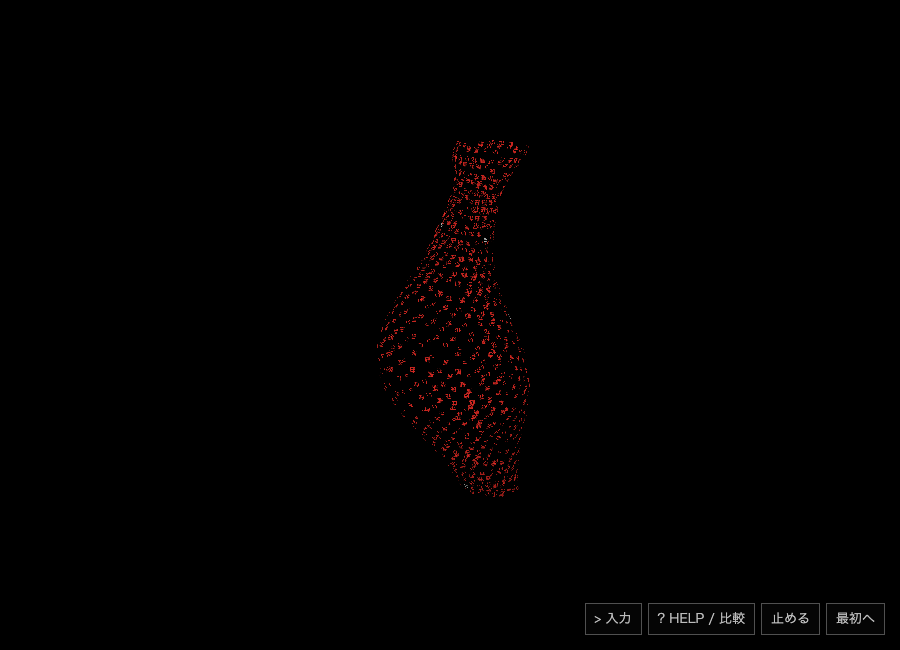

# 今回の実装確認

## 独立した確認

3担当へ、人工seedと学習/dev監査、凍結holdoutとJS移植照合、UI・教師文レビュー・standalone encoderを分担。モデル・データを固定する前にholdout本文は作成担当へ渡さず、学習した後に全244文を1回だけ評価した。生の返信と凍結hashを保持する。

- [独立244文](evaluation/REPORT.md): 6方式1,464返信。想定形の許容集合と属性、hold誤反応、部分文字列共有を別集計。
- [同じ244文×2の移植一致](evaluation/runtime-parity/REPORT.md): Python→ブラウザ用JSで形・hold・3属性・候補順488/488一致。モデル・gatesを変えた再評価ではない。
- [全5候補のtrain/dev監査](training-review/README.md): 分割・由来・全選択headのdev予測・source/model hashを別担当が確認。
- [独立encoder90fixtureとCPU計測](../../prototypes/glyph-creature/src/task-student-v1/static-runtime/REPORT.md): feature誤差、境界、load、数値buffersと全Node RSSを分ける。
- [UI/公開経路レビュー](preview-review/PUBLIC-REPORT.md): 旧7公開ref保持、材料先行追加、hold、非同期reset、cache、相対assetとhashを確認。private pathを置換した公開コピーで、元の点検記録はローカルへ残す。

## 画面と動作

作成担当は実際のCodex in-app browserでEnter→日本語paste→Enter→HELP→6方式比較を操作。赤い文字が花瓶の表面になる、次の白い文字が加わる、holdでも文字が追加され花瓶が残ることを画面で確認した。ブラウザerrorログ0。[実操作記録](evidence/root-ui.json)。

`白い全体を細くして縦に伸ばした花瓶` はlongを選んだが、widthはneutralとなり、細さの指示は認識できなかった。この失敗を修正するための再学習は行っていない。日本語pasteの確認を実IMEの全般的確認とは呼ばない。

初期のheadless Chromeでは、60形・長さ1.65/幅0.65/曲がり0.35・1,536描画で有限な値を確認。holdで材料と色の追加、hidden時のtimer停止、idle時に推論を繰り返さないことを確認した。これは意味encoder接続前のUI確認である。

このPNGは**意味encoder接続前のrules表示**。意味推論の成功例、最終版の画面記録、全widget資源の測定として使わない。

4つの形変形確認とTypeScript checkが通り、Web配布buildが完了。配布にモデルMIT、tokenizer Apache-2.0、Three.js MIT、出所NOTICEを同梱した。build時の674KB JS chunk警告は残る。既存Three.js描画を再利用し、runtimeにTransformer/ONNXは入れていない。

## CPU・資源

static encoder＋headの単独Node/Apple M5測定で、短文p95約0.027ms、512文字の日本語境界p95約0.324ms。ローカルread・hash・parse・encoder構築と2head読込合計約39ms。process全体peak107.20MiB。数値buffers10.16MiBと全process RSSは違う指標である。

この値にブラウザ・GPU描画・文字atlas・OS入力・長時間観測は含まれない。モデル8MiBでも全widgetが8MiBとはならない。encoder/読込headはhidden/reset後もcacheに保持し、hiddenでは描画timerのみ止める。全widgetでのRAM解放・電力低下・一般16GBノートPCの達成は報告しない。

## 公開範囲

AI作成の入力文、推論原票、学習した小head、MIT日本語モデルの変換表とtokenizer、コードと方法を公開。実ユーザー本文・参考本・画像・API鍵・個人のローカルpathは含めない。Bonsai4/8B教師重みを同梱しない。教師serverは所有PID/commandを確認して停止済み。自動継続やスリープ防止はこの実験で新たに設定していない。

既定の旧アプリは変更せず、新タグ・`/task-student-v1/` にのみ追加する。独立評価で否定に重大な誤りがあるため、全アプリ入力を自動で解釈するエンジンへは採用しない。新URLは、明示的に入力して表現と方式を比べる研究試作。
