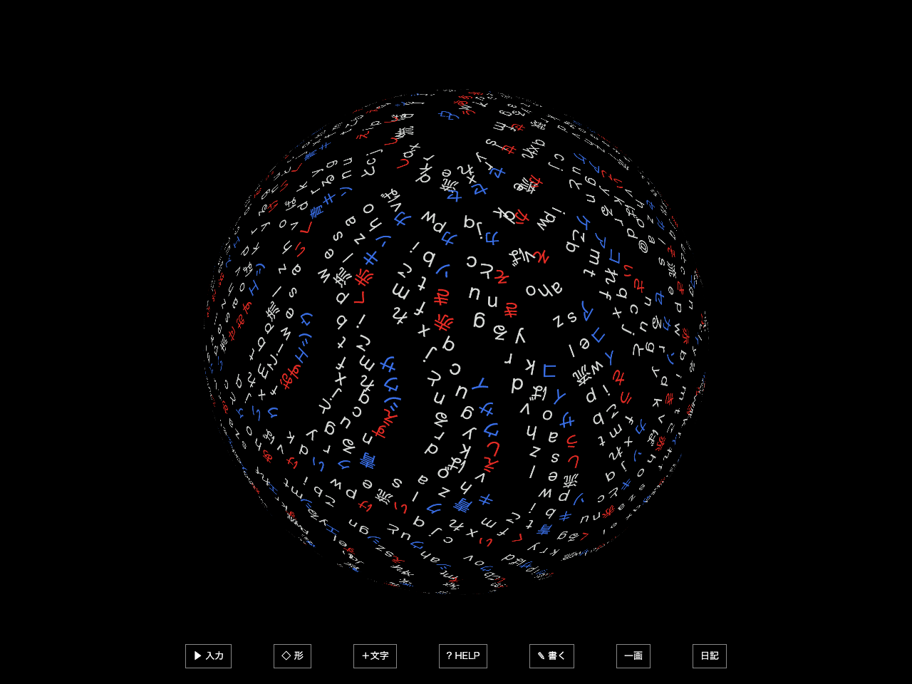
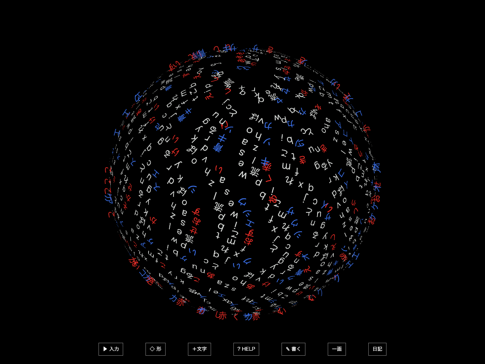
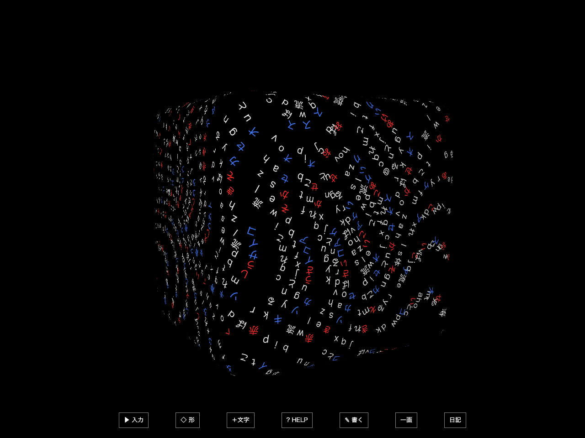
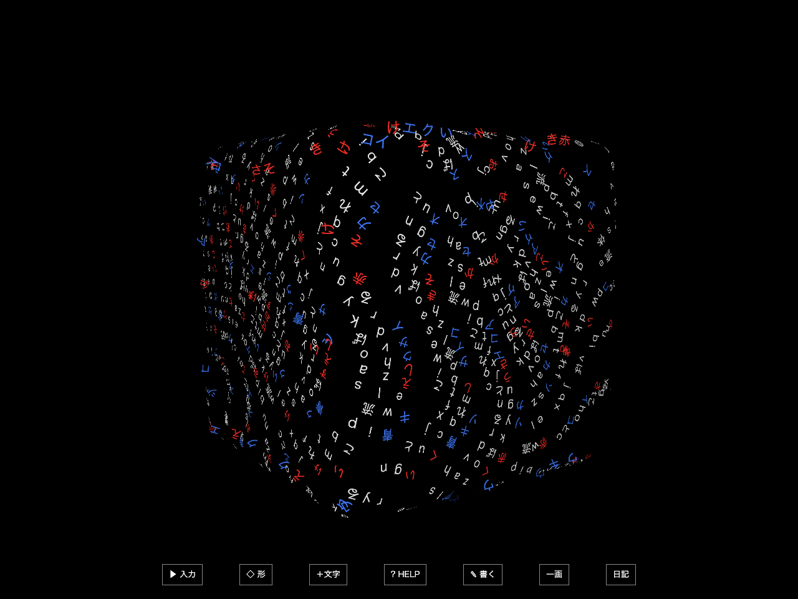

# 色付き文字が輪郭を巡回する比較版

版 `0.9.1-contour.1` / 2026-09-30 / branch `experiment/glyph-contour-v1` / 基点 `5bba69c`。

手続き的な表面版から分岐し、既にある文字の一部が、面から輪郭へ寄り、巡回して面へ戻る表現を試す。形と語彙を増やす版とは別の実験。元の4173・4194の作業コピーは変更しない。

## 試す

1. `http://127.0.0.1:4196/` を開き、Enter。
2. `白い文字が球体の表面を流れる` を送る。少なければ「＋文字」で増やす。
3. `赤いあいうえおかきくけこ` を追加する。青など別の色も追加できる。
4. 「? HELP」→「輪郭の実験」から「色付き文字が巡回」を選ぶ。入力枠は × / Esc で閉じる。
5. 「なし」「輪郭を強調」と比較する。`立方体`、`呼吸する球体` も試せる。

既定は「なし」。形は引き続き22種類あるが、輪郭の実験は**単体の球・立方体、通常 / 呼吸**だけ。メビウス、波、複数の形、鎖では元の面表現を保つ。「なし」へ戻すと文字はゆっくり面へ戻る。停止は HELP の「止める」。

白と自動の赤→白は巡回対象にしない。赤・青・黄色など、入力で指定された色の文字から固定IDを選び、字形・色・総数を保つ。コピー文字を輪郭へ追加する仕組みではない。

## 見え方と修正

| 比較 | 表面だけ | 輪郭を巡回 |
| --- | --- | --- |
| 球 |  |  |
| 立方体 |  |  |

[回転後の立方体](evidence-v4/cube-rotated.png) / [少数文字](evidence-v4/sparse.png) / [文字追加後](evidence-v4/dense.png) / [輪郭付近の強調だけ](evidence-v4/sphere-emphasis.png)。比較の各画像は同じ入力列から撮った別時刻で、停止位置を一致させた画素差分ではない。

- 初回は巡回へ選ぶ文字が少なく、輪郭の変化が弱かった。1回の追加から最大80字まで選ぶよう調整した。文字の多くは面へ残る。
- 最初の文字だけで巡回枠が埋まらないよう、大きい文字群は160字単位で順番に動かす。後から追加した色も参加し、交代時は元の面へ戻す。交代の短い補間中は前後の群が重なる場合がある。
- 文字数が少ないと面への整列が弱く、輪郭の文字まで真横で消えていた。巡回に入る文字だけ字面を視点へ向ける。
- 立方体を回したとき下端が操作部へ重なったため、この比較版では立方体の画角へ余裕を追加した。
- `evidence-v1`〜`v3` は調整前の比較として保持し、`evidence-v4` を最終確認として扱う。

## 実装の範囲

- 球は透視投影の輪郭となる円を、現在のカメラ位置から求める。物体の赤道を固定でなぞる方式ではない。
- 立方体は元の `cubeSurface` と同じ丸いL12曲面へ辺の経路を投影する。角を滑らかに曲がり、見えている辺を巡回する。カメラから背を向ける経路上の文字は面の法線で隠す。
- 文字の面→輪郭→面への移動も球 / 丸い箱の表面へ投影し、中心を貫通させない。文字ごとに来訪時刻をずらす。
- 字面は表面での向きから、輪郭の接線と視線で作る向きへ徐々に変える。元の `inkColor` を使い、勝手に全体を赤くしない。
- 形の切替・ドラッグ・停止は元の操作と同じ。物理流体計算、モデル、追加素材、外部APIは使わない。
- この版の「輪郭を強調」は、面の文字が輪郭付近へ来たとき見えやすくするだけ。「色付き文字が巡回」は文字の位置そのものを輪郭の経路へ動かす。二つを区別して比較できる。

## 実際に確認したこと

- 単体テスト **88件 / 16ファイル**が成功。追加6件で、透視輪郭、経路の連続性、元の曲面への整合、面と輪郭の行き来、群の交代、対象の制限を確認。
- 型検査・配布ビルド成功。約597 KBの通常入口に既存の500 KB超チャンク警告は残る。
- [ブラウザの26条件](evidence-v4/results.json)が成功。普通の入力欄から白→赤→青を追加し、切替、字形・色・数・IDの保持、停止、ドラッグ、後から追加した黄色の参加、メビウスへの切替、色を指定しない入力を確認。立方体の背面に回った経路の文字が隠れる状態も確認。ブラウザ例外・コンソールエラー・外部リクエストは0。
- 比較画面は1280×960、Chrome headless / macOS。時刻を30 Hzで進めた比較であり、一時間の実時間観測ではない。
- [実時間の描画観測](realtime.json)：3,777文字、120フレームの準備後に600区間を測定。Apple M5 / Chromeで中央値16.7 ms、p95 16.7 ms、p99 16.8 ms。これは約10秒のこのMac上の確認であり、一般PCでの性能保証ではない。
- 従来の全ブラウザテストは今回再実行していない。既存の証拠画像は上書きせず、新しい比較はこのフォルダへ保存した。

## 再現

`prototypes/glyph-creature` で実行する。

```sh
npm ci --ignore-scripts
npm run dev
npm test
npm run build
npm run test:contour
```

ブラウザの比較だけを保存し直す場合、リポジトリのルートで `node experiments/contour-v1/check.mjs latest`。出力先は `evidence-vlatest`。番号を変えると新しい比較を並べて残せる。実時間の短い観測は `node experiments/contour-v1/realtime.mjs`。

## 残る制限

メビウスの自己遮蔽、凹んだ形、波打つ曲面には一般の奥行き判定が必要で、今回は対応しない。丸い箱の辺を通る文字は、投影された辺が短くなる視点で重なりやすい。輪郭を構成する文字が少ないと、線としては途切れる。群が大きい場合、後の文字が巡回へ参加するまで待つ。

輪郭の選択状態は保存データへ追加していないため、ページを読み直すと「なし」へ戻る。過去の日記・入力の形式は変更していない。実OSの日本語IME、Windows、Safari、実機のスマートフォンは今回未確認。
