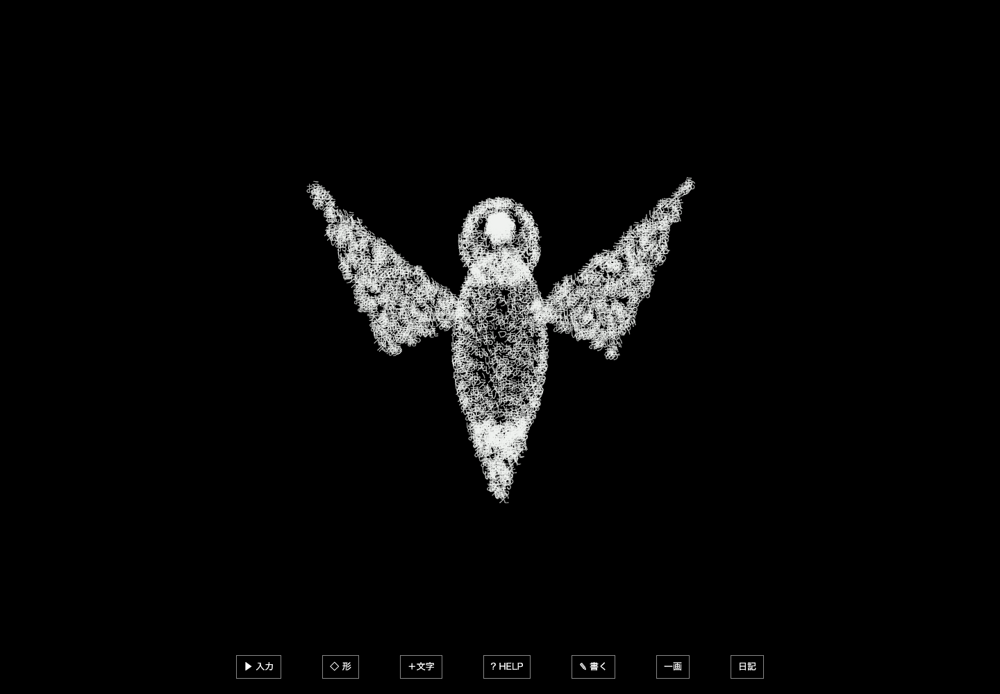
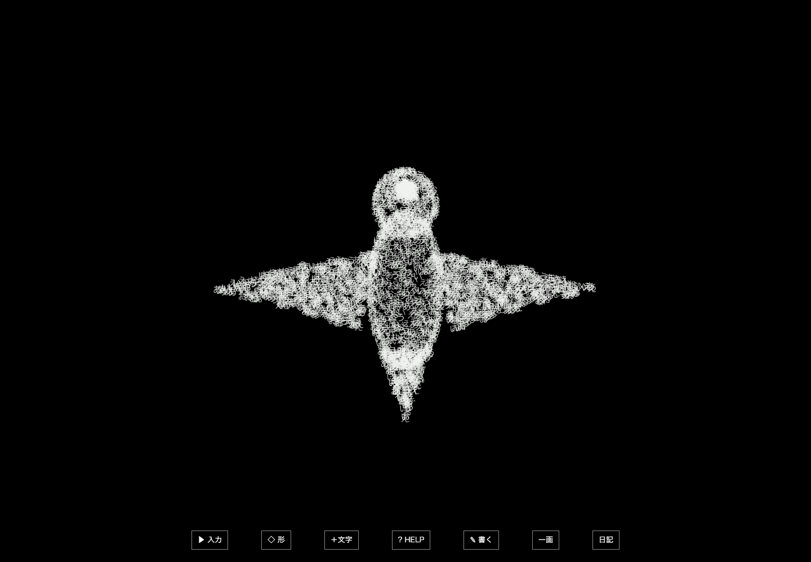

# 根性版 — 生き物の骨格と文字の表面

2026-10-01 / `0.11.0-rigs.1` / `feat/glyph-creature-rigs-v1`。基点は回転・クラゲ版の`3266371`。4197の版を保持して4198へ分岐した。

## 試す

[通常画面](http://127.0.0.1:4198/)でEnter、`表面 白い鳥 通常`、`表面 青い魚 通常`、`表面 緑の蛇 通常`などを入力する。短い入力なら「＋文字」で密度を増やせる。形の指定から60秒後には従来の自動巡回が再開する。見続ける場合はHELPで形の自動切替を止める。

今回は鳥・魚・蛇に共通の骨格処理を入れた。従来の60形、語彙、文字の流れ、入力ごとの色、執筆・日記・クラゲの拍動を引き継いでいる。HELPの停止で骨格も停止し、ドラッグで向きを変えられる。[執筆欄](http://127.0.0.1:4198/?write)も同じ描画を使う。保存領域はポートごとに分かれ、既存版のデータには書き込まない。

| 生き物 | 骨格 | 動作 |
| --- | --- | --- |
| 鳥 | 胴・首・左右の肩と翼先・尾、計7本 | 肩を軸に約6秒で羽ばたき、翼先と尾が遅れて動く |
| 魚 | 頭から胴・尾元・尾先へ、計4本 | 約4.8秒で左右に尾を振り、背びれも胴に追従する |
| 蛇 | 頭から8個の背骨へ、計9本 | 約7.6秒で頭から尾へ曲がりが伝わる |

## 共通の仕組み

`creature-rig.ts`でThree.jsの実際の`Bone`親子階層と`Skeleton`を作る。初期姿勢の逆変換を保存し、関節を回すたびに現在の骨の変換と組み合わせる。表面の各位置に最大3本の骨の影響を設定し、重み付きで位置を変形する。鳥の肩を動かすと、その子である翼先も動く。

文字は従来の薄い平面のまま、変形した表面に沿って流れる。骨格は文字の本文・色・数を変更しない。姿勢だけでなく、変形後の周辺位置から面の向きも求めるため、文字の傾きも身体に追従する。通常の`SkinnedMesh`へ置換するのではなく、既存のインスタンス描画へCPUの線形ブレンドスキニングを組み込んだ。

骨の行列は同じ生き物・同じ時刻で共有し、文字ごとに計算しない。最大16体の異なる時刻を保持するキャッシュを用意した。骨格・文字・全体の回転は共通の描画時刻で動き、停止中に別時計だけ進むことを避ける。鳥と蛇の旧座標揺れは初期形の位置へ固定し、今回の関節運動へ置き換えた。

参照した一次資料: [Bone](https://threejs.org/docs/pages/Bone.html)、[Skeleton](https://threejs.org/docs/pages/Skeleton.html)、[SkinnedMesh](https://threejs.org/docs/pages/SkinnedMesh.html)。実際の行列更新は導入済みThree.jsの`Skeleton.update`実装も確認した。これは手続き的な関節運動であり、物理計算や動物の動作学習ではない。

## 比較と確認

- 単体98件 / 19ファイル、型検査、通常と筆画の配布ビルドが成功。初期姿勢の復元、親子運動、重みの合計、長い時刻での有限性、表面の向き、16体の姿勢共有を確認した。
- 関連ブラウザ13件が成功。今回の6件と、クラゲの3件、根性版の語彙・入力色・メニュー・執筆・周期の4件。従来の全ブラウザ試験を再実行した意味ではない。
- 実入力から鳥・魚・蛇を作り、3つずつの姿勢を画像比較。停止中の画像一致、赤い文字を足しても前の本文と色が残ること、1回の描画呼び出しを確認。例外・console error・外部リクエストは0。
- 390×844で8羽の鳥を表示し、1フレームの骨更新が8回以下であることとドラッグ後の有限性を確認。
- 3形を6秒ずつ36回、216秒分の描画時刻へ進めた。各時刻で表示が残り、明るい文字が画面端へ接しない。実時間の216秒観測とは異なる。
- 32,000文字の鳥を通常の描画ループで短く観測。120区間の中央値21.7ms、p95 22.0ms、骨更新120回、1回の描画呼び出し。このMacのChrome headlessでの結果で、一般的なPCの性能を保証するものではない。[実測](evidence/realtime-32000-bird.json)。
- 性能試験の初回は、HELPを閉じて繰り返し選択が隠れたままになり時間切れ。テストの操作を現在の表示状態へ合わせ、再実行して成功した。アプリの機能を変更して試験を通したものではない。
- 横のブラウザでも入力して表示を確認。実OSの日本語IME、Windows、Safari、本人による今回の動きの評価は未確認。配布ビルドには既存の500kB超のチャンク警告が残る。

[鳥の関節記録](evidence/bird.json) / [魚](evidence/fish.json) / [蛇](evidence/snake.json) / [周回](evidence/turns.json)。旧検査の出力もこの実験の`regression/`に保存し、前の実験記録を上書きしない。

## 次の展開と限界

共通処理へ「関節の位置と親子関係」「表面に対する重み」「動作」を足せば、蝶・亀・蜘蛛などへ順に広げられる。まず骨の連動を見分けやすい3形で仕組みを確かめた。全60形や全生き物に骨格を追加した版ではない。

現時点の形は根性版の数式から作った表面で、外部の3Dモデルやアニメーションは読み込んでいない。将来、骨格付きglTFモデルを使う場合は、その頂点・面・スキンウェイトを文字の配置へ引き継ぐ別経路を作る。任意のモデルへ自動で骨格を付ける仕組みは未実装。生き物らしさは本人の試遊で調整する。

## 再現

`prototypes/glyph-creature`で`npm ci --ignore-scripts`、`npm run dev`。検証は`npm test`、`npm run build`、`npx playwright test tests/creature-rigs.spec.ts tests/konjo-motion.spec.ts tests/konjo.spec.ts`。モデル、追加素材、外部APIは必要ない。
