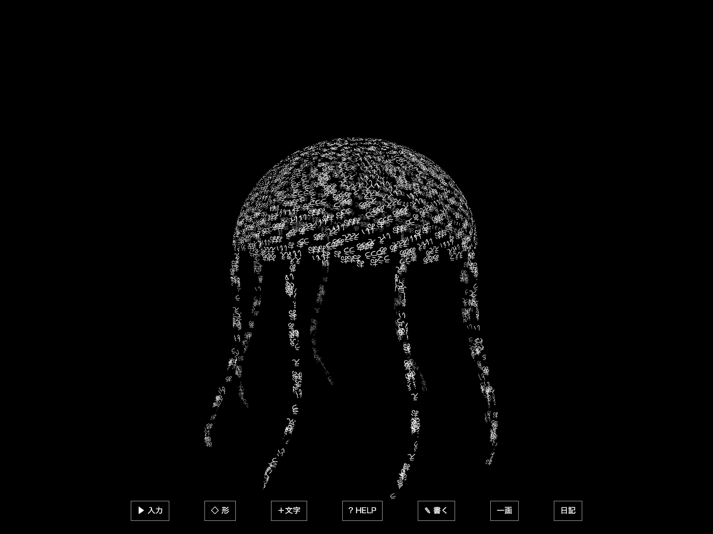

# 根性版 — ゆっくり回る見え方とクラゲの拍動

2026-10-01 / `0.10.1-konjo-motion.1` / `feat/glyph-konjo-motion-v1`。基点は60形版の`3d765ff`。

## 試す

[通常画面](http://127.0.0.1:4197/)でEnter、`表面 白いクラゲ 通常`を入力する。クラゲの固有の拍動は「呼吸」などの指定がなくても動く。`呼吸する青いクラゲ`なら従来の全体の呼吸も重なる。少なければ「＋文字」で増やせる。

HELPの「止める」で全体の回転・文字の流れ・傘と触手が止まる。ドラッグで向き、ホイールで距離を変えられる。[執筆欄](http://127.0.0.1:4197/?write)も同じ描画を使う。従来の60形と語彙・周期変更を保持する。元の4195は別の作業コピーに保存し、このポートの保存データは別領域。

## 変更

- 元の全体回転は0.025rad/s、約4分11秒で一周だった。球やクラゲは軸対称で変化を見分けにくい。今回は0.03rad/s、約3分29秒へ調整し、上下に約5度、約165秒周期の緩やかな傾きを加えた。カメラの位置を移すのではなく、既存の表示物を回す方式。手動で付けた向きに自動角を足す。
- クラゲの傘は7.2秒周期で半径を約10%縮め、高さを約6.5%伸ばす。小さな浮沈と縁の揺れも重なる。
- 8本の触手の根元を、動く傘の縁へ合わせた。先端ほど遅れて異なる位相で揺れる。文字の位置と面姿勢は同じ変形した表面から求める。
- 全体を回した比較で、横長画面の一方向だけ端に明るい1画素が現れた。クラゲにだけ約6%の画角余裕を足し、一周を再確認した。
- すべて既存の時刻から動かす。停止中に別の時計で動き続ける処理は追加していない。物理流体・生物シミュレーションではなく、手続き的な形の動き。

## 確認

- 単体94件 / 18ファイル、型検査、通常と筆画のビルドを通過。傘の幅と高さの変化、拍動中の全触手の根元の接続と滑らかさを確認。
- 関連ブラウザ9件を通過。今回の3件に、60形版の語彙・入力色・メニュー・執筆・周期の4件、従来の呼吸と大量文字の2件を合わせた。従来の全ブラウザ回帰は再実行していない。
- 1200×900と390×844のChromeで、呼吸を重ねたクラゲを6秒ずつ36回、計216秒の時刻前進で一周以上（約371度）比較。各サンプルで有限性・明るい文字が画面の端に触れないこと・文字数の保持を確認。これは実時間の216秒観測ではない。
- 「止める」の前後でキャンバス画像が一致。ドラッグの角度、ホイールの距離、再開後の時刻が変わることを確認。語彙のブラウザ検査では例外・console error・外部リクエスト0。
- 横のブラウザで通常の入力を送り、吸収と立体表示を実際に確認。実OSの日本語IME、Windows、Safariは今回未確認。

[横長の記録](evidence-v2/jellyfish-1200.json) / [縦長の記録](evidence-v2/jellyfish-390.json)。`initial-partial`には初回の短い周回と修正前の画面を保存し、最終確認は`evidence-v2`へ分離した。

全体の周期変更は従来どおりなので、入力でクラゲを選んだ後、一定時間すると他の形へ移る。クラゲを見続けたい時はHELPの形の自動切替を止められる。

## 再現

`prototypes/glyph-creature`で`npm ci --ignore-scripts`、`npm run dev`。確認は`npm test`、`npm run build`、`npx playwright test tests/konjo-motion.spec.ts tests/motion-art.spec.ts tests/konjo.spec.ts`。
