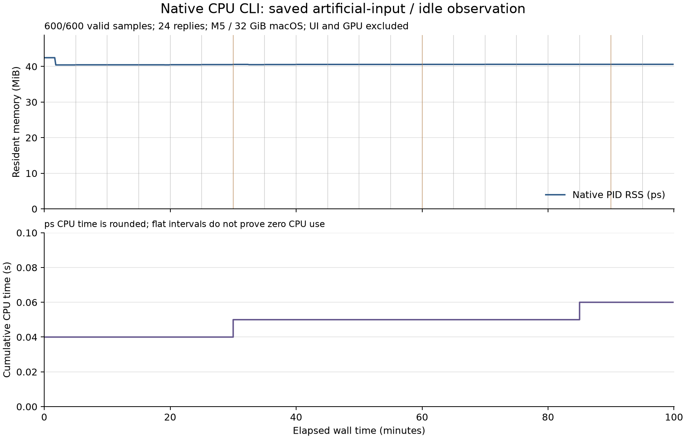

# 固定日本語CLIの100分観測 R1

2026-10-03。固定したSwift R5 CPU CLIを、人工入力の間に待機させた。100分枠6000.0133435秒を完走し、stdin EOFで通常終了した。実行sessionもexit0、終了後にdriver/time/nativeの3 PIDは存在しなかった。固定8入力のbyte/SHAは開始・終了で不変。

| 原票の母数 | 結果 |
| --- | --- |
| 通常の短い人工文 | 4文を循環し、300秒ごとの予定20件すべて返信 |
| 4000 Unicode scalarの反復文 | 4件すべて4001 tokensでtoken_limit保留、ranks=[]。長文のembedding/ranking完了4件ではない |
| native PIDのps標本 | 10秒間隔の600件、600件有効、missing0 |
| nativeのtime -l | real5999.96s、user0.05s、sys0.00s、maximum RSS44,531,712B＝42.46875MiB、peak footprint35,127,800B＝約33.50MiB |
| ps RSSの範囲 | 42,401,792〜44,531,712B＝約40.44〜42.47MiB。最後42,582,016B＝約40.61MiB |
| 通常返信のdriver往復 | median0.630ms、min0.536ms、max22.365ms。process起動・描画・全工程遅延を含まない |
| 長い反復文のdriver往復 | median3.367ms、min2.874ms、max3.769ms。トークン化と保留の経路 |

最後の通常queryは5700.166秒で送信、最後のpsは5990.104秒。最終標本から終了まで約9.909秒ある。最初のpsは0.048秒、ps間の観測区間は約5990.056秒で、100分全体と同一母数ではない。EOF後の子process終了とdriver SUMMARYの時刻も分ける。

`time -l` のuser+sys/realから1コア換算の参考CPUは約0.001%。表示が0.01秒単位へ丸められているのでCPU完全0としない。psの累積CPU表示は0.04→0.06秒で、time -lの表示丸め・取得点と異なる。driver/ps/Git/他アプリの資源は母数に含めていない。通常host上で並行作業があり、静かなhostを統制した性能比較ではない。

灰色の縦線は通常query、橙色は長い反復文。重なる0分は別の入力2件である。図は実行開始後・最終値を見る前に作図方法を固定し、終了後にMatplotlib 3.11.2で原票だけから生成した。図のための追加native/model/ps実行は0。横線や小さなRSS増分から、リーク不存在・省電力を証明しない。

## 結論と限界

この固定CLIでは、モデル表・tokenizer・説明候補を保持した人工query/idleを100分運べた。長期表示のあるwidget全体、全アプリ入力、8時間の利用、GPU負荷、電力、16GB Windows/Intel/AMD laptop、自然な文章の意味精度の達成ではない。CPU CLIのRSSと、13形の短い実窓charged footprintを足して全アプリの実測とはしない。

R5自身の外側JSONL行はboundedではなく、診断返信に人工本文/token/pieces等がある。[別の本文なし入口R2](../native-static-wire-v1/README.md)はその境界を整えた別候補で、この100分runには使っていない。新しい入口の100分達成と混ぜない。既定60形Web・13形Release・旧モデル/保存/URLは変更していない。

[独立した保存原票の算術監査](../native-static-longrun-review-v1/REPORT-R1.md)は別記録で、追加のnative実行ではない。sourceに残る初期PID発見のcleanup境界、write戻りbyte未照合、progress JSONの非atomic更新、PID開始identityの未保存、freeze drift時にSUMMARYが欠け得る点は、今回の正常終了で一般解決されたことにはしない。

## 方法と再確認

[事前METHOD](METHOD-R1.md)、[query定義](QUERIES-R1.json)、[固定8入力](FREEZE-R1.json)、[開始記録](RUN-R1.json)、[最終SUMMARY](SUMMARY-R1.json)、[24返信](QUERIES-RAW-R1.json)、[600標本](SAMPLES-R1.json)、[time -l](TIME-R1.log)、[作図方法](PLOT-METHOD-R1.json)、[図と原票のSHA](FIGURE-R1.json)。原実行driverはRUN存在時に再実行を拒否する。再試験は同じrepoの新しいexperiment folderにdriver/定義/固定記録をbyte同一で複製し、モデルとsourceのhashを確認して行う。元の保存原票を上書きしない。

モデルの取得・固定revision・配備の制限は[元R5の公開入口](../native-static-japanese-v1/PUBLIC-README-R6.md)。本比較でモデル取得、再学習、意味の新しい採点、UI/OS/人の評価は行っていない。
