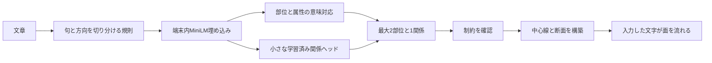

# 文章から部位を組み立てる比較

v0.12の単一形状版を残し、部位の意味・部位ごとの寸法・接続関係を分けて扱う実験。制作中の記録は[STATUS](STATUS.md)。評価前の結果をここへ書かない。

初回Enterで入力欄。文章をEnterで送るとその文字が材料になる。HELPから例、密度、色、解釈方法を選ぶ。モデル準備は初回約128MB。公式モデルの取得だけが外部通信で、文章の推論はCPU/WASMのWebWorker内。指定色は今回の文字だけ。文字のない黒い画面に説明文を常時置かない。

「根性」は指定語と関係の規則による比較対象。小型モデルでは埋め込みと学習した関係ヘッドを使う。句の境界・日本語と英語の親子方向・否定を全てモデルが学んだとは扱わない。未知語、否定、関係が不明、3部位以上は今の形を保持する。保持に要した短時間を新しい形の生成成功と数えない。

Programはsphere/box/tube/blade/ring/vase、部位ごとのheight/width/depth/bend/twist、end/above/throughを持つ。コンパイラの中心線・断面・曲面チャートは実データ。各文字は接線に沿う平面として描き、全体のゆっくりした回転と表面の流れを保つ。任意の点群、実行コード、ファイル指定、範囲外値は受け付けない。

学習・調整と、独立担当が先に凍結した人工評価を分ける。初回評価後の修正は回帰確認。測定は文章確定から解釈・構築・最初の描画・吸収終了までを分け、初回モデル準備やキャッシュ後の準備も別に示す。16GB laptop CPU/iGPUでの実測はまだ行っていない。

歌詞からMV、任意の物体を細密メッシュへ変換する処理、自動リギングは今後の案。今回は既知primitiveの新しい構成を作る。

接続を優先するため、貫通する子の径や長さを調整する場合がある。入力のsource寸法と、描画するeffective寸法・adjustmentsを別に残す。初期のthroughは子が輪・管・刃の場合を対象とし、他の子部位は保持にする。調整された径をモデルが直接指定した値と混ぜない。

この最初の構造版のtwistは文字の位置・流れの位相を変える処理であり、箱や刃の断面そのものを物理的にねじる処理ではない。実体のねじれは次の比較修正として分ける。bendの中心線による曲がりとは区別する。

## この版の確認

[独立評価](evaluation/REPORT.md)に初回と各回帰、失敗、モデルと規則の境界を保存。実UI回帰は28/30、同種2部位6/6、追加文4/8。128単体テスト・型・build、新UI2ケース、旧骨格6ケースを確認した。

このM5 Macでは準備後の入力から吸収完了まで3.970〜4.015秒。モデル未準備の初回は、公式モデル取得を同じ入力処理内に含めて13.839秒だった。10秒目標は冷初回で未達、30秒許容内。約8,000字・人工4倍CPU制限では約4.1秒、実フレーム間隔中央値33.3ms。16GB PCでの保証ではない。

公開入口: [program-v1](https://koseihamaya2077.github.io/glyph-matter/program-v1/)。保存点は `glyph-matter-v0.13.0-program.1`。元のroot版と `skeleton-v1` の入口を維持する。
