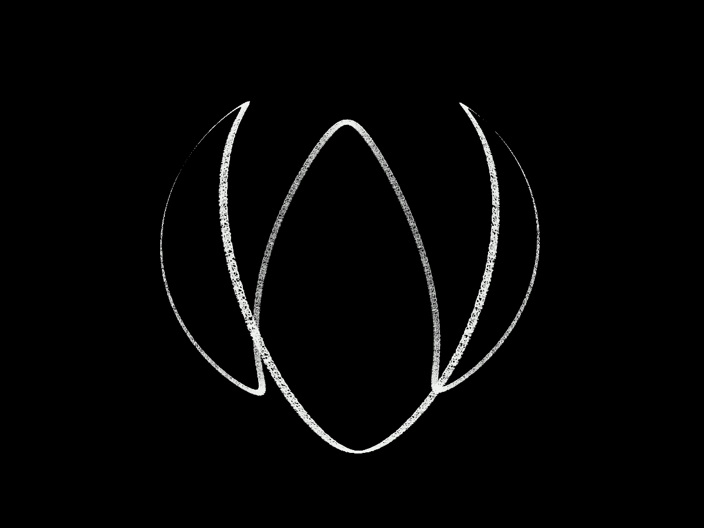
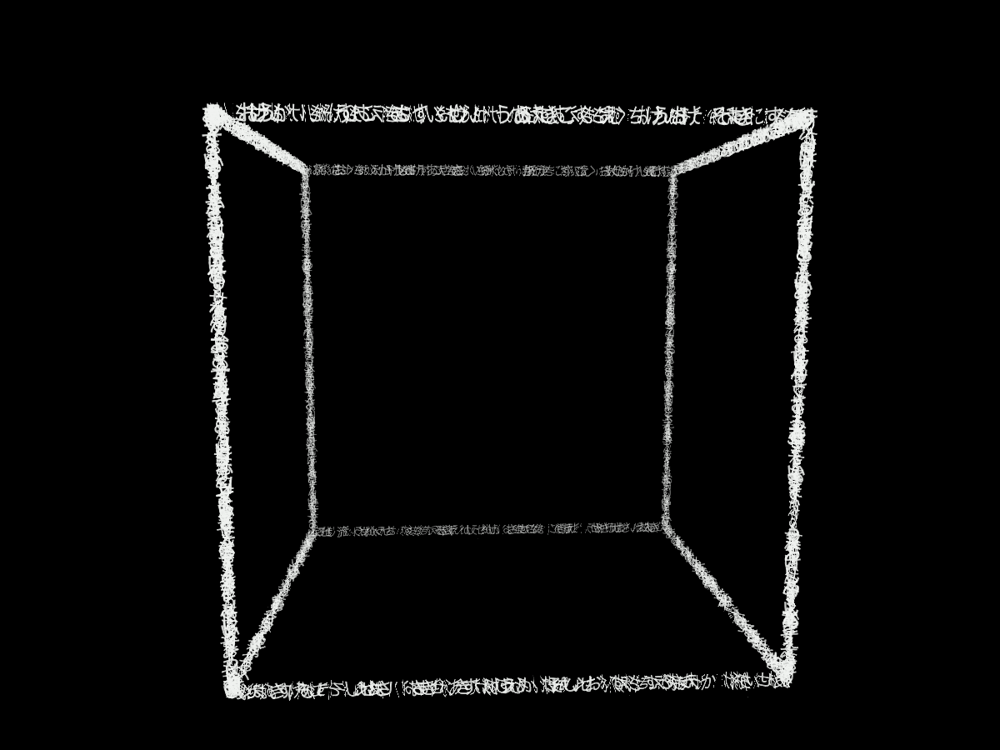
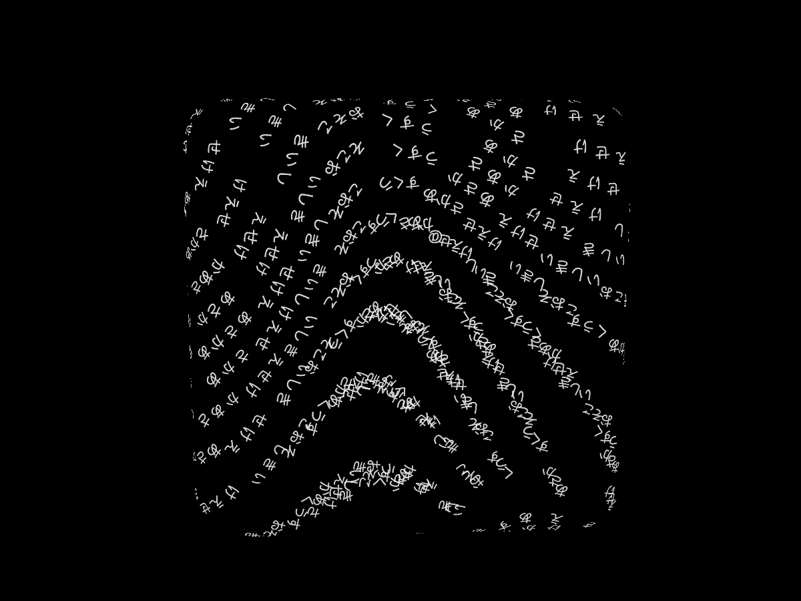
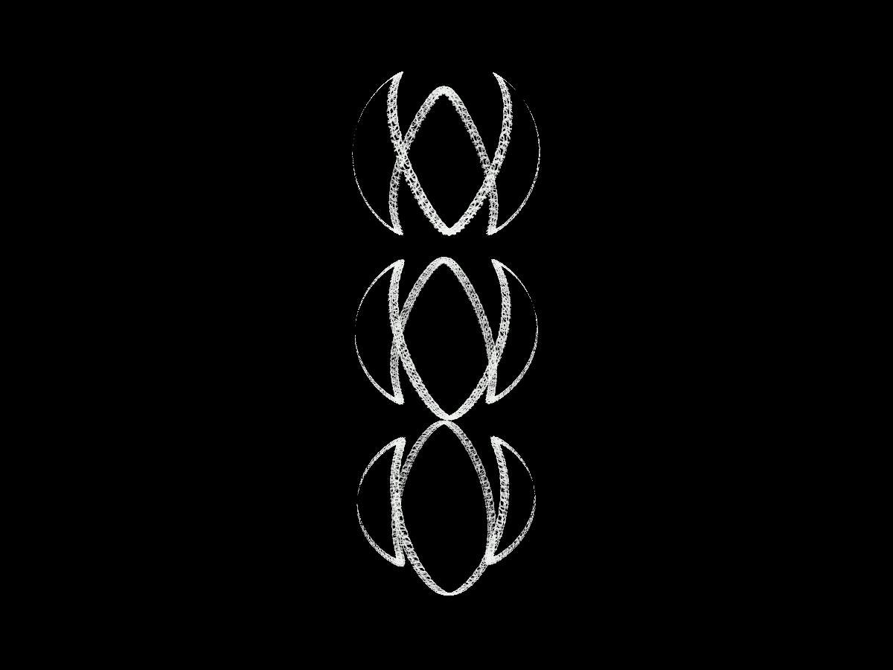
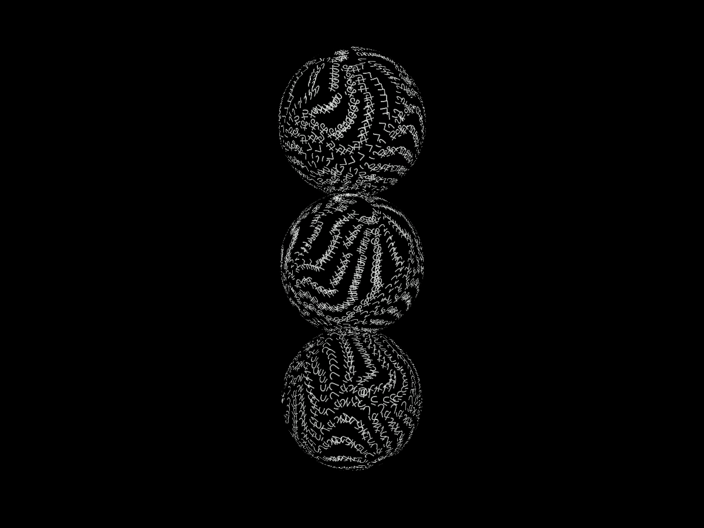

# 球体を文字の面として描く

v0.7.1 / 2026-09-30。球体が一本の曲線に見えるという試遊フィードバックへの修正。

`流れる 球体` が球面上の一本の周期曲線へ文字を集めていた。立方体・直方体・団子にも同様の面から線への切替があった。半径や座標が正しくても、表面を覆うという意図は満たしていなかった。

## 変更

- 球体・立方体・直方体・団子は、`流れる`でも`表面`でも全面を文字で覆う。
- 球面全体に文字を分布し、軸ごとに速度が変わる滑らかな回転を重ねる。球の半径を保ちつつ、表面の模様が動く。呼吸・波は引き続き組み合わせられる。
- 文字の位置と接線を同じ計算で求め、文字平面を表面へ沿わせる。
- 閉じた形の裏側の文字は、面がこちらを向く度合いに応じて滑らかに隠す。少数文字の自由回転、入力欄からの取り込み、メビウスの両面表示は維持。
- HELPの球体説明も「表面全体」に修正。古い保存データのflow指定にも反映する。

見える下地メッシュや輪郭線は追加していない。文字だけで面を見せる。これは座標変形による流体風の表現で、物理流体ソルバではない。メビウス・円環・平面図形は既存の面／流路の区別を保つ。

## 比較

v0.7.0（1a7ff7e）と今回の版。合成入力、seed7、1200×900、同じ文字数、正確なt12秒。元のユーザースクリーンショットや入力原稿は使用していない。

| v0.7.0 | v0.7.1 |
| --- | --- |
|  |  |
|  |  |
|  |  |

中央部を96区画に分け、文字の画素がある区画を測定。球2048字は36→90区画、8192字は35→96区画、立方体2048字は19→91区画になった。形の外枠だけが大きくても合格にしないための確認で、好ましさの判定ではない。[旧結果](qa/baseline/results.json)・[採用結果](qa/final/results.json)。

512字、2048字、8192字の球、2048字の立方体・団子をt12/t20で撮影。5ケースとも文字数一致、有限な座標、ブラウザ例外なし、画面外縁6pxへの接触なし。512字は隙間が多く、密度は入力文字数に依存する。

中間案candidateは全面に分布させた段階。裏側の文字が透けて二重に重なるため、採用版finalでは手前の面を見せる処理を加えた。candidateは入力後に時計を停止したためt12に最大0.05秒程度のずれがあり、正確な同時刻比較はbaseline/finalを用いる。

## 検証と制限

ロジック65件・全54ブラウザケース・型検査・ビルド成功。ブラウザの通し確認は約1.5分。通常入力での面の分布、形ボタンによる切替後の文字・色の保持、少数文字の成長、日記と執筆保存の回帰を確認した。32,000字の球は通常RAF30区間で中央値16.7ms・p95 16.7ms・最大16.8ms（Chrome154、このMac、headlessでの短い観測）。性能保証ではない。

球面を等面積128区画に分けるロジック検査を追加。2048字を複数seed・時刻で流して95%以上を覆うことと、旧版の一本の曲線が同じ検査で不合格になることを確認。立方体の六面の内部と団子の三球も確認した。

Codex内ブラウザでも、Enter→「流れる 球体 あいうえおかきくけこ」の入力→球面への移行を実操作で確認。自動テストの日本語入力は直接入力で、OSのIME検証とは区別する。

複数個・鎖では文字の向きは従来どおり独立回転。裏側の抑制は単体の閉じた形を対象とし、物体同士の厳密な遮蔽は扱わない。旧日記の文字・色・seedは保持するが、絵は新しい描画方法に従う。旧版の見え方はv0.7.0で再現できる。
