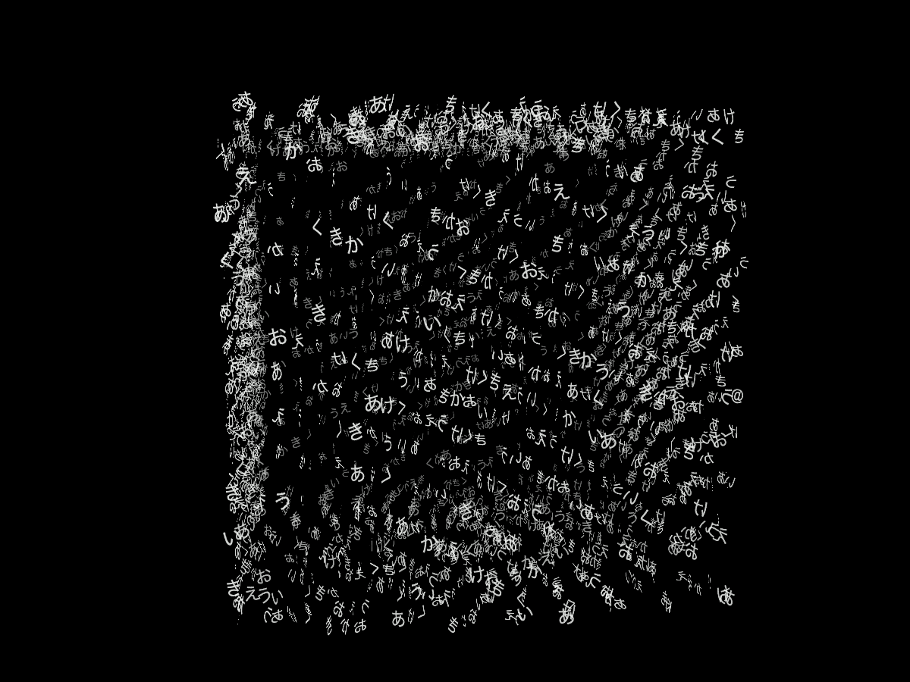
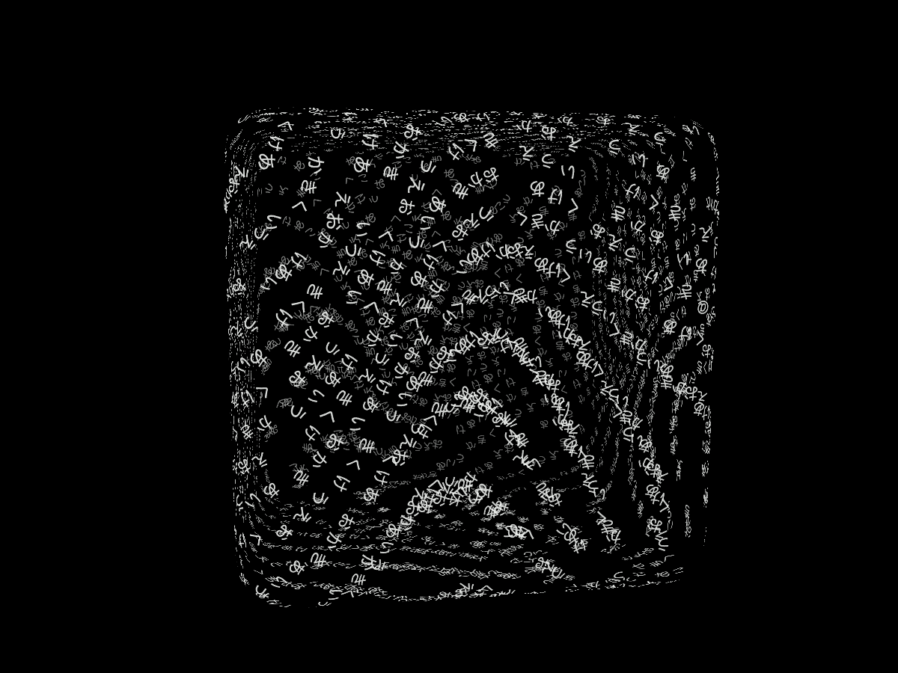
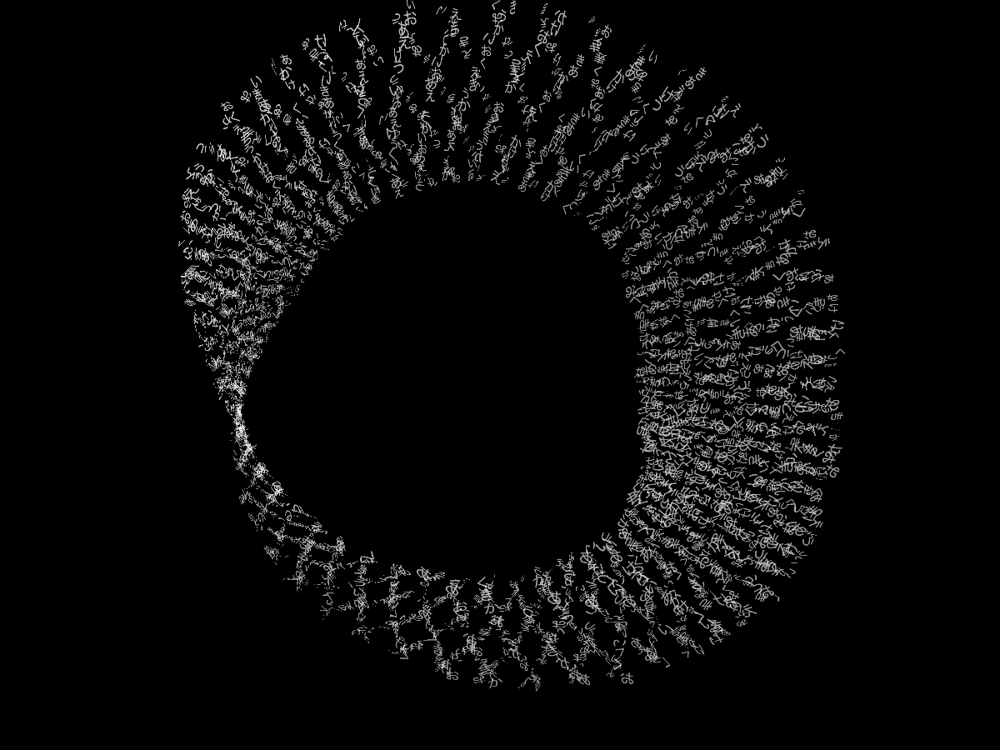
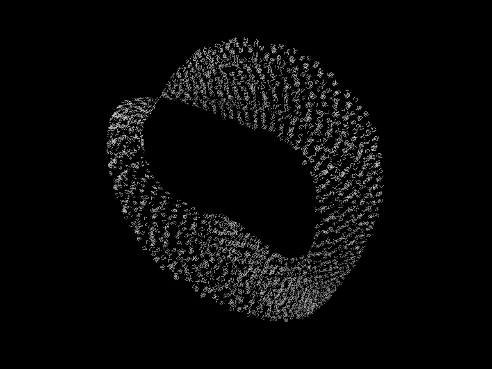
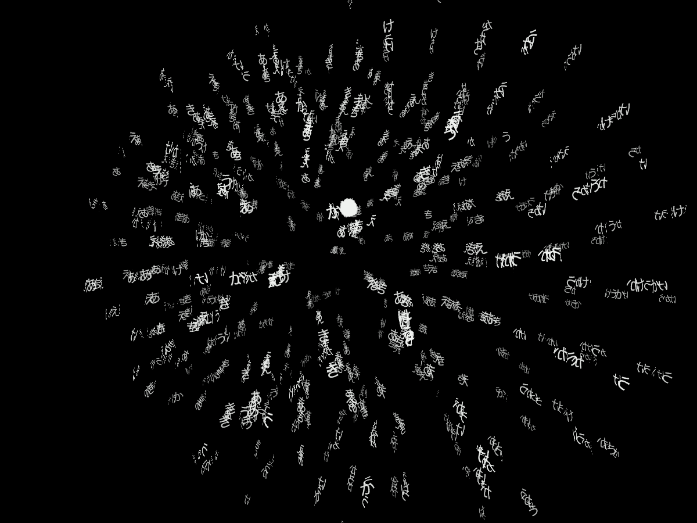
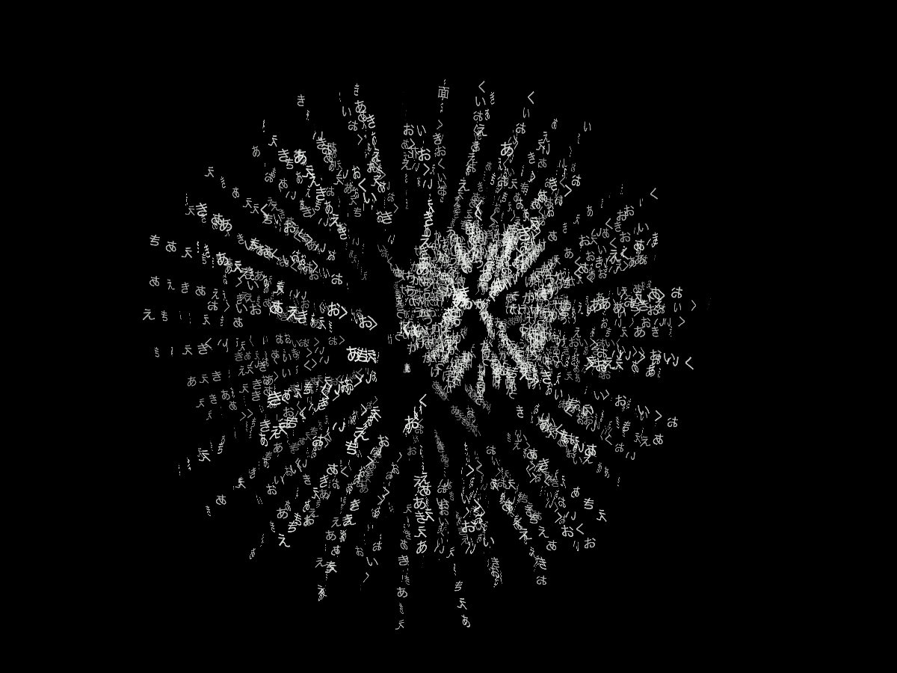

# 文字の表面と形の変形

2026-09-30の試遊フィードバックを受けた修正。UIの説明は操作に必要な文面へ、文字の流れは連続した揺らぎへ、花火はゆっくりした拡散へ変更した。v0.6.0を比較元として固定。

## 採用した表現

| 対象 | 変更 |
| --- | --- |
| 執筆画面 | 「執筆」「Enterで行を追加」「Shift + Enterで改行」へ整理。画面や操作は追加しない |
| 立方体・直方体の表面 | 文字が局所的な渦を含む流れに沿って移動。角を少し丸め、文字平面も面へ接する |
| メビウス | 帯の上の流れと、帯自体の曲がり・幅・ねじれを分離して動かす。半ねじれの継ぎ目は維持 |
| 花火 | 群・枝ごとにずらした約19〜29秒の拡散。中心へ一斉に潰れる動きと過密を抑制 |
| 文字の姿勢 | 高密度では面の接線に沿わせ、独立した回転・拡縮を抑える。少数の平面文字は回転を残す |

毎フレームの乱数で揺らす方式は使わない。同じseedと時刻で復元できる、滑らかなせん断と座標変形を組み合わせた**流体風の表現**。流体の圧力や粘性を解く物理シミュレーションではない。ユーザー入力の外部送信、新しいモデルや素材の取得はない。

## 同じ条件での比較

合成文字2,048字、seed 7、1200×900、時刻12/16/20秒。文字以外の下地メッシュ・輪郭線を足していない。

| v0.6.0 | 採用版 |
| --- | --- |
|  |  |
|  |  |
|  |  |

動画: [旧立方体](comparison/baseline/cube.webm) / [新立方体](comparison/final/cube.webm)、[旧メビウス](comparison/baseline/mobius.webm) / [新メビウス](comparison/final/mobius.webm)、[旧花火](comparison/baseline/fireworks.webm) / [新花火](comparison/final/fireworks.webm)。動画はブラウザ録画のため実行負荷による時間の伸びを含む。厳密な比較時刻はPNGと各results.jsonを参照。

中間案candidateでは花火の白い密集が残り、最下端にも文字が触れた。最小半径を増やし、最大半径と距離を調整したsettledでは解消。続くt8〜60秒の確認でメビウスがt28/29に画面の最上段まで触れたため、最大の歪みを見込む一定の距離へ変更したfinalを採用。瞬間的な大きさへカメラを追従させない。

## 確認

ロジック63件・全51ブラウザケース・型確認・ビルド成功。通し実行は約1.6分。

- 数式: 半ねじれと4πの帰還、位置の微小差分と解析接線の一致、立方体表面の保持、長時間の有限性と連続性、seed再現を確認。省略可能な接線の片側指定も検証。
- 位置と接線の共有計算が、別々の計算と一致することを検証。描画での二重計算を減らした。
- 合成文章で形を選び、既存の文字・色を保持。UIから停止中は画素・時計・位置が一致し、再開で動く。
- 2,048字、t8〜60秒の各53画面で、立方体・メビウス・花火が外縁6pxへ触れず、消滅しない。
- 32,000字の通常RAF30区間（8フレーム予備動作後、Chrome154 headless、このMac）: 立方体中央値16.7ms/p95 33.3ms、メビウス中央値16.7ms/p95 16.8ms。単一の短い観測で性能保証ではない。
- 花火の標本速度は旧版とのRMS比約11%、最大値比約13%。ゆっくりした表現の数値確認であり、好ましさの自動評価ではない。

実OSのIME、他OS、実機スマートフォンは未確認。通常の球・渦・軌道等へ今回の新しい材質座標の流れを一律には追加していない。複数個・鎖の文字姿勢は従来の独立回転。日記の文字・色・時刻・seedは読めるが、形の描画方式は今回の版に従うため旧版と絵が完全一致するものではない。旧版の見え方はv0.6.0に残す。

まず `表面 立方体`、`表面 メビウスの輪`、`花火` で試す。再開時の判断は本人が流れと揺らぎをどう感じるか。
