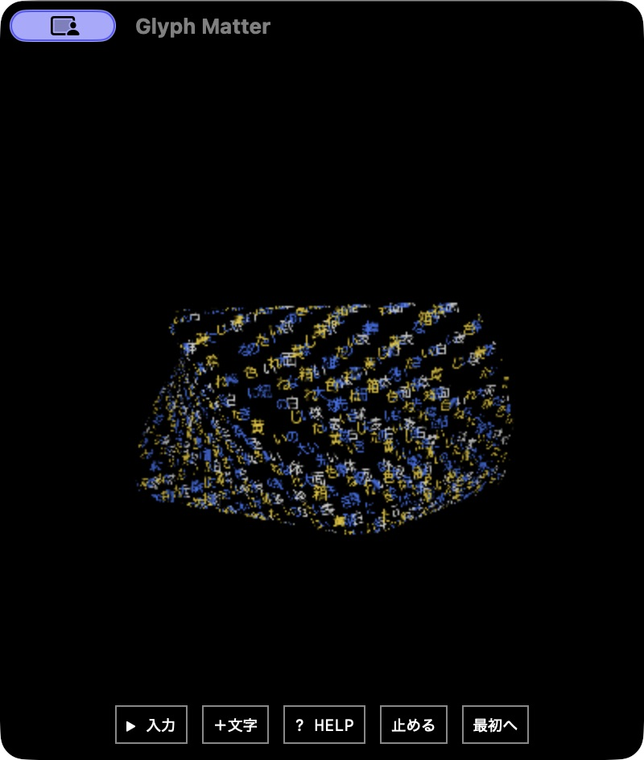

# 常駐版 v0.14.0 の独立評価

主担当のR2 native追加確認: 新しいDesktopアプリを作り、strict署名検査、実起動、R1終了後と同じローカルoriginの身体・白/青/黄の色を復元するところを実画面で確認した。配布ソースはR2 Webビルドと同じで、R1アプリを変更せず保持。下記のRAM/CPU原票はR1、R2の専用窓の資源再測定はまだ行っていない。日本語IMEの全操作は未検証。

2026-10-03。小さい専用窓で文字の形を眺め、必要な時に入力する動作は確認できた。ただし、今回の実装は当初の常駐メモリ・CPU予算を満たしていない。軽量化が完了した版として扱わず、比較のための動く基準版として残す。

## 対象と方法

実機は Apple M5 / 32GB macOS。通常の16GB laptop CPU/iGPUでは未測定。Desktop Heroesから参考にしたのは小窓で他の作業と並行する体験であり、素材やUIを模倣していない。開発元の説明には比較に使える実CPU・RAM測定値がない。[計画と一次資料](PLAN.md)を参照。

ブラウザは400×440、新規プロファイル、人工文7件を固定して操作した。初回 R1 と修正後 R2 を別々に試験し、それぞれの配布物hashを保存した。試験中に配布物が変わっていないことを確認した。R1ネイティブアプリに同梱されたWeb資産15件も、R1ブラウザの資産hashと一致した。[fixture](fixture.json)、[R1ブラウザ](browser-first.json)、[R2ブラウザ](browser-r2.json)、[R1同梱資産](native-r1-manifest.json)。

ネイティブ版の測定では、起動前後の差・プロセス名・同一coalition・終了時の消滅で専用アプリ、WebContent、Networking、GPUの4プロセスを帰属した。既存ブラウザの同名プロセスは加算していない。公開するデータは人工入力と数値のみで、ローカル個人情報や署名付きダウンロードURLは含めない。

メモリは `proc_pid_rusage` のプロセス別 charged footprintを合計した。共有ページを完全に重複除外したシステムRAM差分とは異なる。CPUはMach ticksをtimebaseでナノ秒へ換算し、CPU時間差÷実時間差×100で求めた。100%は1論理コアに相当し、PC全体の100%ではない。約0.5秒のCPUループで99.46%に校正した。RSS、JS heap、ダウンロード量とは区別する。[計測コード](native_metrics.c)、[サンプラー](sample_native.py)、[校正](measurement-calibration.json)。

## 操作と保持

|確認|結果|
|---|---|
|7人工文とリセット後の再入力|R1・R2とも完了。球と棒、ねじれた箱、花瓶、上下・貫通の組合せを描画。全座標が有限。|
|既存文字と色|各入力で以前のバッチ・文字を保持。白の後に青を追加しても以前の白を保持。|
|一般文・不確かな形|以前の形を保持し、入力文字を追加。|
|Workerの生存期間|準備・各解釈の終了後にworkerCount=0、started=stopped。次の入力で新しいWorkerを作成。|
|停止3秒|frames・ticks・シーン時間の増分が0、pending=0。|
|非表示3秒のブラウザ橋渡し契約|停止とは別にpaused=falseで非表示にし、frames・ticks・時間の増分0、pending=0。実OSの非表示操作とは別試験。|
|再表示|250ms後に進んだシーン時間は約0.20秒。非表示の3秒をまとめて進めない。|
|通常表示|R1は10.013秒で148フレーム、14.78fps。R2は10.011秒で149フレーム、14.88fps。|
|再読み込み|3,265文字、バッチ、色、Program、文字種を保持。復元直後のWorkerなし。|
|応答を遅らせた後のリセット|古い応答が文字を復活させず、@1文字に戻る。その後の再入力も成功。|
|戻る操作|R2で実際のBFCache復帰を確認。persisted pageshow=1、戻った後の1秒で15フレーム、文字保持。|

ブラウザ画面も確認した。白い球と細い棒、青いねじれた箱では文字が面を構成し、色が混在した。人工文は以前の解釈を壊していないかを確認する回帰用であり、未知の言葉に対する新しい意味精度の評価ではない。

R2は中断されたモデル準備からの操作復帰、保存時の上限処理、BFCache復帰を修正した後の試験である。最初のナビゲーション試験は `DOMContentLoaded` 待ちがBFCache復帰でタイムアウトした。待ち方をcommitへ修正し、実persistedイベントと描画再開を確認した。この最初の失敗はアプリ不具合と数えず、[原票](navigation-first-harness-issue.json)と[修正後の結果](navigation-r2.json)を両方残した。

## 解釈時間と外部通信

R1ブラウザの初回明示準備は8.80秒、R2は8.42秒。キャッシュ後も毎回Workerを新しく作り、入力から吸収演出終了までR1は5.44〜5.52秒、R2は5.49〜5.64秒。モデルの内部計算時間だけでなく、Worker起動・モデル再展開・文字の吸収を含む実操作の経過時間である。

ネイティブR1では担当者が実UIで初回準備15.7秒と、その後の2回の解釈完了を確認した。こちらはブラウザの8.80秒とは別の測定である。モデル準備は約127.5MBの固定重み等を取得したが、この取得量はRAMの値ではない。

新規プロファイルの準備でのみ、Hugging Faceと同社の配布CDNへのGETを記録した。入力7件の処理中に外部リクエストはなく、記録したGETにリクエスト本文はない。署名クエリは配布リダイレクトであり、公開記録にはクエリ本文を含めていない。モデルを使わない既定のルール経路も残る。

## ネイティブR1の実測

0.5秒間隔で4プロセスを同時に採取した。表のピークは同時刻の合計の最大で、各プロセスの生涯ピークの合算ではない。ラベルが解釈とその後の静かな表示をまたぐ測定窓は、そのまま混在窓として記す。

|測定窓|表示と文字数|charged footprint合計|CPU・1コア換算|
|---|---|---|---|
|30.00秒の通常表示|白い球、385文字|同時刻ピーク271.74MiB、終了271.00MiB|10.07%|
|120.01秒の準備を含む窓|初回ダウンロード・準備・終了後を含む|同時刻ピーク1,445.16MiB、終了233.19MiB|混在窓8.62%。準備だけのCPU率ではない。|
|127.01秒の解釈後通常表示|1,153文字、visible=true、paused=false、Workerなし|同時刻ピーク304.35MiB|15.63%|
|50.996秒の2回目解釈を含む窓|1,153→1,665文字。解釈後の表示も含む|同時刻ピーク728.88MiB|混在窓22.81%。解釈だけのCPU率ではない。|
|2回目解釈後の終点|1,665保存／1,536描画、Workerなし|284.24MiB|この終点のみを長時間の通常値としない。|
|停止ラベル42.51秒|1,665文字。開始直後の切替を含む|同時刻ピーク275.38MiB|0.799%|
|停止したまま非表示47.01秒|フレーム11,436のまま固定|同時刻ピーク229.66MiB、終了185.04MiB|0.190%|

原票は[385文字の通常表示](native-at-calm.json)、[初回準備](native-session-r1.json)、[解釈後と2回目](native-session-r1-post.json)、[停止・非表示](native-session-r1-visibility.json)。最初の30秒の仮ラベルは@を想定していたが、全サンプルの実テレメトリが385文字の球だったため訂正した。120秒窓の冒頭3秒も実際には非表示であり、通常表示のCPU値として採用していない。

停止・非表示ではCPUが下がり、Worker終了後にfootprintも下がった。一方、Worker終了後もresident sizeが高く残るサンプルがある。RSSの解放まで確認した、またはOS全体で同量の物理RAMが戻った、とは主張しない。

最後に担当者はR1をpaused=falseのまま実OS操作で非表示にし、15:39:13〜15:41:08 UTCの間フレーム12,107が停止、再表示後は12,256へ再開したと記録した。評価担当が独立に読んだ15:41:31 UTCの保存テレメトリでも、visible=true、paused=false、12,478フレーム、1,665文字、Workerなしを確認した。ただし、この最後の非表示期間のOS CPUサンプルは取り損ねたため、上表の0.190%を「停止せずに隠した時のCPU率」と読み替えない。

実UIでQuitした後、15:42:23 UTCに帰属した4プロセス全ての終了を独立に確認した。[終了確認と最後のテレメトリ](native-r1-exit.json)を残した。途中の窓表示で最初のクリックが効かなかった場面は、担当者の実UI操作で非アクティブな窓と分かり、タイトルを選んでから操作に復帰した。JavaScriptフリーズとは判定していない。日本語は実UIの貼り付け成功を確認したが、OSの日本語IME変換・確定の全操作は未検証。

## 予算に対する判定

|当初の候補目標|今回の測定|判定|
|---|---|---|
|通常200MiB程度|1,153文字の通常窓ピーク304.35MiB|未達|
|解釈時512MiB以内|初回準備を含む同時刻ピーク1,445.16MiB、2回目728.88MiB|未達|
|穏やかな表示で1コアCPU5%以内|通常窓15.63%|未達|
|描画p95 3ms以内|R1の各入力後4.3〜8.4ms、R2 3.4〜7.8ms|未達|

描画hookの旧フィールド名 `renderCpuP95Ms` は `performance.now()` で囲んだ描画処理の経過時間であり、OSが計上する専用CPU時間ではない。別途測ったOS CPU率と区別する。FPSを15へ抑えただけで、CPU・RAMの軽量化を達成したとはしない。

次の比較版では、静かな表示中の文字配置更新・曲面計算を減らすことと、モデル再展開時のRAMピークを下げることを優先する。今回の基準版は保持して、同じ人工文・同じ4プロセス帰属方法・同じ描画数で比較する。

GPU使用率と電力、16GB laptop CPU/iGPU、Windowsの専用アプリ、20分連続の静かな表示、30分・2時間試験は未実施。アプリの経過時間を、連続の放置計測と読み替えない。任意の未知語から自由なメッシュを生成する機能の達成も、この評価の範囲外である。
