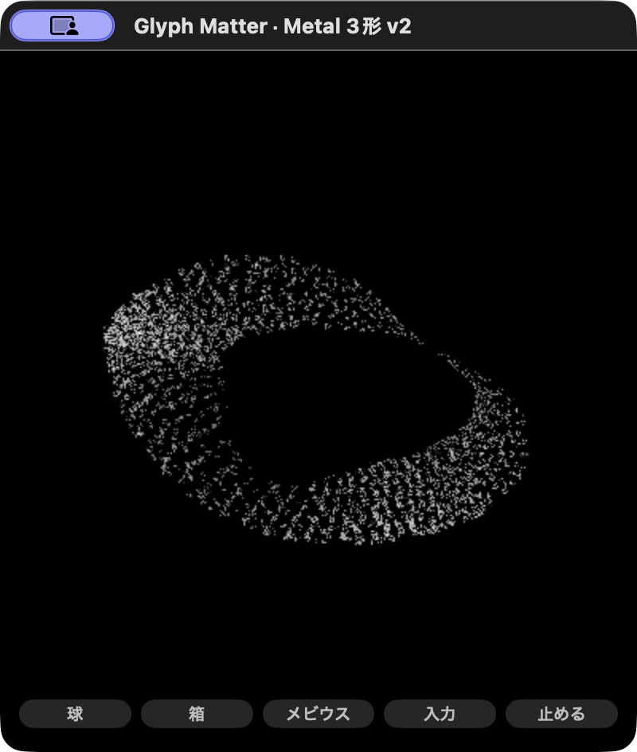

# Metal小窓の端切れを直した比較版 v2

旧R5では回転中のメビウスが端で切れる姿勢があった。元の文字面・ID・色・流れを保ち、独立v2でカメラの距離下限と奥の切断面を直した。初期の`@`は近いまま。根性60形の既定版を置き換えない。

| 確認 | 結果と範囲 |
|---|---|
| 独立CPU射影 | R2: 35,667主条件＋96縦長で画面外/near/far/非有限値0。最小余白は横24.12px、縦40.36px。R1のfar切断を原票ごと保持 |
| 状態・表面 | v2 CPU1,213 assertion成功、元TS504地点とDouble最大差1.78e-15。R2 GPU581成功、Float位置最大差0.0008844。全画素一致ではない |
| 実Mac R2 | 近い初期@、球/箱/メビウス、Enter→日本語paste→追加、旧白＋新青。1536→1796stored/1536draw、22→30kind |
| 実停止・非表示 | pause後と再開→実Hide後でframes/time不変、予約停止。実QuitでPID消滅も確認 |
| 通常履歴の短い復元 | 新しい試験保存先で人工入力→実Quit→再起動。261文字/20種類/メビウスと青い原文batchを保持。pause状態は保存しない |
| 通常窓の負荷 | 別の[実窓比較](../widget-metal-native-evaluation-v2/README.md)。offscreen値を代用しない |

[旧R5の切れた画面](qa/r5-mobius.png) / [近い初期@](qa/v2-r2-initial.png) / [球](qa/v2-r2-sphere.png) / [箱](qa/v2-r2-cube.png) / [旧白と追加青](qa/v2-r2-blue.png)。同時刻の画素比較ではなく、実操作中の姿を記録した。

## 変更と限界

3形の有界半径、文字quad、FOV、窓比率から保守的な距離下限を求める。距離に応じたquadの大きさも含め、形補間では新旧半径を混ぜる。毎文字のCPU位置更新は加えていない。R1のfar=100は縦長で切れたため、R2ではbody/quadの上限を含むfarへ広げた。shader SHAは旧R5/R1/R2で同じ。

定着body・既定zoomの有限比較。吸収途中、手動zoom<1、全時刻の形式証明、好み/読みやすさを保証しない。メビウスは旧版より遠くなり文字が小さくなる交換がある。Core TextとWebの字体/rasterizer、カメラ、rawbatch/seedも完全一致しない。

macOS13+/Metal/arm64でビルド・実画面を確認。Windows/Intel Mac/16GB laptop実機、GPU利用率/電力、60形/rig/model移植は未確認。人工fixtureは履歴read/write off。別に[通常履歴の短い人工復元](evaluation/normal-restore-r1/RESULT.json)も確認したが、容量全境界・破損復帰・実日常履歴は実窓で網羅していない。日本語pasteをIME変換の確認とはしない。261文字の青い姿は暗く疎らで、視認性は次の別版で改善対象。保存成功を好みの合格と扱わない。

## 原票と再現

- [独立射影・R1失敗/R2・helper](evaluation-independent/README.md)
- [CPU原票](evaluation/v2-core-cpu-r1.json) / [R2 GPU原票](evaluation/v2-r2-gpu-report.json) / [ビルドSHA](evaluation/v2-build-r2.json)
- [pause before](evaluation/v2-r2-paused-before.json) / [after](evaluation/v2-r2-paused-after.json) / [Hide before](evaluation/v2-r2-hidden-before.json) / [after](evaluation/v2-r2-hidden-after.json)
- [アプリ作成・操作](../../desktop/glyph-metal-lab-v2/README.md) / [対象案](BRIEF.md)

元desktop v1・WK v3・URL/tag/アプリ/保存は保持。R1/R2原票を差し替えず、R5の2時間予定soakの約30分中断もcameraの成果へ加えない。[中断レビュー](../widget-metal-soak-recovery-v1/REPORT.md)。OS入力監視、OS設定、有料API、実本文取得は追加していない。
