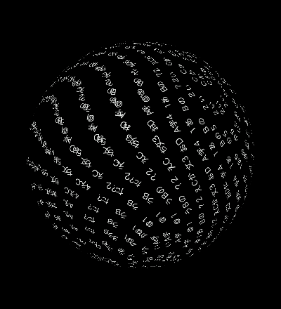
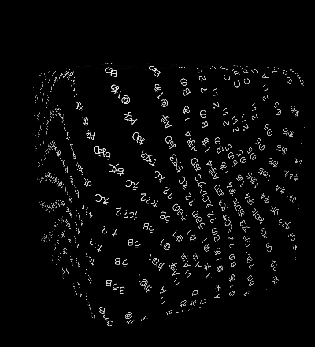
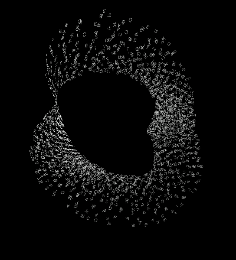

# 3形をMetalへ移す比較実験

2026-10-03。8時間の改善許可の範囲で、常駐表示の費用を分けるために作った独立した3形比較。現行WKWebView版・60形の根性版・小型学習モデルを置き換えない。[ソース・操作・再現](../../desktop/glyph-metal-lab-v1/README.md)。

## 今の判断

**表面に沿う文字とその動きをGPUへ移す経路は、数値とoffscreen画像で成立した。小窓としての採用は保留。** このMacがロックされ、CUAによる実操作と通常表示の90秒CPU/RAM比較を実施できなかった。表示がoccludedの状態を通常表示の測定として使わない。Apple M5のGPU試験を、16GBノートPCやWindowsの常駐性能へ一般化しない。

R5のロック中の起動smokeでは、library＋render pipelineを約195.5msで初期化し、人工fixture1,536文字と数値診断を生成した。一方で画面のframeは0のままだった。[起動原票](evaluation/locked-startup-smoke.json)。描画可能な通常表示を確認した結果ではなく、CPU/RAM比較には採用しない。人工モードは本文snapshotを読み書きせず、検証用プロセスだけ終了した。

この画像は400×440のoffscreen fixtureで、操作済みアプリのスクリーンショットではない。UIが省かれていることを、UIの完成や軽さの根拠にしない。

## 技術と分担

| 層 | 今回の実装 | 残る課題 |
| --- | --- | --- |
| 窓と入力 | AppKit、明示的なNSTextField、3形ボタン、停止・非表示・終了 | ロック解除後の実UIと日本語IME |
| 入力から形 | 作者定義の3形／8色の語彙 | 60形や学習モデルは未接続。曖昧語・否定の一般理解はしない |
| 文字の保持 | NFC graphemeごとのID、原文・追加実数・ink・seed・時刻を分離 | corpusや履歴を外部送信しない保存／入力経路の継続確認 |
| 字形 | 入力時のCore Text atlas、64px cell、32列、必要な行数へ成長 | ブラウザとの字体・emoji・rasterizer差、1,024種類近くの費用 |
| 立体と流れ | 元sphere/cube/Möbius写像と解析接線をMetal vertex shaderへ移植 | 全60形のGPU移植、骨格、複合Program、GPU電力 |
| 描画 | 厚さ0の文字quad、1,536 instanceを1 draw、入力時80B/instance、毎frame176B uniform中心 | 同じ窓での実FPS・CPU・charged footprint、3形以外の一般化 |
| 時刻と視点 | 15fps／吸収30fpsを要求、成長・視点の少数スカラーのみCPU更新 | 停止・非表示・長期再開と8時間の連続実動作 |
| 永続化 | 新namespaceの原文snapshot、排他的atomic公開、旧版に触れない | 実UIから入力→終了→復元・保存失敗表示 |

MetalKitのMTKViewには周期・必要時・明示描画の選択がある。今回は通常は周期描画、停止／非表示は周期予約を止め、操作で必要な1回だけ描く。[Apple: MTKView](https://developer.apple.com/documentation/metalkit/mtkview)。同じprimitiveをまとめるinstanced drawはMetalの標準APIを使う。[Apple: drawPrimitives](https://developer.apple.com/documentation/metal/mtlrendercommandencoder/drawprimitives(type:vertexstart:vertexcount:instancecount:))。

字形は入力時にCTLineで組み、atlasへ描く。毎frameにCore Textの組版やCPUでの文字の3D投影をしない。[Apple: CTLine](https://developer.apple.com/documentation/coretext/ctline)。自前bufferの小ささから、driver・font cacheを含むアプリRAMを見積もらない。

surface-flowの連続写像は流体solverではない。Sphereは軸座標に応じた回転、cubeはL12面への写像、Möbiusは面とその解析接線・幅方向の有界shearを使う。元の材料座標から求めた位置と接線を同時に動かし、文字が単一の線／軌道だけに集まる表示を避ける。文字ごとの毎frame CPU配列更新がなくなった事実と、全体資源が軽くなった実測は区別する。

## 数値と画像の結果

| 確認 | 結果 | 範囲 |
| --- | --- | --- |
| CPU状態／Unicode／幾何 | **1,213 assertions PASS** | 原文NFCの分離、自由grapheme、旧ink／ID保持、32k身体・1MiB原文、snapshot fallback、球・箱・メビウス |
| 元TypeScriptとSwift Double移植 | 最大component差 **1.78e-15** | 504地点、4seed、7ID、時刻0/0.1/24/100/3600/28800 |
| Sphereの単位半径差 | 最大 **2.22e-16** | surface-flowのunit map。描画時は元shapes.ts同様1.2倍 |
| Möbiusチャート継ぎ目 | 最大 **1.53e-13** | u+2π・w反転、位置とu接線一致／幅接線反転 |
| GPU Float / Double差 | 位置 **0.0008844**、du **0.002127**、dv **0.003878**以内 | 504地点。8時間後の時刻でのFloat差も含む。連続8時間稼働の実証ではない |
| GPU offscreen | **581 assertions PASS** | 3形、1,536文字、1draw、有限位置・解析接線・色・birth size・Unicode atlas |
| 球／箱／メビウスの表示pixel | 9,084 / 9,373 / 14,356 | 黒空間を残して表示、canvas枠へのclipping無し。審美的な合格判定ではない |
| 入力ink | 青、古い青、赤、黄、指定なし古字の白化がPASS | 新入力の色と旧色が独立。Core Text alphaに色を乗せる |
| atlas | 4rowまでの成長／以前のtile ID維持がPASS | @、あ、漢字、NFC、結合mark、flag、family emoji。日本語IME実操作は別 |
| native UI・通常CPU/RAM | **未確認** | ロックによって延期。occludedやheadlessをcalm表示の成績にしない |

原票: [CPU](evaluation/cpu-report.json) / [GPU](evaluation/gpu-report.json) / [R5アプリとsourceのSHA](evaluation/artifact-manifest.json)。描画の自前instance bufferは1,536×80B=122,880B、uniform 176B、atlasは1row0.5MiB〜最大32row16MiB。GPU検証では4row2MiBまで。これらは全体RAMではない。

## 初回準備と失敗も分けて残す

このMacのCommand Line Toolsにはoffline `metal` compilerが無く、同梱MSLを`MTLDevice.makeLibrary(source:options:)`で同期compileする。アプリ診断の計時はその呼び出し直前からlibraryとrender pipelineが出来るまで。offscreen原票の`shaderCompileMS`はsourceの読込とlibraryの作成までで、後続のcompute／render pipeline作成を含めない。通常15fpsの描画にはcompileを含めない。AppleはこのAPIがsource文字列を同期compileすると定義する。[Apple: makeLibrary](https://developer.apple.com/documentation/metal/mtldevice/makelibrary(source:options:))。

最初のoffscreen版で約122.9ms、sphereの描画倍率を合わせた版で82.4ms、同じsourceの再試験では0.82ms、birth sizeを固定した最終sourceでは85.3msだった。**OSのcompiler cacheを空にしていないのでcache-coldの速度ではない。** アプリ初回のlibrary＋pipeline準備は`shaderCompileMS`で別記録できる。offscreenのlibraryのみの値と同じ範囲として比較しない。Metalコンパイラの共有service PIDをアプリ専用のRAMへそのまま足さない。

保存試験の最初にFoundationの`.atomic`と`.withoutOverwriting`の組合せがfatalになることを検出し、pendingファイルの完成後に排他的なatomic renameを行う方式へ修正した。テストで原文が1MiBになる境界と、その後の入力が旧履歴を変えず拒否されることを確認。R1〜R4のローカル試験出力／アプリは保持し、最終の候補は**R5**。旧試作を削除して比較を作ったわけではない。

## 研究としての次の一巡

1. ロック解除後、同じ人工原文・色・seed・時刻・400×440・1,536文字で、WK比較版とR5を実操作する。原文とtileの保持、文字の読みやすさ、閉曲面の近側、Möbiusの帯の変形、入力からの吸収を比較する。Core TextとWebの画素完全一致は要求せず、同じ材料座標の誤差と見た目の退化を別に判断する。
2. 同じ表示条件で90秒のactive、30秒paused、30秒unpausedHidden、復帰を測る。appへ帰属するPIDと主プロセスのcharged footprint、1コア換算CPU、実frame数、壁時計submit時間を分ける。5%/200MiBの候補予算に達した場合だけ小窓の採用候補とする。GPU使用率・電力・16GB PCはさらに別測定。
3. 採用後、軽量モデルが出す有界な形・部位Programを新境界へつなぐ。本文を直接shader codeへ変換せず、検証済みenum・有限parameter・部位数の上限へ制限する。まず3形から増やし、60形・骨格の品質を落として資源目標を満たしたと主張しない。

問いは「意味解釈を入力時へ分け、材料座標の文字面をGPUで更新した場合、通常PCの常駐予算と表現の連続性を同時に保てるか」。この時点で新規性・研究成果・全面的な成功は主張しない。[小窓の研究地図](../../research/widget-research-map-20261003.md)にあるモデル・手続きProgram・curl noise等の先行研究と、今回のrenderer比較を分けて扱う。
