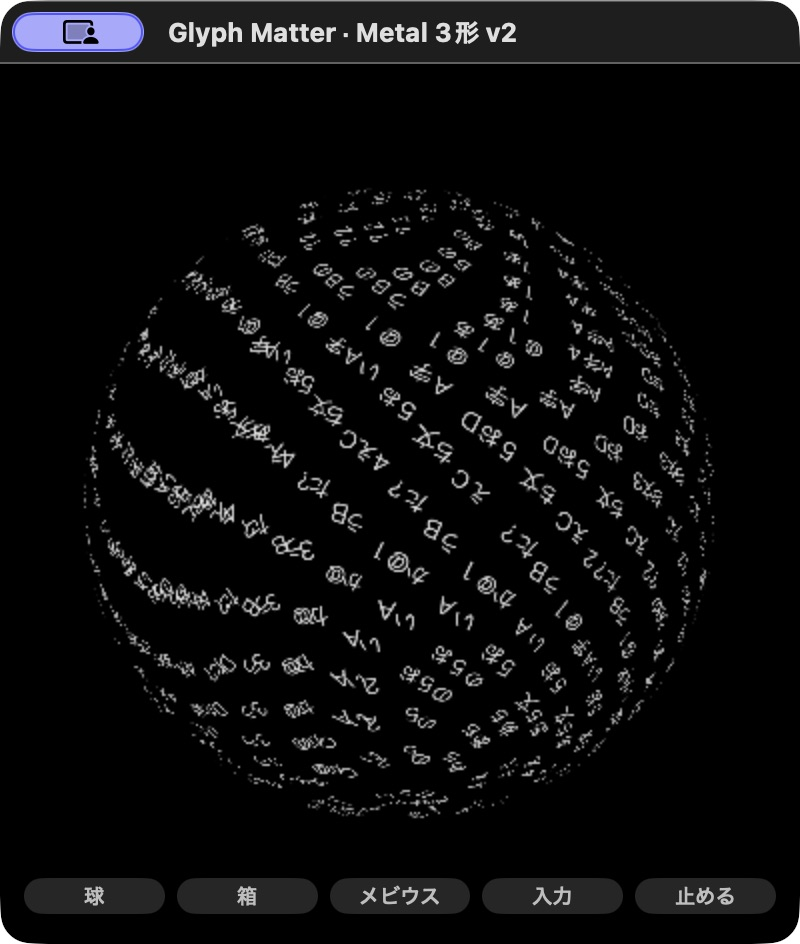

# 実小窓の短時間比較: WK v3 / Metal v2

2026-10-03、Apple M5・32GB Mac。主実装のrootが実アプリ起動・入力・停止・Hide・資源計測を行い、別担当のJSON検査器へ原票を渡した。**Metalの3形候補が軽い観測値を示した。60形の既定版を置き換える根拠にはしない。**

## 固定した範囲

[rootの測定前METHOD](evaluation/real-r1/METHOD-ROOT.json)。400×440の小窓、白い球、保存1,537／描画1,536文字、モデル・workerなし。準備後60秒以上待ち、通常90秒・pause30秒・再開して実Hide30秒を0.5秒間隔で観測した。WK→Metal→新しいWKプロセスの順。繰り返しWKは通常90秒だけで、停止・Hideは反復していない。

WKは新しい試験bundleID／ポートで人工本文を貼り付け、Metalは人工fixtureの履歴read/write off。旧版と実本文・保存は使わない。WKの24文字種類、Metalの22種類、seed・batch・ID・時刻・camera・font・rasterizerは完全一致しない。WKのshape／camera／viewport／atlas bytesはnative診断にないため、source・入力・画面によるroot確認へ依存する。

担当が[原PLAN](PLAN.md)を固定したのは03:54:38 JST。[補足](PLAN-R2.md)と検査器の完成は最初の測定開始後・その担当の実測値閲覧前。すべて事前登録された評価ではない。rootが把握する重いbuild/testは計測中止めたが、他アプリを閉じた専用の無負荷機ではない。

## 保存された結果

CPUは明示PIDのuser/system counterをMach timebaseで換算した1コア100%基準。charged footprintは同じ観測時点のPID合計、RSSも別集計。いずれもシステムで一意なRAMではない。GPU利用率・電力・presentation FPSは測っていない。

| 条件 | 秒 | PID数 | CPU % | charged peak MiB | RSS peak MiB | frame counter差 / 壁時計秒 | JSON gate |
|---|---:|---:|---:|---:|---:|---:|---|
| WK v3 通常 | 90.009 | 4 | 8.858 | 173.253 | 207.328 | 1,332 / 14.799 | PASS |
| WK v3 pause | 30.007 | 4 | 0.0052 | 128.581 | 208.359 | 0 / 0 | PASS |
| WK v3 Hide | 30.010 | 4 | 0.1785 | 128.753 | 212.406 | 0 / 0 | PASS |
| Metal v2 通常 | 90.004 | 1 | 2.661 | 68.298 | 85.188 | 1,358 / 15.088 | PASS |
| Metal v2 pause | 30.006 | 1 | 0.0014 | 24.142 | 84.781 | 0 / 0 | PASS |
| Metal v2 Hide | 30.010 | 1 | 0.0020 | 25.157 | 87.703 | 0 / 0 | PASS |
| WK v3 通常反復 | 90.004 | 4 | 7.681 | 124.253 | 230.656 | 1,258 / 13.977 | **FAIL: 14〜16/s外** |

最初のWKと反復ではfootprintが約173→124MiBと変わり、RSSは逆に大きくなった。同一の描画方式でも大きく変動する。平均を一つだけ示したり、方式の変更だけが原因と断定したりしない。

反復WKの最後のnative packetは約5秒更新されないまま採られた。web uptime差85.545秒に対するcounter差は約14.706/sになるが、これは**後付けの診断**である。末尾の実frameを観測した証拠にはならず、原gateのFAILを保持する。CPU・RAMのcounter計算は原票に残すが、この反復を「同じ描画周期を満たした通常試験」として予算合格に使わない。[独立レビュー](review-real-r1/REPORT.md)へ追加の検討を残す。

## 帰属・実操作・終了

WKは所有する新しいapp主PIDと、正確に同じresource/jetsam coalitionを持つGPU・Networking・WebContentの4PIDを固定。初回WKは起動前の全PID一覧がなく、その限界を[帰属](evaluation/real-r1/wk-r1-attribution.json)へ残した。Metalは所有するAppKit/Metalアプリ1PIDで、driver／compilerサービスは帰属対象に含めない。欠測・PID再利用・coalition変更・counter逆転を検査する。

実UIでpause／再開後Hideを行い、診断counterが止まったことを確認。MetalはCmd+Qで終了しPID不在。最初のWKはHide後のCUA終了操作がtimeoutしたため、測定後に所有とstart counterを再確認し**その試験主PIDだけ**を終了した。実Cmd+Q成功とは扱わない。反復WKは見えている窓のCmd+Qで終了し4PID不在。[初回WK終了](evaluation/real-r1/wk-r1-shutdown.json) / [Metal終了](evaluation/real-r1/metal-r1-shutdown.json) / [反復WK終了](evaluation/real-r1/wk-repeat-r1-shutdown.json)。



[実WKの白い球](evaluation/real-r1/wk-r1-white.png)。異なる時刻の画面で、画素等価の比較ではない。日本語pasteの成功を、IME変換の全体検証としない。

## 採否と次の比較

この3形・短時間条件ではMetalが候補CPU5%／charged peak200MiB内で、検査器もPASSした。**ウィジェット全体の目標達成ではない。** Metalには60形、骨格の生きもの、モデル、執筆・日記が未移植。違う機能を省いた効果、native/runtimeの差、atlas・cameraの差が混ざる。16GB laptop／Windows、長期常駐、入力時ピーク、通常履歴restore、視認性と好みは未確認。

採用は保留し、既定の根性60形を維持する。別のMetal v3で剣・花瓶・クラゲなどを段階移植し、面・動き・語彙を保持してから同じ評価を繰り返す。長いoffscreen renderer試験は実窓試験と分ける。

## 再現と原票

[全原票](evaluation/real-r1/) / [コピーSHA一覧](evaluation/real-r1/PUBLICATION.json) / [Metal build source SHA](evaluation/real-r1/metal-r2-build-info.json) / [WK c016661 source/web SHA](evaluation/real-r1/wk-v3-compare-build-info.json)。旧原票は上書きせず保存し、rootから公開用へコピーした28ファイルはbyte一致。実アプリのbinaryではなくmetadataと人工測定原票を収録する。

リポジトリのrootから、新しい出力名を指定する。元結果を上書きしない。

```sh
python3 experiments/widget-metal-native-evaluation-v2/validate.py \
  experiments/widget-metal-native-evaluation-v2/evaluation/real-r1/metal-r1-calm.json \
  --expectation experiments/widget-metal-native-evaluation-v2/evaluation/real-r1/metal-r1-expectation.json \
  --phase calm --output .local/metal-native-summary-new.json
```

これは保存JSONの再計算であり、アプリを再起動・再測定する命令ではない。
