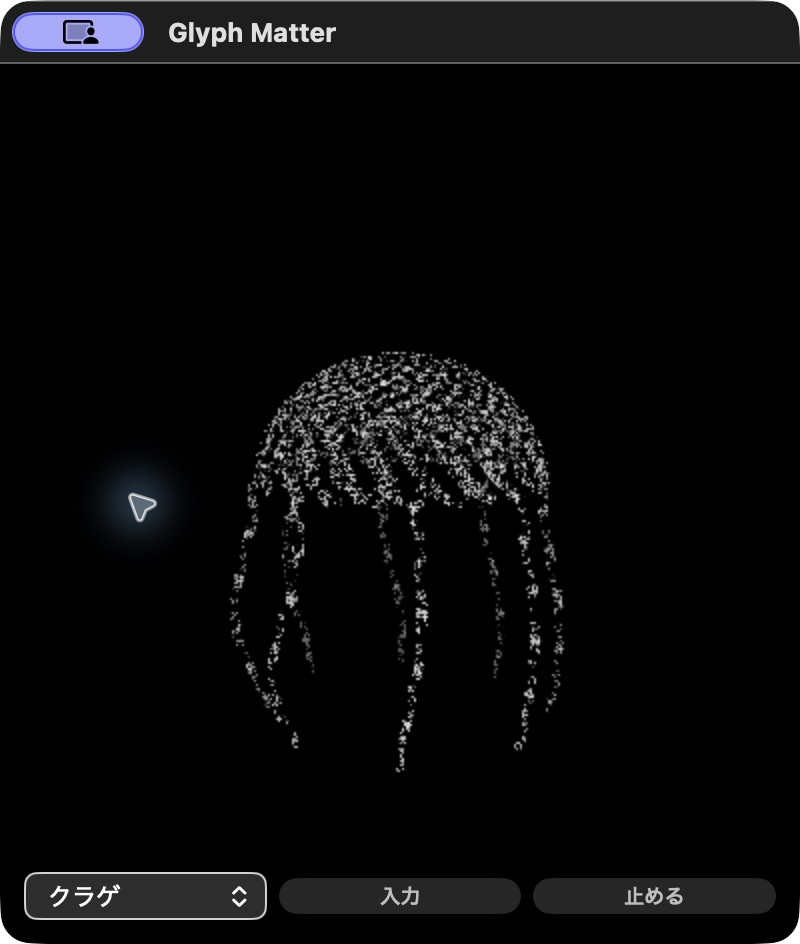

# 13形Metal候補の実小窓資源 R1

2026-10-03 05:47〜05:59 JST。Apple M5・32GiB・macOS arm64。OS buildは[実機記録](evaluation/real-r1/os-build.txt)。Final Floor30/0.3.0を資源値を見る前に選び、source・app・METHODを[FREEZE](evaluation/real-r1/FREEZE.json)へ記録。起動前にstrict ad-hoc署名を確認した。

**候補の4形・この条件では、事前のCPU5%/charged peak200MiB以内だった。** 6 phaseすべて数値gate合格。一般的な16GBノートPC、任意形/文、system unique RAM、電力、GPU利用率、8時間の実窓、快適性を実証した値ではない。旧v2やWKとの差を因果的改善率へ換算しない。

[事前方法](METHOD-R1.json)、[validator](validate.py)、[既知27人工guard回帰](synthetic-tests-r1.json)。validatorはv2からrenderer期待名だけ変更。uniform336等は新sidecarで指定し、閾値を後から動かさない。sidecarはrootの実UI確認を含み、数値validator自身がUIを確認したものではない。

## 状態と結果

400×440、白い人工文字1,537保存／1,536描画／22種類、通常15fps、推論・履歴read/writeなし。球は60秒以上、後の3形は10秒以上安定待ち、pause/hideは2秒待ち。主PID1289のstart/coalitionを明示して0.5秒周期で測定。各calm181標本、停止/非表示61標本。

CPUはuser+system差分をnative monotonic区間で割り、100%は1 logical core。helperの区間はCLOCK_MONOTONIC、user/systemはMach timebaseからnsへ変換する。MiBは1,048,576bytes。charged footprintとresidentは別列、system unique RAMへ読み替えない。

| 状態 | 秒 | CPU・1コア基準 | charged peak MiB | resident peak MiB | 提出差分 / 秒 | 数値gate |
| --- | ---: | ---: | ---: | ---: | ---: | --- |
| sphere-calm | 90.004 | 2.01265% | 69.829 | 83.750 | 1354 / 15.04371 | PASS |
| jellyfish-calm | 90.003 | 1.59105% | 71.923 | 87.688 | 1359 / 15.09942 | PASS |
| butterfly-calm | 90.005 | 1.59672% | 71.938 | 87.703 | 1355 / 15.05476 | PASS |
| saturn-calm | 90.005 | 1.90317% | 72.235 | 91.875 | 1348 / 14.97692 | PASS |
| saturn-paused | 30.006 | 0.00092% | 27.548 | 91.422 | 0 / 0 | PASS |
| saturn-hidden | 30.003 | 0.00159% | 28.126 | 92.094 | 0 / 0 | PASS |

正確な値は[JSON](ROOT-VALUES.json)と各summary。root/agent build/testsは測定中休止。ただし凍結R5の別offscreen 2時間soakは並走していた。この負荷は対象PIDへ加算せず、完全に無負荷なPCとも扱わない。

frames/drawCallsはGPUへ提出した数で、実画面presentation FPSではない。MTL error0も観測counterであり、全GPU完了や全時刻の保証ではない。停止/非表示はframes差0・scheduled=false。chargedが下がってもresidentは同様には減らず、「RAMがすべて解放された」と言わない。

[球原票](evaluation/real-r1/sphere-calm.json) / [クラゲ](evaluation/real-r1/jellyfish-calm.json) / [蝶](evaluation/real-r1/butterfly-calm.json) / [土星](evaluation/real-r1/saturn-calm.json) / [停止](evaluation/real-r1/saturn-paused.json) / [非表示](evaluation/real-r1/saturn-hidden.json)。sidecar/summaryを同じdirectoryへ保存。27fileは[コピーSHA](ROOT-PUBLICATION.json)でlocal原票と一致。privateな絶対executable identityはlocalのみ。

## 実操作と残る確認

rootがUIから順に4形を選び、停止→再開→Cmd-Hを操作。Hide後の採取中はAXを取得せず、CUA再選択による復帰を混ぜなかった。絶対app pathでexplicit openし、同じ土星の窓と再開を確認、actual Cmd-Qで主PID消失を確認。[終了原票](evaluation/real-r1/shutdown.json)。最初のrelative openはapp名解決で失敗し、絶対pathへ修正した。

この写真は読みやすさの合格ではない。密な文字、疎な青色、側面の薄い形には残課題がある。通常modeの人工日本語paste・色・花瓶・再起動復元は[別の実UI](../widget-metal-authored-v3-root-ui/normal-r1/RESTORE-CHECK.json)。全13形のCPU幾何検算・GPU・offscreen・framingは[作者記録](../widget-metal-authored-v3/README.md)。実IME全体は未確認。

独立算術監査は[別担当の報告](review-real-r1/REPORT.md)で6phaseの分母・閾値・原票27fileのSHAを確認し、不一致0。元gateは変更しない。限定条件を満たす比較候補として公開し、既定60形の置換は行わない。
