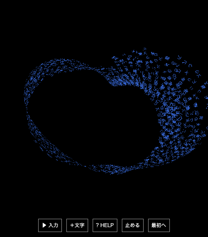

# Widget v3 公開前の独立レビュー

**採択：修正後の c016661 / R2 を、実験用Web比較版の公開候補として採択する。** 8acd4f3 / R1 で再現した原文消失と色のプレビュー不整合は、別の配布ビルドで修正を確認した。元の配布ファイル・原票・画像を保持した。

Macロック中の確認であり、操作は専用のChrome頭なしブラウザーと人工入力で行った。SwiftShaderを指定して実WebGLの描画呼び出し・有限座標・画像を確認した。実際のnative小窓、日本語IME、hardware GPU、アプリ全体のRAM/CPU、プレイヤー体験の合格判定は含まない。

## 再現した不具合と修正確認

| 不具合 | 修正前の再現 | R2の結果 |
|---|---|---|
| P1：種類上限で原文を失う | ×1でU+4E00から1,023種類を追加し、初期`@`込みで1,024種類へ。次に`刀一`を送ると、先頭が新種類のため追加0。入力欄を消し、保存しないまま約3.93秒の成功表示 | `刀一`を入力欄に保持して上限を通知。形・pause状態・成功計測は不変、busyはfalse |
| P2：選択色とプレビューが異なる | 色をgreenに固定し`青い花瓶の文字`を入力すると、欄は青、追加batchはgreen | 欄も追加batchもgreen。以前のblue batchはそのまま |

P1の原因は、R1の`widget-main.ts`が`Matter.add()`の`added:0`を無視し、入力消去・成功処理へ進むことだった。`model.ts`は追加0のbatchを記録しない。R2は材質の追加可否をgeometry変更前に確認し、追加0ならdraftと状態を保持する。

P2の原因は、入力欄の色更新が文章中の色を明示選択より優先し、送信時の優先順位と逆だったこと。R2は両方を明示選択優先へ揃え、色select変更時にも更新する。

種類上限で既存文字から始める`一刀`も確認した。実体への追加は1文字でもbatchは原文全文を記録し、再読み込み後も原文・accepted count・履歴が一致した。

## 独立した確認範囲

| 対象 | 確認結果 |
|---|---|
| 既定60形 | canonical名を実UIから60件送信し、60/60で期待したauthored shape・Programなし・有限renderer状態を保持 |
| 形保持の境界 | Möbiusを通常のringへ置換しない。tinyの判定保留は現在のfinite Programを保持して、原文と今回の色を追加 |
| 小型分類器の既定OFF | 新規ページのproviderはrules。分類器未読込、modelClient Worker開始0、分類器asset requestなし |
| モデルの遅延取得 | tiny選択後にローカルmoduleが読み込まれ、modelClient Worker開始は0のまま。既知の球＋棒の2部位/end例が有限Programになった |
| モデル入力上限 | tinyで4,001 UTF-16単位を送信すると、原文draftとbodyを保持し、追加・成功計測を行わない |
| dynamic atlas | 初期1行、1,024種類の人工身体では32行。reset後は小さいatlasへ戻る。source上も旧Textureをdisposeする |
| 保存 | `glyph-widget-state-v3`へ保存。人工v1/v2 sentinelは再読み込み後もbyte単位で不変 |
| 原文と色 | 実際に送信したfield全文の結合文字・ZWJ emoji・空白・tabをbatchに保持。blue/greenのbatchと再読み込み履歴が一致 |
| WebGLと通信 | 最終の青いMöbiusで1,536文字を描画し、drawCalls/有限座標を確認。R2のpage exceptionと外部requestは0 |

60形の確認は、送信直後のshape選択とrenderer状態を見てからresetした。60件すべての吸収完了・画素一致・見た目の品質を評価したという意味ではない。モデルの意味精度はこの少数の操作例から推定しない。

独立ハーネスのR2チェックは23件通過した。既存の23 assertionsを複写したものではなく、60件のcanonical UI入力、上限の拒否と部分受理、色優先順位、保存、optional tinyの各経路をこのレビューで組み立てた。R1の不具合を含む原票も残した。

## 原票と限界

- `production-review-raw.json`：最初のR1実行。製品不具合2件に加え、ハーネス側の誤判定2件を含む。
- `production-review-followup-raw.json`：R1の補正実行。実際のinput field値を原文の比較対象にし、正しい`scene.drawn/drawCalls/finite`を確認。製品不具合2件を再現。
- `production-review-r2-raw.json`：別のR2配布ビルドで同じ不具合と通常経路を再確認。全チェック通過。
- `capture-review-r2-raw.json`：新規の人工bodyで青いMöbiusを形成した最終画像の確認。
- `release-review-summary.json`：判定・source SHA-256・制限・原票対応。各原票は配布ファイル全件のSHA-256も記録する。

最初の原文比較で失敗したのは、`input[type=text]`がfill時に与えた改行をsanitizeしたためで、送信時のfield実値が失われたのではなかった。最初のWebGL判定も、存在しない`renderedCount`を読んだハーネスの誤りだった。補正後に両方を確認し、元の失敗原票を保持した。

通信は所有する`127.0.0.1:4291`だけへ許可し、外部宛は遮断した。人工入力のみで、既存の個人履歴を参照していない。旧key保持はこの独立browser contextの人工sentinelによる確認であり、既存nativeアプリの実保存履歴を操作した確認ではない。

MiniLMの約128MB取得・推論は実行していない。native側はsourceを読んだだけで、実窓やIMEを操作していない。保存失敗時のquotaや長時間の履歴増大は今回の操作確認の対象外。RAM/CPU予算の採択は別の測定が必要。

R1とR2のproductionファイルSHA-256はレビュー終了後も全件一致した。共有source/native、モデル、Git、元の成果物は変更していない。各実行後に自分のbrowser/serverだけを終了した。修正・公開はroot所有者へ返却する。

