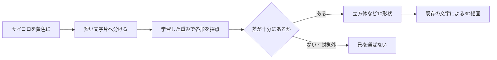

# ことばと形を結びつける、自作モデル 0.1.0

**最初の学習モデルを作り、文字アートv0.4.0に実験機能として組み込んだ。** 「サイコロ」などの例から、現在描画できる10種類の形と「形を選ばない」を学習する。未知の立体そのものを生成するモデルではない。描画は既存の数式を使う。

学習もブラウザでの推定も端末内。クラウドAPIや事前学習モデルを使わず、有料の推論APIは使わない。初回のPython環境構築では無料のNumPyを取得する。作品の入力は送信・自動収集しない。

## まず試す

[文字アート](../../prototypes/glyph-creature/README.md)でEnterから入力欄を開き、「ことば / 操作」→ **「学習した形を使う（実験）」** をオンにする。初期値とリセット後はオフ。

- `サイコロを黄色に` → 立方体。追加文字だけ黄色。
- `ドーナツ 8個` → 8個の円環。
- `今日は眠い` → 形を選ばず、そのまま文字の材料になる。

オンでは形の種類をモデルが担当し、色・流れ・個数・鎖・大小などは既存の明示語彙で扱う。オフではv0.3.0の語彙による形の選択を使う。オンでも一般的な文章理解が完成したわけではなく、修飾語の否定や複数の対象を扱えない場合がある。

## 何を学習したか



例えば「サイコロ」から「サ」「イ」「サイ」「イコ」「サイコ」など1〜3文字の断片を取り出す。学習例に多く登場する断片を少し軽くするTF-IDFという重み付けを行い、文章全体の長さもそろえる。

次に、各文字片がどの形を示すかの重みをゼロ付近から学習する。正解の形へ高い値を出せるよう、誤りの大きさを測り、重みを少しずつ240回更新した。実装は線形分類器＋softmax、更新はAdam。学習する重みとバイアスは **66,330個**。語彙は **6,029種類の文字片**、配布JSONは **773,901 bytes**。

重みは`train.py`で計算され、ブラウザの推定処理に「サイコロならcube」という条件分岐はない。対応例を用意するのは人間・AIの仕事であり、その例に合わせて重みを計算する部分が学習。未学習の言葉の意味が自然にすべて分かるわけではない。

## データと評価を分ける

| データ | 件数 | 用途 |
| --- | ---: | --- |
| [train.jsonl](data/train.jsonl) | 3,684 | 語彙・IDF・重みの学習 |
| [validation.jsonl](data/validation.jsonl) | 418 | 見送りの基準を選ぶ。別文型だが同じ形の呼び名を含む |
| [holdout.jsonl](data/holdout.jsonl) | 60 | 別担当が先に作り、重み・基準を固定した後で初めて確認 |

学習例は、この実験のために書いた語と文型を組み合わせた合成データ。Webやユーザーの入力履歴を収集したものではない。「箱」を立方体とする等の作者側の約束も含み、普遍的な正解ではない。

最終評価に完全一致の文章が1件あり、厳密な集計では除外して **59件** とした。通常文・否定・未対応の物体も含める。元データの`unseen_synonym`という区分には訓練済みの「ボール」「サイコロ」等も含まれるため、この区分を「未知語理解の成績」とは呼ばない。別の言い回しの群として扱う。

## 実際の成績

| 指標 | 自作モデル単体 |
| --- | ---: |
| 形を選んだ例の正解 | **20 / 21**（95.2%） |
| 形を指定した40例を正しく拾えた数 | **20 / 40**（50.0%） |
| 対象外19例を誤って形にした数 | **1 / 19** |
| 見送りも含めた全体の正解 | **38 / 59**（64.4%） |

「高精度95%」だけを成果とはしない。半分の形の指示を見送った結果でもある。小規模な自作評価の観測値で、一般的な日本語性能を保証しない。softmaxのスコアは正解確率として校正していない。

失敗例として「三角屋根の家を作って」を三角形と誤認した。「帯を半回転ひねって両端をつないで」はメビウスと選べなかった。学習語と共通する文字片への依存が見える。

同じ59件に旧語彙方式を当てると30件正解、対象外への形の誤認は12件だった。モデルモードではモデルを形選択に使い、通常モードの結果と区別する。これは用意した例での比較であり、作品全体の普遍的な優劣ではない。[全応答](artifacts/evaluation.json) / [旧語彙・ブラウザ実装の比較](artifacts/browser-comparison.json)

最初の1,284例では、覚えた文型への依存が強く、調整用の別文型で失敗した。その記録も[初回報告](artifacts/attempt-01/training.json)に残した。文型と否定・通常文の例を増やし、調整用データだけで選別基準を決め直した後、最終評価を開いた。最終評価を見て重みや閾値を変更していない。その後、アプリ統合時に旧parserが通常文を再解釈する問題と、Python/JSの特殊空白の差を修正した。統合比較は修正確認用であり、新たな未見評価ではない。

## 自分で学習する

Python **3.11以降**を用意する。以下はこのフォルダで実行する。Windowsでは`python3`を`py`等、使っているPythonの名前に置き換える。

```sh
python3 -m venv .venv
# Mac / Linux
source .venv/bin/activate
# Windows PowerShellの場合は .venv\Scripts\Activate.ps1
python -m pip install -r requirements.txt
python train.py
python predict.py "サイコロを黄色に"
```

依存はNumPy 2.3.5のみ。今回のMacでは学習約1.5秒。速度は1回の観測で、他端末を保証しない。学習結果は`artifacts/model.json`と`artifacts/training.json`へ保存する。`make_data.py`は基本データを書き直すため、手で編集したJSONLへ不用意に実行しない。

`predict.py`は候補、スコア、見送りの理由と、判断に強く寄与した文字片を表示する。未知の言い換えを試し、誤りの傾向を見る入口になる。

## 例を教え直す

[data/extra.example.jsonl](data/extra.example.jsonl)を自分用にコピーし、1行ずつ`text`と`label`を追加する。使えるlabelは`condense / vortex / orbit / mobius / ring / cube / cuboid / cross / triangle / square / none`。

```sh
python train.py --extra data/my-examples.jsonl --output artifacts/candidate
python predict.py "自分が試したい文章" --model artifacts/candidate/model.json
python evaluate.py --model artifacts/candidate/model.json --extra data/my-examples.jsonl --output artifacts/candidate/evaluation.json
```

候補は別フォルダへ出し、採用済みモデルを残す。肯定例だけでなく、同じ語が入った通常文・否定文も教える。「学習→例を試す→間違いを調べる→例を増やす」の循環を小さく回す。

今のholdoutは結果を見たので、今後の改善では回帰確認用になる。これを見ながら修正したモデルを新たな未見評価と称さない。一般化を測る際は、別の未公開の問題群を先に固定する。追加学習データを使った評価には同じ`--extra`を必須とし、完全一致の混入を数える。

候補を作品へ採用すると決めたら、`artifacts/model.json`へ置き、評価・対応する推定照合ファイルも更新して作品側のテストとビルドを行う。誤ったモデルを自動的に配布する仕組みは設けていない。

## 再現とハーネス

- seed、学習回数、学習率、正則化、データのSHA256、調整した閾値を保存する。
- NumPyの学習結果をJSONへ出し、Pythonとブラウザの推定が一致することを、最終評価とUnicode境界の入力で確認した。
- 同じ環境・seedで再学習し、4,162例の判定差は0。浮動小数と集合の列挙順の影響で重みの最大差は約0.000001、ファイルの完全一致は保証しない。[再現確認](artifacts/reproducibility.json)
- 形の拒否、入力した文字の保持、色と個数の組み合わせ、初期オフとリセット、外部リクエストなしを作品のブラウザテストで確認する。

## 次の勉強につなげる

1. 誤りを眺め、「語が未知」「文型が違う」「否定」「複数対象」を分ける。
2. 同じデータと評価で、多言語の文埋め込み＋小さな分類器と比べる。今版にはまだ導入していない。
3. 形の種類を選ぶ段階から、「球を3個並べる」のように部品と配置を出す段階へ広げる。「だんご」などの構成はこの方向で試せる。
4. 任意の3D形状を学ぶ研究へ進む場合は、文章だけでなく形のデータと、表面を流れる経路の評価も用意する。

根拠: [文字n-gramとTF-IDF](https://scikit-learn.org/stable/modules/feature_extraction.html)、[線形分類](https://scikit-learn.org/stable/modules/linear_model.html#logistic-regression)、[データ漏洩](https://scikit-learn.org/stable/common_pitfalls.html)、[スコアの校正](https://scikit-learn.org/stable/modules/calibration.html)。次の候補として[SetFitの学習方式](https://huggingface.co/docs/setfit/main/en/conceptual_guides/setfit)も調査した。これらは方法選択の根拠であり、この作品の性能は上記の実測値による。
