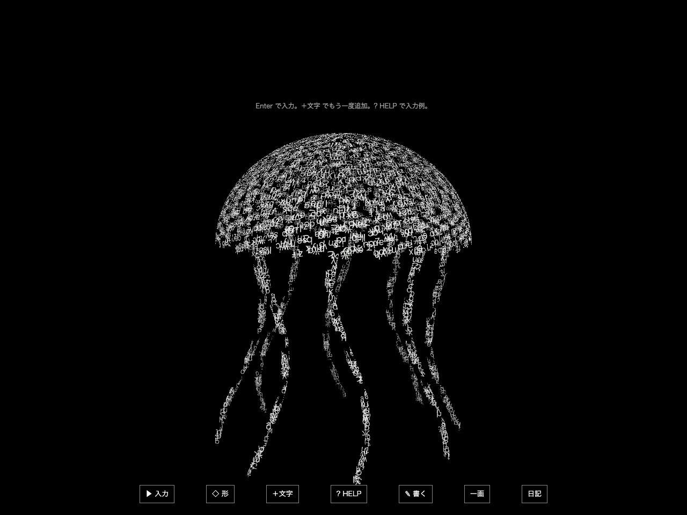

# 文字のかたち — 対応語と形を増やす別版

2026-09-30。基点 `782c35d` / 作業ブランチ `feat/glyph-word-shapes-v2`。既存の球面・立方体・メビウス・静かな花火・執筆を土台に、モデルを使わない表現を増やす実験。

## 起動と試し方

`prototypes/glyph-creature` で `npm ci`、`npm run dev`。この別版は **http://127.0.0.1:4194/** を使う。元の4173とは別の作業コピー・ポートで、ブラウザの保存領域も分かれる。以前の日記を必要に応じてJSONで読み込んで眺められるが、自動移行はしない。

Enterで入力欄を開き、例えば `白い文字がくらげの表面を流れる` と入力する。既定の繰り返し64回では961文字になる。短い一語だけなら疎な状態から始まる。下の「＋文字」で今の形のまま直前の入力を同じ倍率でもう一度足せる。HELPの×256も選べる。文章自体が形の材料になり、次に `表面 青い花瓶` と打つと、今回の文字だけが青くなって花瓶へ移る。形はメニューの「形」「生きもの」「もの・空」からも選べる。

新しい形でも `流れる` と `表面` は面を保持する。色、呼吸、波打つ、複数個、通常の追記、専用執筆欄、30秒の自動巡回、明示語の60秒優先を組み合わせられる。旧メビウス等の流路／面の区別は保持。

| 新しい形 | 対応語の例 | 表現 |
| --- | --- | --- |
| 花 | 花、花びら、フラワー、flower、blossom | 五枚の広い花弁の面が緩やかに曲がる |
| 蝶 | 蝶、ちょうちょ、バタフライ、butterfly | 胴と二枚の翼。低速の羽ばたき |
| くらげ | くらげ、クラゲ、海月、水母、jellyfish | 傘の表面と八本の細い腕が揺れる |
| 木 | 木、樹木、大樹、tree、fir | 三段の樹冠と幹の表面 |
| 星 | 星、星型、スター、star | 厚みのある五芒星の面 |
| 螺旋 | 螺旋、らせん、コイル、スプリング、helix、coil | 緩やかに変形する太い螺旋の面 |
| 砂時計 | 砂時計、すなどけい、hourglass | 中央で細くなる回転面 |
| 土星 | 土星、どせい、saturn | 球と広い環の面 |
| 剣 | 剣、つるぎ、ソード、sword、blade | 細い刀身・鍔・柄の三部分 |
| 花瓶 | 花瓶、かびん、壺、つぼ、vase、urn | 首と胴がある回転面 |

旧形状にも `サイコロ / dice` →立方体、`ドーナツ / donut / torus` →円環、`ボール / globe` →球体を追加。重なる単語は長い方を使い、花火から花、花瓶から花、土星から星を追加抽選しない。複数の独立した形は従来どおり候補から一つ選ぶ。

## 実装の境界

対応語と手書きの数式を組み合わせた版。通常入口は分類モデルのコード・重みを読み込まず、学習モードの操作も出さない。以前の実装・学習資料・重みは保存している。学習データやモデル品質の改善という主張はしない。

文字は3D表面の接線へ置いた平面。面の位置と接線を共通の関数から求め、個々の字形を引き伸ばさずに運ぶ。表面の流れは有界な座標変形であり、物理的な流体シミュレーションではない。複数個の配置では従来仕様に合わせ、文字の個別回転を使う。母体の全形状が同程度に変形するわけではなく、剣や星は主に表面の流れと指定した呼吸・波で動く。

形は22種類。自動巡回には新しい10種を追加し、花火は明示語・ボタンだけにしている。花瓶・砂時計は側面が主で、底や蓋まで閉じた汎用3Dメッシュではない。くらげ・蝶・土星の環などの開いた面は両面表示し、重なる部分が透ける場合がある。否定文・言葉の意味全体・未知の物体は理解しない。対応語が文章の一部にあると意図せず形が変わる可能性は残る。

## 比較して直した点

1. 最初の全形状4096文字の画像を確認すると、くらげ・螺旋・砂時計が上下に大きすぎた。追加形状だけカメラ距離へ余裕を加えた。
2. 最初の蝶は胴がなく、二枚の葉のように見えた。薄い胴を追加し、翼との隙間を狭めた。
3. 最初の星は丸く花に似ていた。五芒星の辺を持つ輪郭へ変え、中央の文字集中を減らした。
4. くらげは腕が明るすぎた。材料の75%を傘へ、25%を八本の腕へ配分し直した。木も先端に文字が集まりすぎない面分布へ変更。
5. HELPが長くなると狭い画面で入力欄が上にはみ出すことを回帰試験で発見。表示高さを画面下の操作列も含めた値へ修正し、閉じる×を入力欄の横へ移した。

## 実際の確認

- 追加10形を本物の入力欄へ送信し、4096文字・12秒と30秒の状態、元の文字、色、有限な描画を確認した。[結果](evidence/surfaces.json)。画像の時刻はハーネスで前進した描画時刻で、30秒間の実時間観測とは区別する。
- 通常の初回Enter→文章送信→分類からの形選択、専用執筆欄の新しい形指定をブラウザで確認。
- [一時間相当の時刻前進](evidence/one-hour-simulation.json)では、10形すべてで4096字の有限な描画と画素の存在を確認。長時間の実時間プレイを検証した意味ではない。
- 同じ起点の字形・姿勢・表面・語の包含・自動巡回、旧形状・執筆・日記・筆画の回帰を確認する。最終の件数は[作品の進捗](../../concepts/glyph-creature/PROGRESS.md)へ記録。
- [短いフレーム観測](evidence/frame-observation.json): Chrome 154 headless / macOS。833〜961文字の4形と32,000文字の花瓶を、30フレームの準備後120区間測定。中央値16.7ms、p95 16.7〜16.8ms。これはこの端末のrequestAnimationFrame間隔であり、GPU処理時間・一般的なPC・長時間の安定性の保証ではない。
- 独立した[蝶の観測](evidence/independent-butterfly-observation.json)では、4097文字のp95は16.8ms、32,000文字では33.4ms。上限ではフレーム落ちがあり、一定60fpsを保証しない。
- 型検査と配布用ビルド、JS/console errorなし、通常操作の外部リクエストなし、モデルの読み込みなしを確認。実OSのIME、Windows/Safari、実スマートフォンは未確認。

素材追加・外部API・入力の外部送信・OS設定変更はない。新しい10形はこの実験用に書いた数式で、既存のフォント/Three.jsの利用条件を引き継ぐ。
