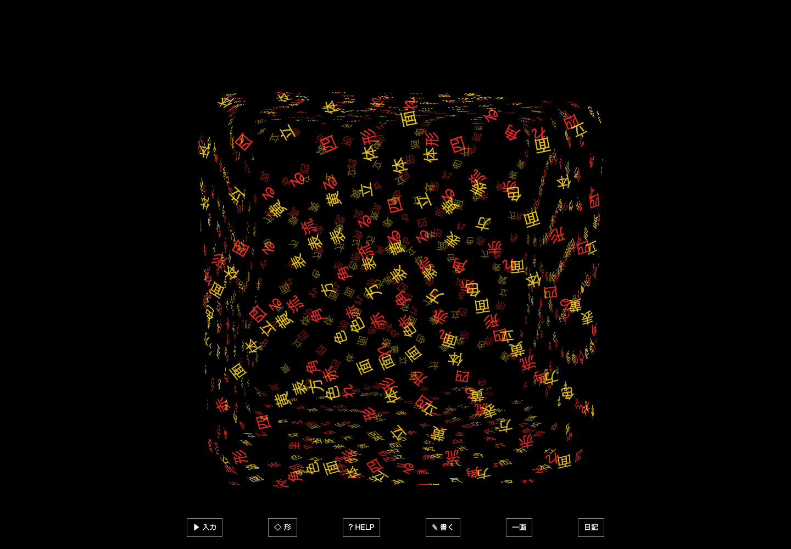

# 文字のかたち — Glyph Matter

`glyph-creature-p0-v0.4.0` / ことばで形・流れ・色を組み合わせる、動く文字のコンセプトアート。



## 開く

Node.js 22.12系・24系・26以降のいずれかとWebGL2対応ブラウザを使用する。このフォルダで実行する。

```sh
npm ci
npm run dev
```

[http://127.0.0.1:4173/](http://127.0.0.1:4173/)を開く。自分の端末で起動した時のアドレスで、インターネット上の公開デモではない。停止は端末でCtrl+C。

## はじめ方

近くに浮かぶ `@` と、じわっと現れる `press enter` から始まる。最初のEnterで、`press enter` の10文字そのものが取り込まれる。もう一度Enterを押すと、白枠の素朴な入力欄が開く。

文章、日本語、英字、記号を自由に入力できる。変換確定後にEnterで送ると、入力欄の位置から文字が離れ、毎回少し違う螺旋で体に加わる。空白は粒にしない。入力例や細かな操作は「ことば / 操作」を開いたときだけ表示する。

## ことばの組み合わせ

| 入力例 | 起こること |
| --- | --- |
| `流れる メビウスの輪` | 半ねじれの形に沿う細い一本の循環路 |
| `表面 メビウスの輪` | 帯の面全体に文字が流れる |
| `流れる 赤 四角形` | 四角い流路になり、この入力で増えた文字は赤のまま残る |
| `表面 黄色 立方体` | 箱の面に文字が流れ、この入力で増えた文字だけ黄色になる |
| `円 8個` | 8群に分かれた輪が空間内を動く |
| `円環 鎖` | 5個の輪が交互の向きで連なる。`8個`なども組み合わせ可能 |
| `円環 大小` | 大小2個の別々の輪。メビウスの位相変形ではない |
| `オメガ メビウスの輪` | 歪んだ輪へ変形する試み。Ω字形の厳密な再現ではない |
| `表面 直方体` / `流れる 十字` / `表面 三角形` | 対応する形の面または外周へ変わる |

メビウスのねじれと流れの位置は時間で変わる。形は上記と凝縮・渦・原子軌道を含む10種類。凝縮・渦・軌道では従来の軌跡を使い、「流れる／表面」による違いはまだ設けていない。

色は白・赤・黄・青・水色・緑・紫・桃色。**色指定はその入力で追加した文字だけに効き、以前の文字を塗り替えない。** 指定した色は白へ戻らない。無指定なら従来どおり赤から約8秒で白へなじむ。入力欄の色選択でも指定できる。

形が見える量をすぐ試せるよう、入力の繰り返しは初期値64回。「×」で1・16・64・256回から選べる。個数指定とは別の操作であり、`円 8個`は繰り返しが64でも8個の輪を作る。短い入力を1回だけ追加した場合、形を描く文字が少なく輪郭がまばらになる。

これは対応語を組み合わせる仕組みで、一般的な文章理解ではない。指定しなかった項目は現在の状態を引き継ぎ、形を明示すると個数・配置を基本状態へ戻す。色だけの変更では配置も保持する。対応語が文章の一部に含まれると設定として解釈する場合があり、否定文や未知の物体には対応していない。文字列自体は材料として保持する。

## 自分たちで学習した形を試す

「ことば / 操作」で **「学習した形を使う（実験）」** をオンにすると、自作の分類モデルが形を選ぶ。初期値とリセット後はオフ。`サイコロを黄色に`、`ドーナツ 8個`を試せる。色・個数等の修飾子は従来の処理を使う。教えた言葉に近い文字片からの推定で、見送る場合や誤る場合もある。

[何を学習したか・成績・教え直し方](../../experiments/word-shape/README.md)。学習済みの小さな重みを作品と同梱し、入力を外部へ送らずブラウザ内で計算する。任意の3D形状そのものを作るモデルではない。

## その他の操作

- Escで閉じる。下書きは次に開くまで残る。送信後も入力欄は閉じる。
- 空間のドラッグで回転、スクロールで距離を調整。タッチでは軽くタップして入力欄を開く。
- 「ことば / 操作」に4つの従来形状ボタン、「もう一度」「止める／動かす」「最初へ」を置く。
- 文字は厚さゼロの平面として独立して回転・拡縮する。真横では見えなくなり、裏は鏡像になる。

## 範囲と制限

入力の外部送信、大容量モデルの追加取得、課金はない。[無料小型AIの実験](../../concepts/glyph-creature/LOCAL_AI_RESEARCH.md)では端末内推論まで確認したが、意味の誤りが残り採用を見送った。ネット検索から任意の形を理解して3D化する機能は未実装。

合計32,000文字、異なる文字は1,024種類、形の個数は1〜16まで。一回の入力が16,384 UTF-16コード単位を超える場合は切断せず断る。結合文字はNFCで正規化し、書記素クラスタで保持する。表示はOSのフォントに依存する。

再読み込みで状態は消える。流体の物理計算ではなく、数式による軌跡と変形。字形そのものを曲面に沿って曲げる処理、任意画像からの立体化、クイズ、実績／図鑑、ゲーム経済は未実装。

## 開発と確認

```sh
npm test
npm run build
npm run test:e2e
```

ブラウザテストは通常のChromeを使用する。他の環境にブラウザがない場合は`npx playwright install chromium`で用意する。具体的な結果は[確認記録](evidence/README.md)へ。

ビルドで配布用`dist/`を作る。開発版を止めた後、`npm run preview`で配布用の表示を確認できる。distもHTTPサーバーから開き、index.htmlの直接ダブルクリックは使わない。

開発版だけに`window.__GLYPH_ART__`の状態取得・時刻前進・リセットを用意している。通常操作のテストと併用し、内部状態だけで成功としない。吸収のseedは入力ごとに変え、指定seedでの計算は再現可能。

素材はOSフォント、独自の5×7ビットマップ文字、文字・数式、Three.js。参考画像や添付本、動画や音源は含めない。[Three.jsの利用条件](public/THIRD_PARTY_NOTICES.txt)を同梱する。
