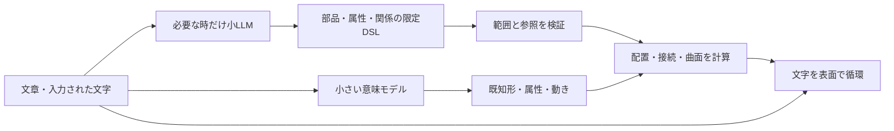

# Glyph Matter：16GBノートPCへ向けた文章→形の設計

調査日：2026-10-02。一次資料の調査を3担当で分担し、別担当が新しい人工評価文を作成した。公開するのは調査・人工データ・実験コードと結果。個人の原稿、参考本・画像、端末固有の識別情報は含めない。

**主方針は「小モデルが部品・属性・関係を読む → 自前の幾何処理で表面を作る → 蓄積した文字を流す」。** 軽い既知形の推定を常時使い、より自由な部品構成は必要な時だけ小LLMで求める。直接3D生成は別実験として残す。16GB共有RAM・ノートCPU/iGPUでの実用性能は、対象実機で確認するまで達成扱いにしない。

**今回の新しいCPU評価では、汎用0.8B/2B＋prompt＋JSON制約だけでは部品構成の意味をほとんど保持できず、作品への採用を見送った。** メモリに収まる見込みと品質の成立を分ける。主方針は役割を狭めた学習・専用decoder・配置ソルバーへ進む研究計画であり、現在のLLMが使い物になったという結論ではない。

[現在の試遊版](https://koseihamaya2077.github.io/glyph-matter/)は60形の根性版＋骨格の保存タグから配布している。今回ゲーム本体は変更せず、従来の見た目と操作を基準として保持した。名前・公開URLの変更で過去のタグ、ブランチ、以前のローカル版を削除していない。

## 1. 今回の判断が以前の実験と違うところ

すでに多言語MiniLMによる既知形の検索、0.5B/0.8BのWebLLM解釈、4Bの自由座標による部品組立、8B/14Bの入力操作判定を試している。「小モデルを入れれば解決」とはしない。

- 既存MiniLM int8は118MB、M5・32GBで推論中央値2.12ms。対象24形の言い換え初回21/24。修正後22/24は同じ問題の回帰結果であり、新たな未見評価ではない。[既存実験](https://github.com/KOSEIHAMAYA2077/semantic-glyph-lab/blob/main/experiments/semantics/REPORT.md)
- 既存Qwen3.5-0.8BはWebGPUで動いたが、箱・サイコロ等に意味誤りが残った。今回これを初導入とは数えない。[以前の小型AI評価](../concepts/glyph-creature/LOCAL_AI_RESEARCH.md)
- 4Bの自由座標では接続、脚の数、相対位置が崩れた。JSONの成功と形の意味が一致しなかった。[部品実験](https://github.com/KOSEIHAMAYA2077/semantic-glyph-lab/blob/main/experiments/composition/README.md)

次は**座標をモデルの出力から外す**。「輪を三つ鎖にする」なら、モデルは輪・数・鎖という関係を出し、接続と位置は決定的な処理で解く。これは単一ラベル検索より表現を増やすが、あらゆるメッシュを生成する方式ではない。

## 2. 最近の研究から借りるもの

| 一次資料 | 確認した内容 | この作品で使う考え方／条件 |
| --- | --- | --- |
| [aDSL / Agentic 3D Creation, 2026-08](https://arxiv.org/html/2608.17975v1)・[著者コード](https://github.com/sig-pku/aDSL) | 部品、アンカー、接触・支持・整列、関節をDSLとして共通化し、計画・実行・修正を行う | 相対関係と接続を自前ソルバーへ任せる。著者自身が強い商用LLM依存を制限と記す。既定はOpenRouter/Gemini＋Blender。コードの利用許諾は確認できず、直接取り込まない |
| [Bioinspired123D, 2026](https://arxiv.org/abs/2603.29592)・[著者コード](https://github.com/lamm-mit/Bioinspired123D) | Llama 3.2 3B＋LoRAから形生成プログラム。幾何・生物構造のデータ、検索、検証・修復を組み合わせる | 小モデルに構造表現を学習させる先行例。こちらは任意Blender/Pythonコードではなく限定JSONへ置き換える。コードApache-2.0だがベースLlamaの条件は別。完全版の検証・修復には外部モデルもあり、全工程ローカル無料ではない |
| [Text2CSG, CAD 2026](https://doi.org/10.1016/j.cad.2026.104127) | 凍結言語特徴と構造decoderを分け、CSG木を生成する | 言語モデル全体を毎回生成器として使う以外の道。出版社の公開要旨・導入・結論を確認。全文・実行できる重み・CPU速度は未確認、コードは公開予定との記述 |
| [Vitality-Aware Compression, ECCV 2026 / v2 9月3日](https://arxiv.org/html/2607.00382v2)・[著者ページ](https://jaeah.me/compact-3dit_web/) | 形状への影響で層を選び、pruning・4/8bit量子化・選択的蒸留。Hunyuan miniのDiT容量44.5%減 | 軽量な直接3D生成器そのものの研究として追う。ただし1.042→0.578GBはDiTのみでencoder/autoencoderを除く。論文のVRAMを全アプリのRAMとしない。圧縮学習はA100で行われ、配布コード・圧縮重みへのリンクは今回未確認 |
| [GuideCAD, IEEE Access 2025 / arXiv 2026](https://arxiv.org/abs/2606.07024)・[著者コード](https://github.com/mskimS2/GuideCAD) | 画像＋CAD記述文から構築命令。論文図5は学習対象34.48M／全体246.37M。凍結encoder＋小decoder | 全推論モデルも約0.25Bの設計先行例。ただしCPU/iGPU/16GBの実証はなく、公開評価コードは事前計算した画像特徴を使うため、報告0.035秒を画像入力〜描画の総遅延とは扱えない。利用許諾・学習済みcheckpoint配布は今回未確認、設計参考とする |
| [CAD-Coder, Guan et al., NeurIPS 2025](https://arxiv.org/html/2505.19713v3)・[著者コード](https://github.com/gudo7208/CAD-Coder) | Qwen2.5-7BからCadQueryコード、構文学習と実行形の幾何報酬 | 構文だけでなく実行形で評価する。著者学習は8×A800 80GB、BF16重み約15.23GB。量子化可能性は16GB/iGPUでの速度実証ではない |

[GuideCAD](https://arxiv.org/abs/2606.07024)は2026-06のarXiv登録だが、IEEE Access 2025の研究。凍結した言語・画像encoderにprefixを与え、**学習するパラメータ**を減らす。全体246.37Mは微調整比較版と同じで、「4倍少ない」は学習対象の比率。FP32の重み下限を単純計算すれば約0.99GBだが、実行RAMではなく、一般ノートでの即用根拠にはしない。

既存の構造研究も役立つ。[ShapeAssembly (2020)](https://rkjones4.github.io/shapeAssembly.html)は階層的な部品とattachment、[ShapeCoder (2023)](https://rkjones4.github.io/shapecoder.html)は部品集合から再利用できるmacroを学ぶ。どちらも自然言語→任意メッシュのモデルではなく、独自の非商用条件がある。発想の参照とコードの採用を分ける。[Text2CAD](https://github.com/SadilKhan/Text2CAD)も比較資料だが、公式コードには固定CUDA処理、英語encoder、非商用条件があり、そのままCPU向けには使わない。

## 3. 直接3D生成を本線にしない理由

| 候補 | 対応入力と実装 | 今回の扱い |
| --- | --- | --- |
| [Point-E](https://github.com/openai/point-e) | 英文→点群、別モデルで面を抽出。公式例にCPU経路、MIT | 軽い直接生成の比較用。文字が循環する連続した面は追加工程が必要 |
| [Shap-E](https://github.com/openai/shap-e) | 英文→暗黙表現→メッシュ。公式例にCPU経路、MIT | 直接text-to-3DのCPU比較候補。既存M5実験を16GBノートの実証に読み替えない |
| [TripoSR](https://github.com/VAST-AI-Research/TripoSR) | 画像→メッシュ、MIT、CPUフォールバック | 文章→画像の前段が必要。6GB VRAMやA100の速度をCPUのRAM・速度として引用しない |
| [SF3D](https://github.com/Stability-AI/stable-fast-3d) | 画像→UV付きGLB。CPU対応、MPSは実験扱い | 表面用途には合うが作者は32GB未満のMac共有メモリにはCPUを推奨。Community License・アクセス条件を確認して別比較 |
| [Hunyuan3D-2mini](https://huggingface.co/tencent/Hunyuan3D-2mini) | 画像→形、0.6B形生成器、独自ライセンス | 直接生成の圧縮研究候補。0.6Bは全工程の規模ではなく、16GB CPU/iGPU即時性能は未確認 |

新しい[Block3D](https://arxiv.org/abs/2608.19567)の4.99秒はA100 80GB測定で、[公開パッケージ](https://github.com/ziplab/Block3D)に学習済みBlock3D重みは含まれない。[Cube3D/CubePart](https://github.com/Roblox/cube)も構造・部品の考え方は参考になるが、配布重みだけで数GB以上、追加encoderと実行バッファも必要。[TRELLIS.2](https://github.com/microsoft/TRELLIS.2)はLinux/NVIDIA 24GB以上の条件。これらを「最新なので一般PCで軽い」とは説明しない。

## 4. 実装を二層にする

**常時の層**：MiniLM int8等で形・属性・動きの推定を分ける。60形の説明は前計算し、角張り・細長さ・膨らみ・ねじれを連続パラメータへ反映する。検索だけなら既知形選択。小さな分類／回帰headを学習するなら、限定された形状族の新しいパラメータを出せる。これは今後の比較案で、今回headは学習していない。

複数物体の「どの部品が赤く、何の上か」を扱う場合、文章全体の平均ベクトルを一つの形へ近づける検索だけでは足りない。語ごとの特徴と対象の参照を保ち、小さい構造decoderへ渡す。簡単な一物体の属性headと、複数部品の構造生成を別の難易度として測る。

**構成を増やす層**：0.8B〜2Bの量子化LLMで有限の部品・相対関係を出す。自前の配置、lathe、sweep、SDF/CSGへ渡す。「三つの輪が鎖になる」「二つの口を持つ花瓶」などの未収録構成を目指す。最初は最大12部品・木の深さ4等の上限を設け、自由座標、Python実行、外部ファイル操作は出力に含めない。

今回のCPU評価は、その手前で**5基本形・4ノード・10関係**だけを読めるか調べたもの。形の組立・画面への適用は行っていない。[凍結した契約と結果](../experiments/consumer-16gb-20261002/README.md)。小LLMがこの範囲でも意味を誤るなら、そのまま試遊版へ載せず、役割分割・追加学習・小decoderを比較する。

## 5. 文字の表面描写を守る

この計画の評価対象はメッシュの見た目だけではなく、**入力した文字が材料として残り、面に沿って動き続けること**。

- メビウスや球は既存のパラメトリック面 `p(u,v,t)` を残す。位置だけでなく接線と法線を求め、文字の平面を面に沿わせる。UV上の流速にゆっくり変化するcurl noise等を加える。これは流体らしい表現案で、物理的な流体シミュレーションそのものではない。
- 部品の変形・骨格と、その面上の文字に同じ変換を使う。文字だけが元の位置へ取り残される状態を避ける。
- 任意の生成メッシュでは、面と重心座標で文字を保持し、隣接面をたどる。単なる一様表面サンプリングは配置には使えても、循環する流れ・穴・継ぎ目の解決にはならない。[Three.jsの表面サンプラー](https://threejs.org/docs/pages/MeshSurfaceSampler.html)
- 新しい形へ移る時も文字ID、入力順、指定した色を保持し、更新結果だけを交換する。入力ごとに消去・再生成しない。生成中も前の形を動かし続ける。

## 6. モデルと実行環境

| 候補 | 配布・容量 | 役割 |
| --- | --- | --- |
| [MiniLM-L12多言語](https://huggingface.co/sentence-transformers/paraphrase-multilingual-MiniLM-L12-v2/tree/main/onnx) | Apache-2.0、公式ARM64 int8 118,412,398B。AVX2版も配布 | 現在の意味検索を基準に、属性・関係headを比較 |
| [multilingual-e5-small](https://huggingface.co/intfloat/multilingual-e5-small) | MIT、384次元・100言語。公式VNNI int8 118,346,824B | 意味表現の比較。`query:`/`passage:`等の仕様がある。VNNI専用exportを普通のAVX2/ARM向けと同じ扱いにしない |
| [Qwen3.5-0.8B](https://huggingface.co/Qwen/Qwen3.5-0.8B) | Apache-2.0。[ggml-org GGUF](https://huggingface.co/ggml-org/Qwen3.5-0.8B-GGUF) Q4_0 563,036,064B | 既存失敗を含む小型基準。今回はCPU・新しい限定契約で再評価 |
| [Qwen3.5-2B](https://huggingface.co/Qwen/Qwen3.5-2B) | Apache-2.0。[Unslothによる第三者変換](https://huggingface.co/unsloth/Qwen3.5-2B-GGUF) Q4_K_M 1,280,835,840B | 部品と関係の比較候補。第三者量子化と公式モデルを区別 |

これらは**ダウンロードファイル量**であり、推論ピークRAMではない。context、KV/再帰state、作業バッファ、描画、OSも別に必要。短いcontext、同時推論1件、thinkingなし、出力上限、取消を設ける。毎キー入力でLLMを実行せず、文の区切り・短い待ち時間後に処理し、古い応答で新しい入力を上書きしない。

- Windows共通基準：ONNX Runtime CPU＋llama.cpp CPU。GPUなしで先に測る。
- Intel/AMD iGPU：llama.cpp Vulkanを比較。IntelはSYCL/OpenVINOも候補。SYCLをAMD共通経路にはしない。
- Apple Silicon：CPU基準に加えllama.cpp Metal。既存MLXは別比較。Macの測定をWindowsの性能証明としない。
- 公開Web：ONNX Runtime WebのWASM＋Workerを基準にWebGPUを比較。描画とGPU推論の競合を測る。WASM多スレッドにはcross-origin isolationが必要で、GitHub Pagesで当然に有効になるとはしない。

一次資料：[llama.cpp](https://github.com/ggml-org/llama.cpp)・[SYCL](https://github.com/ggml-org/llama.cpp/blob/master/docs/backend/SYCL.md)・[OpenVINO要件](https://docs.openvino.ai/2025/about-openvino/release-notes-openvino/system-requirements.html)・[ONNX Web設定](https://onnxruntime.ai/docs/tutorials/web/env-flags-and-session-options.html)。

JSON schemaの強制だけで意味は正しくならない。llama.cppのgrammarは対応subsetのみでschemaをpromptへ自動挿入せず、未対応制約もある。規約をpromptにも記し、別の検証器で範囲、ID参照、部品数、関係を確認する。[公式grammar説明](https://github.com/ggml-org/llama.cpp/blob/master/grammars/README.md)

## 7. 今回のCPU比較の結果

新しい人工24文を用意し、固定prompt・同一runtimeでCPU比較を行った。0.8Bは意味条件3/24（make0/20）、2Bは4/24（make1/20）。独立契約は24/24・23/24と大半が成立したが、数や色の捏造、相対関係の欠落が残った。サーバーRSS観測最大は1.353GiB・2.686GiB、応答中央値は1.697秒・3.626秒。機械はM5・32GBであり16GBノートの性能証明ではない。

grammarなし診断でも意味一致は増えなかった。Mac Metalでは2Bの中央値1.076秒まで短くなったが意味一致は4/24。形式・速度の改善を作品の品質の改善と取り違えない。[条件、採点方法、生出力、再現手順](../experiments/consumer-16gb-20261002/README.md)。このCPU比較は3Dの組立や描画を含まない。

## 8. 次の版へ進む条件

1. 調整に使わない日本語の未見文で、形・属性・個数・否定・関係・通常文・未知対象を別に集計する。以前の入力は回帰確認用。
2. keep/unsupportedでも文字自体は材料に追加する前提を保つ。形の選択失敗で文章を捨てない。正しいJSON、契約適合、意図した構成、形の画面、文字の被覆と循環を別に評価する。LLMが当てたラベルだけで新形状生成の成功としない。
3. 16GB実機でCPU→iGPUの順に、冷起動・暖機後p50/p95、RAM/共有GPUメモリ、スワップ、執筆と描画の同時動作を測る。まず全アプリ6GiB以内等の予算を置くが、これは設計目標で実測結果ではない。
4. 次の比較版は「既知形＋属性head」と「限定DSL＋配置ソルバー」を別ブランチにする。現行の根性版へ直接置き換えない。
5. 学習は合成DSL→自前描画→意味・接続検査で教師例を作る。言い換えの学習文と最終評価文を分離する。重い教師モデル・学習機を使う場合も、利用者の16GB推論要件と区別する。

**今回決めた順序**：まず既存表面に小さい意味モデルを結び、属性と動きを分離する。次に小LLMまたは小decoderから限定構造を生成し、座標をソルバーへ渡す。直接3D拡散器の圧縮は並行する研究候補として追う。この順序なら現在の文字表現を基準に、軽さと表現の広さを比較できる。
