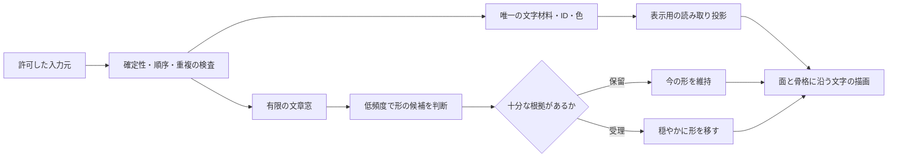

# サイドインテリア版の現在の実装判断

2026-10-03。使い方は、創作・プログラミング・仕事の横で、入力した文字が身体に残り、内容に応じてゆっくり姿を変える小窓である。次の構成を推奨する。実装済みと提案を分け、以前の試遊版・保存・URLを残す。

## 材料と形の判断を分ける

形を解釈できなくても、容量内で受理した確定文字は材料にする。形の候補が来ても、過去の文字・色・IDを作り直さない。文書の現在の内容と、これまで材料にした履歴は別である。削除・undoで身体を残す現在の扱いは暫定であり、日々の記録として適切かは本人の試遊で決める。専用入力の研究labは身体256・文書512 UTF-16の有限容量であり、一日の全入力を無損失で蓄積する完成版ではない。

通常描画ではモデルを動かさず、文字用の平面と曲面座標を描く。材料が変わらない間に本文の全量を毎フレームJSON転送することは避けたい。これは次の比較案であり、現在のnative入力接続で資源低減を実証した結果ではない。表示キャッシュを置く場合も材料の第二所有者にはせず、接続世代・材料ID・提示範囲が一致する時だけ再利用する。

## いま採用できるもの、まだ採用しないもの

既存Webには、一定周期で形を切り替え、言葉や手操作で選んだ形をしばらく保つ仕組みがある。周期的な切替と内容への反応は両方残したい。ただし、今回のnative入力接続はその一日の体験まで移した版ではなく、文字材料と3形への接続を検査する有限labである。既存の30秒・60秒という周期を、仕事中の快適さから確定した製品値とはしない。[既存の切替実装](../prototypes/glyph-creature/src/shape-cycle.ts)。

| 層 | 今の判断 | 根拠と限界 |
| --- | --- | --- |
| 表現の基準 | 既存60形Webを維持 | 球や箱の面・メビウスの帯・生き物の文字表面を比較基準にする。モデルの種類を変えるために表現を粗くしない |
| Macの軽い描画 | AppKit/Core Text/Metalを有力候補にする | 13形版の4形各90秒はCPU約1.6〜2.0%・charged peak約70〜72MiB。M5/32GiB・限定条件で、一般16GB機や電力の実証ではない |
| 形と動作 | 作者定義の面・骨格を先に使う | 魚・鳥・蛇は16形別候補へ移植。旧13形の同条件offscreen PNGは一致。新16形の実窓はMac lockで未確認 |
| 入力から材料へ | 専用編集欄の比較を先に固める | 実ブラウザのASCII追加・色・停止・入力欄の非表示を確認。実日本語IME・他アプリ横断の完成版ではない |
| 曖昧な自然文 | 既定モデルの採用を見送る | 約200KiB検索R1は独立正例14/60、説明3/36・物語1/12。軽さだけでは不足。約8MiBの静的日本語特徴は別の配備候補であり、以前の独立精度も未達 |
| 全アプリへの反応 | 活動と本文を別経路で扱う案 | OSキー活動を確定した文章とみなさない。対応する編集APIの差分も、本人の打鍵・IME確定と同一とは限らない。実OS取得は未実装 |

正本: [13形の実窓測定](../experiments/widget-metal-native-evaluation-v3/REPORT.md)、[16形の面と骨格](../experiments/widget-metal-authored-v4/REPORT.md)、[専用欄から文字表面への実操作](../experiments/ambient-editor-surface-root-ui-v1/README.md)、[検索R1の独立評価](../experiments/ambient-shape-retrieval-evaluation-v1/REPORT.md)、[静的日本語特徴の固定比較](../experiments/static-japanese-retrieval-v1/README.md)。

日本語の特徴を軽く実行する部分は、別の[Swift CPU候補](../experiments/native-static-japanese-v1/PUBLIC-README-R6.md)で進んだ。作者の既知709回帰と独立20・別補助4のtokenizer/数値/順位一致を確認し、短batchの単独CLI peakは43.53MiBだった。これは配備の確認で、曖昧な文章の意味精度を更新する結果ではない。本文を出さない応答、外側frame制限、形の受理policyを整えるまで、材料と小窓へ接続しない。[独立レビュー](../experiments/native-static-japanese-review-v1/REPORT.md)。

## 全入力の使用像に向かう順序

最初は自分の編集欄から、次に明示的に接続する執筆・開発アプリから確実な差分を受ける。広い互換経路では取れない本文を推測せず、活動量だけの反応に留める。どこから届いたか、確定か候補か、入力元を切り替えた後の古い通知ではないかを記録し、本文を読む前に除外・許可範囲を判定する。[macOS/Windows/編集アプリの一次資料と適用範囲](ambient-input-platforms-v1/README.md)。

Mac標準の `unmarkText` は、印を外した文字を通常挿入として受けることも想定したAPIである。そのため、すべてのunmarkを「取消」とみなして材料0にする保守的実験は、一般的なIME確定に対応した証拠にならない。取消の再入呼出と、本当に確定する経路を分け、実IMEで追加・候補更新・取消・フォーカス変更を確認する必要がある。[AppleのunmarkText説明](https://developer.apple.com/documentation/appkit/nstextinputclient/unmarktext%28%29?changes=_7_4_1&language=objc)。

入力監視・アクセシビリティ権限を実際に使う段階は、この分析・専用欄の実験とは別に扱う。今回それらを要求・変更せず、実本文の取得・外部送信もしていない。対応範囲が不明な状態で「全アプリのすべての文字を取得済み」とは報告しない。

## 研究として次に確認すること

1. 同じ材料・姿勢・時刻で、通常描画の表示キャッシュと既存の全量転送を比較する。得られる局所処理時間と、実小窓全体のCPU/RAMを分ける。
2. 固定した日本語特徴のnative CPU移植は上の候補で一致を確認した。次は外側入力境界と本文なしの応答を整え、アプリ全体の資源を別に測る。配備の一致を新しい意味精度とはしない。
3. 未見の文章に対し、形・修飾対象・否定・保留を別に評価する。モデル名だけで優劣を決めず、同じ教師・入力・形状ライブラリで比較する。
4. 実IMEと対応アプリの少数経路を確認してから、本人が作業中に置ける版へ進む。機構の正しさと、邪魔にならないか・愛着があるかは別の確認にする。

人間評価の参加者は現在0人。8時間の開発作業を8時間の利用体験とは呼ばない。[研究質問と人による評価案](ambient-study-questions-v1/README.md) / [技術・課題・先行研究の地図](widget-research-map-20261003.md)。

## 入力を増やすときと、待機するときの別比較

[cache候補R2](../experiments/widget-metal-ambient-cache-v1/REPORT-R2.md)は同じR3正本を使い、増えた材料を差分で渡し、待機中はmetadataだけを渡す。Swift側で毎回全文を復号・検算する経路を外した。独立12セッション・66通常stepの804描画レコードが元R5とbitwise一致した。独立wire初回R1の時計巻戻り失敗は残し、R2の同期待回帰では15/15を通した。[独立報告](../experiments/widget-metal-ambient-cache-review-v1/REPORT-R2.md)。

これは転送とSwift側の検算の比較である。coreは形の窓でboundedなbodyのsliceを読み、増加時に全bodyから新しいID範囲を選ぶため、内部の全走査が常に0、計算時間が常に差分量だけ、とは言えない。R1の局所CPU測定をR2や全widgetの数値へ流用しない。実窓・IME・GPU再評価は未実施で、既定版へ接続していない。

[連想policyの再検討](ambient-association-policy-v1/README.md)では、正しい命令実行と、日常文から許容できる姿を提案する課題を分けた。これは設計分析で、既存の意味評価の不採用判断を覆す実測ではない。形変更の頻度・保留・現在の定期変更の共存を、次の人による比較へ送る。

日本語特徴の[別CLI入口](../experiments/native-static-wire-v1/README.md)では、32,768 byteの入力frameと2,048 byteの本文なし返信を制限し、異常な行の後に復帰できることを独立20入力・21返信で確認した。旧R5と同じ意味処理を使い、本文は処理中のmemoryにある。これは実IPC認証・入力の同意・取消・古い提案の排除・process寿命を完成させた証拠ではない。受理policyと実入力を足す前に、今の文字正本を上書きしない境界が引き続き必要になる。
