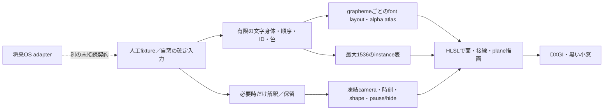

# Metal → Windowsの対応案と接続前gate

2026-10-03。以下のWindows側は全て**未実装の設計候補**。Mac v1の構造を読んだもので、Windows libraryやsampleを取得・実行していない。

## A案の対応表

| Mac v1で読んだもの | Windows候補 | 守る点・接続前の検査 |
| --- | --- | --- |
| AppKit／MTKView、小さい黒いwindow | Win32 HWND、D3D11 device/context、DXGI swap chain | 初回は不透明の黒。透明化・taskbar埋込・work area変更を同時に追加しない。client／外寸／DPIを記録。always-on-topは明示的に切替可能にする案 |
| `MetalGlyphInstance`のfloat4×4＋uint4 | 同じ意味の80-byte instance表。HLSL `StructuredBuffer`＋SRV、またはper-instance vertex input | IDをfontのglyph indexへ置換しない。host/shaderのoffset・stride・整数bitを検査。80Bは現在のfieldからの算術で、Windows ABI実測ではない |
| 2行列＋float4×2＋uint4のuniform | HLSL constant buffer、提案176-byte layout | 16-byte packing、row/column-major、乗算順を明示。MSLを字句置換しただけで同じ行列としない |
| `vertex_id`／`instance_id`、quadの6頂点 | `SV_VertexID`／`SV_InstanceID`、triangle list、`DrawInstanced(6,n,0,0)` | bodyだけの1 draw、0≤n≤1,536。UIやclear、presentを含む窓全体のAPI call数と混ぜない |
| Sphere／Cube／Mobiusの面・接線・arrival・形変更blend | 同じ数式のHLSL vertex shader | Float誤差、seam、有限性、裏面、面被覆、少数文字、長い時刻で照合。最新camera修正を凍結してから移す |
| `.rgba8Unorm` atlas、fragmentはalphaを使用 | 最初はRGBA8 tileを保ち、DirectWriteでlayout／grayscale coverageを作る | ClearTypeのRGB subpixel maskを回転planeのalphaとして流用しない。DirectWriteだけのgray bitmapからcoverageを抽出する案、またはDirect2D gray-alphaを使う案は、Windows実画像で比較して一つに固定 |
| Core Textで1つの文字clusterをlayout・fit、HiraginoSans | Windowsのinstalled font／fallbackを明示し、DirectWrite layoutのglyph runからtileを作る | UTF-16 code unitごとに切らない。graphemeとglyphは一対一とは限らない。Macのsystem fontをWindowsへ同梱しない。字体の画素一致を保証しない |
| linear/clamp sampler、alpha blend、no depth、no culling、黒いclear | 同等のsampler／blend／raster stateから開始 | UV上下、atlas端のにじみ、premultiplied／straight alpha、gamma/color spaceを固定。性能のため文字面を線・sprite輪郭へ置換しない |
| update時のatlas再構築とinstance buffer再作成 | 初回は同じ結果を保つ有限資源。後でtile cacheと差分転送を別候補として比較 | 現v1 `update`は既存tileも含むbitmap/texture再構築を行う。既に差分更新だけと誤記しない。拡張時の旧tile／旧ID／GPU資源回収を検査 |
| pause／hidden → `view.isPaused`、hidden時drawable解放 | frame期限とpresentation待ちの予約を外し、message/event待ちへ戻す | UI input／resize／quitを処理。pause中camera操作などによる明示dirty frameを許すか事前固定。アニメーションtimerが止まることとCPU≈0は別検証 |
| snapshotを別名へ保存 | Windows向けの別保存領域とno-overwrite publication | Macの専用rename APIをWindowsへそのまま移せない。失敗時の旧履歴保持、復元、容量、起動・終了を人工試験後に実窓で確認。既存の保存先へ自動importしない |

Instancingの対応は [D3D11 DrawInstanced](https://learn.microsoft.com/en-us/windows/win32/api/d3d11/nf-d3d11-id3d11devicecontext-drawinstanced) に基づく。resource/viewの概念は [D3D11 resource説明](https://learn.microsoft.com/en-us/windows/win32/direct3d11/overviews-direct3d-11-resources-intro) を読んだ。最初の対象を**Windows 11 x64、hardware deviceのfeature level 11_0以上／Shader Model 5.0**へ絞るのは本資料の案で、最低OS要件の実証ではない。device生成の実際の成功を確認し、未対応を明示する。feature levelは性能を保証しない。[Microsoft feature levels](https://learn.microsoft.com/en-us/windows/win32/direct3d11/overviews-direct3d-11-devices-downlevel-intro)

DirectWriteはtext layoutと描画を分離できる。一方、旧`CreateAlphaTexture`にはbilevel／ClearType形式があり、これを「灰色AAのalpha tile完成API」と言い換えない。gray AAの指定とalpha channel生成は別に選択・検証する。[DirectWrite/Direct2Dの分離とgrayscale](https://learn.microsoft.com/en-us/windows/win32/direct2d/direct2d-and-directwrite)、[alpha texture](https://learn.microsoft.com/en-us/windows/win32/api/dwrite/nf-dwrite-idwriteglyphrunanalysis-createalphatexture)、[bitmap targetのAA mode](https://learn.microsoft.com/en-us/windows/win32/api/dwrite_1/nf-dwrite_1-idwritebitmaprendertarget1-settextantialiasmode)

### bufferの算術とRAMの区別

現fieldを80-byte strideで移す場合、1,536×80＝122,880 bytes＝120KiB。uniformの案は176 bytes。v1 atlasのpixel payloadは、64px cell×32列、1,024種類までの32行なら2048×2048×4＝16MiB。最小1行なら0.5MiB。**これは特定componentのpayload算術で、Windowsの実確保量でもアプリRAMでもない。** CPU bitmap、GPU texture、driver alignment、backbuffer、font cache、shader compiler、身体履歴、保存時複製を加えた全体を測る。iGPUの共有RAMを単純に別欄から加算して二重計上しない。

## 周期描画とpresent

通常15fps／短い吸収中30fpsというv1の指定を最初の比較基準にする。実測frame数を分け、fpsを下げただけの改善を同品質の改善としない。visibleかつanimationが必要な間だけ次のdeadlineを持つ。pause／hide／minimizeでは周期deadlineを解除し、入力や状態変更で明示的にwakeする設計とする。

Win32のmessage＋handle待ちには [MsgWaitForMultipleObjectsEx](https://learn.microsoft.com/en-us/windows/win32/api/winuser/nf-winuser-msgwaitformultipleobjectsex) を利用できる。message pumpを止めない構成が必要。SDL案では [SDL_WaitEventTimeout](https://wiki.libsdl.org/SDL3/SDL_WaitEventTimeout) が窓event待ちの候補になる。時間が過ぎるまでbusy loopでpollする実装や、global timer resolution変更を前提にしない。

DXGI flip modelはMicrosoftの推奨方式であるが、400×440の小窓が必ずIndependent Flipでcompositorを迂回するとは言えない。buffer数などの条件を満たして評価する。[flip model](https://learn.microsoft.com/en-us/windows/win32/direct3ddxgi/for-best-performance--use-dxgi-flip-model)

presentation readinessには [swap chainのwaitable object](https://learn.microsoft.com/en-us/windows/win32/api/dxgi1_3/nf-dxgi1_3-idxgiswapchain2-getframelatencywaitableobject) がある。**これは15fpsの頻度制限そのものではなく、appのdeadlineと別の条件**。`Present`のocclusion statusやdevice removed/resetを処理し、再生成しても材料と色・IDを失わない。全ての「別窓に覆われた」状態で同じstatusが返る前提を置かない。UI threadとの待ち方も確認する。[Present](https://learn.microsoft.com/en-us/windows/win32/api/dxgi/nf-dxgi-idxgiswapchain-present)

## 入力・解釈・保存はrendererから分離する

| 境界 | Windows描画移植だけでできる／できないこと | 次のgate |
| --- | --- | --- |
| 自窓の日本語入力 | native text controlまたはSDLのtext input/editingを使う案。key-downをローマ字本文へ再構成しない | 日本語IMEの未確定→確定→取消、貼付、置換、undo、補完、focus切替を実機で確認。Enterが候補確定と材料送信を二重実行しない |
| 他アプリの材料 | Win32/D3D/SDL/wgpuを採用してもOS全体の確定本文が入るわけではない | [platform案](../ambient-input-platforms-v1/README.md) → [integration map](../../experiments/ambient-integration-map-v1/README.md) の未接続契約を別作業で実装・試験。permission／provider／IME確定証拠は個別確認 |
| 内容と命令 | 全入力を材料にする目標は、全入力を命令として解釈する意味ではない | 明示命令は保留付き解釈。ambientは安定窓・低頻度の内容反映として別評価。文字追加を解釈完了まで止めない将来接続を設計 |
| Model lifetime | rendererだけの基準は解釈器なし。同じfrozen解釈器を必要時に呼ぶ条件は別 | load/warm/終了とworker/processのメモリ戻りを測る。static/tiny modelの既定採用見送りは維持 |
| raw saveとsaving-off | 現v1は原文batch等を保存する。移植だけで`persistText:false`にならない | saving-offならraw text、実glyph、復元可能なID列もvolatileとする契約を別に実装し、終了後diskを検査。保存モードの選択を混同しない |

SDLは自分のwindowで [StartTextInput](https://wiki.libsdl.org/SDL3/SDL_StartTextInput) を有効にすると [text input](https://wiki.libsdl.org/SDL3/SDL_TextInputEvent) と [editing](https://wiki.libsdl.org/SDL3/SDL_TextEditingEvent) を分けて提供する。このAPI文書だけで、Windowsの全IME・全アプリ・undo理由やcommit証拠を検証済みとしない。native実装のText Services/UI Automation等の権限調査は既存platform資料へ委ね、本資料は新たなOS監視を開始しない。

## 実装へ進む前のgate

| gate | 必要なreview可能な結果 | 現在 |
| --- | --- | --- |
| G0 範囲と基準 | 使用するcamera/source/fixture SHA、3形・有限容量・状態仕様を凍結。Windows専用比較版と60形既定版を別にする | 未固定。v1を構造の参照として読んだのみ |
| G1 device／shader | 実16GB Windows機でhardware device、feature level、HLSL layout、finite geometryとreference対応を確認 | 未実装・未実行 |
| G2 文字surface | Japanese/fallback/grapheme、alpha、裏面、面被覆、camera、旧色・IDを数値＋画像＋実窓で確認 | 未実行 |
| G3 lifecycle | pause/hide/minimize/resume/resize/device loss、周期予約停止、非表示中入力の採否と復帰を確認 | 未実行 |
| G4 storage／IME | 保存失敗・容量・no overwrite、IME確定・取消・paste/undoを実OSで確認。OS取得は別gate | 未実行 |
| G5 資源・品質 | [実機評価案](EVALUATION_PLAN.md)で全帰属process、frame、RAM定義、入力burst、長時間の原票を保持 | Windows結果0件 |
| G6 配布・用途 | Windows build/target architecture、必要runtime、font/library/license、署名・installer・SmartScreen等を確認。短期人間評価を別実施 | 配布要件・Windows権限・人間効果は未確認 |

将来MSVCでbuildする場合、使用するC/C++ runtimeに応じた配布が必要になり得る。公式はruntime版とbuild toolの整合、architecture、再配布条件を記す。[Visual C++ runtime](https://learn.microsoft.com/en-us/cpp/windows/latest-supported-vc-redist?view=msvc-170)。ここではcompilerやinstallerを選定・取得しておらず、配布許諾を完了したとはしない。HLSL事前compileは候補で、今回実行していない。
